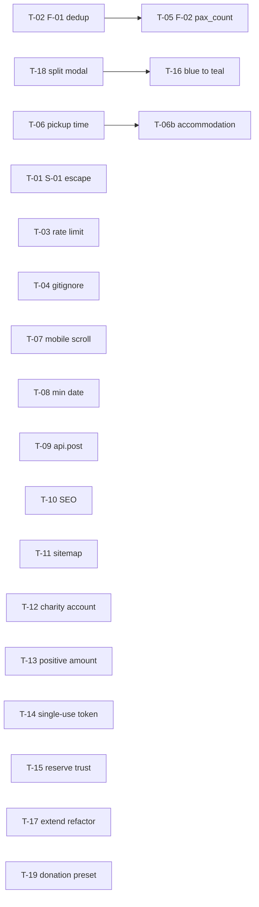

# Execution Plan V9 — contents to be written to [EXECUTION_PLAN_V9.md](EXECUTION_PLAN_V9.md)

## Overall structure

- Header (plan date, follows Audit V9, total tasks, blocker count)
- Agent selection legend (Composer 2 / Sonnet 4.6 / Opus 4.6)
- Dependency graph (mermaid) — shows the two blockers are independent, T-18 should precede T-16, T-05 folds into T-02
- 19 numbered tasks grouped by priority
- Suggested execution order (single developer vs. parallel)

## Agent assignment summary

- **Opus 4.6 (4 tasks):** T-01 (S-01 inline email escape, 3 files incl. use-case), T-02 (F-01 dedup — domain port + repo + use-case), T-06 (F-03 driver notify — migration + schema + route + email + UI), T-17 (Q-01 `public-extend.ts` 836-line refactor), T-18 (Q-02 split `OrderDetailModal`)
- **Sonnet 4.6 (7 tasks):** T-05 (F-02 payload pax_count), T-06b (F-03b accommodation column), T-07 (mobile horizontal scroll, multi-table), T-10 (W-02 SEO rollout across ~11 pages), T-12 (S-04 charity account resolver), T-14 (S-06 single-use cancellation token + migration), T-15 (F-07 reserve-page inclusions/trust)
- **Composer 2 (8 tasks):** T-03 (S-03 rate limit), T-04 (S-07 gitignore + `git rm --cached`), T-08 (F-05 min date attr), T-09 (F-06 fetch → api.post), T-11 (W-03 sitemap), T-13 (S-05 positive amount), T-16 (W-04 blue→teal find-replace), T-19 (BePawsitive ₱5,000 preset)

## Blocker tasks (preview of content + prompt style)

### T-01 — S-01 HTML escape in inline staff-alert emails | Blocker | Opus 4.6 | 0.5 day
- Files: [apps/api/src/services/email.ts](apps/api/src/services/email.ts), [apps/api/src/routes/orders-raw.ts](apps/api/src/routes/orders-raw.ts) L461–504, [apps/api/src/use-cases/booking/submit-direct-booking.ts](apps/api/src/use-cases/booking/submit-direct-booking.ts) L316–380
- Deps: none
- Prompt: "Audit V9 S-01. In `services/email.ts`, export two new template functions `walkInStaffAlertHtml(args)` and `bookingStaffAlertHtml(args)` that reproduce the existing inline HTML from `orders-raw.ts` L461–504 and `submit-direct-booking.ts` L316–380 respectively, with every user/DB string routed through the existing `escapeHtml()` helper (customerName, customerEmail, customerMobile, orderReference, vehicleName, pickupLocation, dropoffLocation, paymentMethodLabel, transferRoute, flightNumber, flightArrivalTime, addon.name). Also wrap the `tel:` href in `encodeURIComponent`. Then replace the inline template literals in both call sites with calls to the new functions. Subject lines do not need escaping but keep them unchanged. Do not change behaviour otherwise."

### T-02 — F-01 Duplicate transfer rows: link existing instead of creating | Blocker | Opus 4.6 | 0.5–1 day
- Files: [packages/domain/src/repositories/transfer-repository.ts](packages/domain/src/repositories/transfer-repository.ts) (interface), [apps/api/src/adapters/supabase/transfer-repo.ts](apps/api/src/adapters/supabase/transfer-repo.ts), [apps/api/src/use-cases/booking/submit-direct-booking.ts](apps/api/src/use-cases/booking/submit-direct-booking.ts), [apps/api/src/use-cases/orders/process-raw-order.ts](apps/api/src/use-cases/orders/process-raw-order.ts)
- Deps: none (T-05 folds into this)
- Prompt: "Audit V9 F-01. Fix duplicate transfer rows on online bookings. (1) In `submit-direct-booking.ts` step 6b, change `bookingToken: null` to `bookingToken: orderReference` when calling `createTransfer`. (2) Add `findByBookingToken(token: string): Promise<Transfer | null>` to `TransferRepository` in the domain package and implement it in `adapters/supabase/transfer-repo.ts` (select * from transfers where booking_token = token, maybeSingle). (3) In `process-raw-order.ts` L334–371, replace the `createTransfer(...)` block with: find the existing transfer via `deps.transferRepo.findByBookingToken(rawOrder.order_reference)`. If found, call `deps.transferRepo.save()` with the transfer mutated to set `orderId = orderId`. If not found (fallback for walk-in edge cases), fall back to the existing `createTransfer` path. `booking_token` already has a UNIQUE constraint so no migration needed."

## Important tasks (titles only — full prompts in MD)

- T-03 S-03 Rate limit `/public-transfer-booking` (Composer 2, 0.25 d)
- T-04 S-07 Add `packages/shared/dist/` to `.gitignore` and `git rm --cached -r` (Composer 2, 0.1 d)
- T-05 F-02 Persist `transfer_pax_count` + `transfer_amount` on `orders_raw.payload` (Sonnet 4.6, 0.25 d, depends on T-02 for exact read path)
- T-06 F-03 Transfers page pickup-time column + driver notification email (Opus 4.6, 1–2 d; migration + schema + route + template + UI)
- T-06b F-03b Accommodation/pickup-location column on Transfers page for GL→IAO routes (Sonnet 4.6, 0.25 d)
- T-07 Operations-pages horizontal scroll fix on Inbox/Active/Transfers tables (Sonnet 4.6, 0.5–1 d)
- T-08 F-05 `min={todayManilaISO}` on token-based `PublicBookingPage` service-date input (Composer 2, 0.1 d)
- T-09 F-06 `TransferBookingPage` raw `fetch` → `api.post` + drop local `normalizeApiBase` (Composer 2, 0.25 d)
- T-10 W-02 Add `<SEO>` (noIndex on transactional) across 11 customer pages (Sonnet 4.6, 0.5–1 d)
- T-11 W-03 Add `/peace-of-mind`, `/refund-policy`, `/paw-card/partners`, `/book/paw-card` to `public/sitemap.xml` (Composer 2, 0.1 d)

## Nice-to-have tasks (titles only)

- T-12 S-04 Resolve charity-payable from `chart_of_accounts` (Sonnet 4.6, 0.25 d)
- T-13 S-05 `z.number().positive()` on `collectPaymentSchema.amount` (Composer 2, 0.1 d)
- T-14 S-06 Single-use cancellation token + migration (Sonnet 4.6, 0.25 d)
- T-15 F-07 Inclusions list + `ReviewsSection` + `BePawsitiveMeter` on `/book/reserve` (Sonnet 4.6, 0.5 d)
- T-16 W-04 `blue-600 / gray-50` → `teal-brand / sand-brand` in `OrderDetailModal` (Composer 2, 1–2 h)
- T-17 Q-01 Extract `resolveExtensionForRaw` / `resolveExtensionForActive` in `public-extend.ts` (Opus 4.6, 1–2 d)
- T-18 Q-02 Split `OrderDetailModal` into tab subcomponents + hooks (Opus 4.6, 2–3 d)
- T-19 ₱5,000 preset in `OrderSummaryPanel` donation ticker + BePawsitive CTA (Composer 2, 0.25 d)

## Key dependencies captured in plan

## Suggested execution order

- **Day 1 — block landing:** T-01 + T-02 in parallel (both Opus), T-04 + T-08 + T-13 as filler (Composer)
- **Day 2 — launch hardening:** T-03, T-05, T-09, T-11, T-16 in parallel
- **Day 3–4 — UX polish:** T-06/T-06b, T-07, T-10, T-15
- **Week 2 — tech-debt:** T-12, T-14, T-17, T-18, T-19

## After confirmation

I will write the full `EXECUTION_PLAN_V9.md` with every task body, copy-pasteable prompt, files-affected bullet, deps, and effort estimate — the draft above shows the blocker format; all 19 will follow the same template.