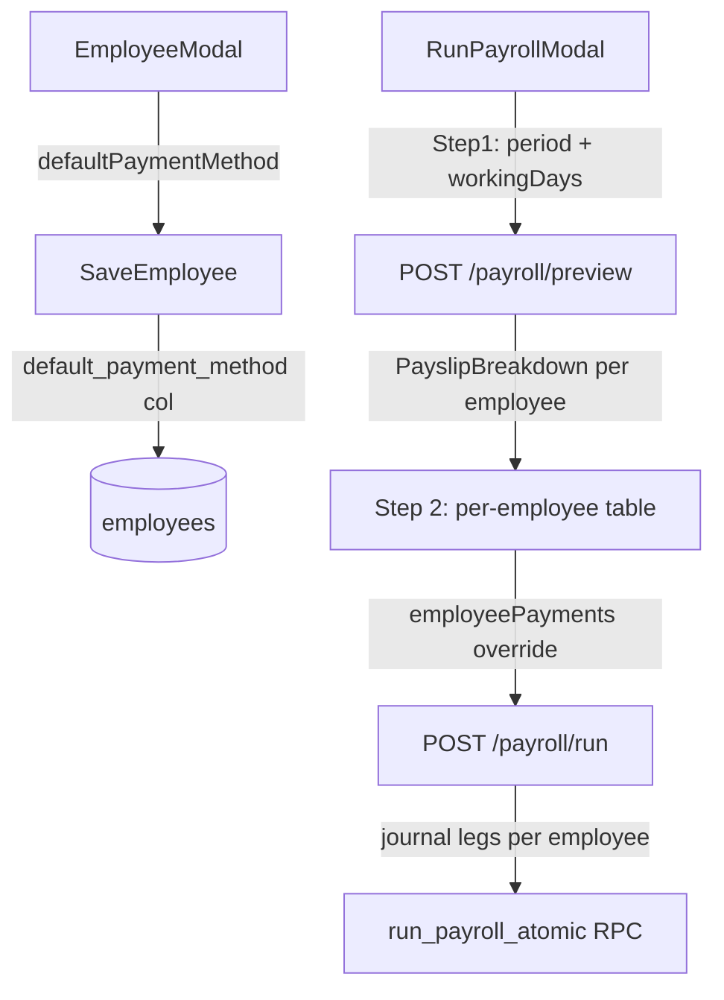

# Per-Employee Payroll Payment Methods

## Data Flow



## Account ID Mapping (hardcoded in use case)

Payroll is company-level. All accounts are always Lola's accounts regardless of which store the employee belongs to.

| Payment method | Source | Account ID |
|---|---|---|
| `cash` | till | `CASH-LOLA` |
| `cash` | safe | `SAFE-store-lolas` |
| `gcash` | — | `GCASH-store-lolas` |
| `bank_transfer` | — | `BANK-UNION-BANK-store-lolas` |

Expense debit is always `EXP-PAYROLL-store-lolas` for every employee.

```typescript
// resolvePaymentAccounts — in run-payroll.ts
function resolveCreditAccount(
  method: 'cash' | 'gcash' | 'bank_transfer',
  source: 'till' | 'safe',
): string {
  if (method === 'cash') {
    return source === 'safe' ? 'SAFE-store-lolas' : 'CASH-LOLA';
  }
  if (method === 'gcash') return 'GCASH-store-lolas';
  return 'BANK-UNION-BANK-store-lolas';
}

const PAYROLL_EXPENSE_ACCOUNT = 'EXP-PAYROLL-store-lolas'; // always, ignoring employee.storeId
```

---

## Files to Change

### 1. Domain entity — [`packages/domain/src/entities/employee.ts`](packages/domain/src/entities/employee.ts)

Add `defaultPaymentMethod: string` to `EmployeeProps` and as a `readonly` property on `Employee`. Default value `'cash'` used in constructor.

### 2. Supabase repo — [`apps/api/src/adapters/supabase/employee-repo.ts`](apps/api/src/adapters/supabase/employee-repo.ts)

- Add `default_payment_method: string` to `EmployeeRow` interface
- Map in `rowToEmployee` (`defaultPaymentMethod: row.default_payment_method ?? 'cash'`)
- Map back in `employeeToRow` (`default_payment_method: employee.defaultPaymentMethod`)

### 3. Shared schema — [`packages/shared/src/schemas/config-schemas.ts`](packages/shared/src/schemas/config-schemas.ts)

Add to `CreateEmployeeRequestSchema`:

```typescript
defaultPaymentMethod: z.enum(['cash', 'gcash', 'bank_transfer']).default('cash'),
```

`UpdateEmployeeRequestSchema` inherits via `.partial().extend()` — no further change needed.

### 4. HR route — [`apps/api/src/routes/hr.ts`](apps/api/src/routes/hr.ts)

In both `POST /employees` and `PUT /employees/:id`, pass `defaultPaymentMethod: body.defaultPaymentMethod ?? existing?.defaultPaymentMethod ?? 'cash'` to `EmployeeEntity.create(...)`.

### 5. Frontend HR types — [`apps/web/src/api/hr.ts`](apps/web/src/api/hr.ts)

- Add `defaultPaymentMethod: string` to `EmployeeRow` interface
- Add `PreviewPayrollPayload` interface (same as `RunPayrollPayload` minus `cashAccountId`)
- Add `usePreviewPayroll` mutation hook → `POST /payroll/preview`
- Update `RunPayrollPayload` to replace `cashAccountId` with `employeePayments: EmployeePaymentDetail[]`
- Add `EmployeePaymentDetail` interface

### 6. Employee modal — [`apps/web/src/components/hr/EmployeeModal.tsx`](apps/web/src/components/hr/EmployeeModal.tsx)

In the **Role & Pay** tab, add a "Default payment method" `<select>` after the existing "Paid As" field (same `inputCls`/`labelCls` styling):

```tsx
<select value={String(form.defaultPaymentMethod ?? 'cash')} ...>
  <option value="cash">Cash</option>
  <option value="gcash">GCash</option>
  <option value="bank_transfer">Bank Transfer</option>
</select>
```

Also add `defaultPaymentMethod: e.defaultPaymentMethod ?? 'cash'` in `employeeToForm` and `blankForm`.

### 7. Payroll schemas — [`packages/shared/src/schemas/payroll-schemas.ts`](packages/shared/src/schemas/payroll-schemas.ts)

Add:

```typescript
export const EmployeePaymentDetailSchema = z.object({
  employeeId: z.string(),
  paymentMethod: z.enum(['cash', 'gcash', 'bank_transfer']),
  fromTill: z.number().nonnegative().optional(),
  fromSafe: z.number().nonnegative().optional(),
});

export const RunPayrollPreviewRequestSchema = z.object({
  storeId: z.string(),
  periodStart: z.string(),
  periodEnd: z.string(),
  isEndOfMonth: z.boolean(),
  workingDaysInMonth: z.number().int().positive(),
});
```

Update `RunPayrollRequestSchema`: replace `cashAccountId` with `employeePayments: z.array(EmployeePaymentDetailSchema)`.

### 8. Payroll route — [`apps/api/src/routes/payroll.ts`](apps/api/src/routes/payroll.ts)

Add new endpoint:

```typescript
router.post('/preview', requirePermission(Permission.ViewPayroll),
  validateBody(RunPayrollPreviewRequestSchema), async (req, res, next) => {
    // findActive employees, calculatePayslip for each, return array
    // Does NOT write to DB
  });
```

### 9. Run-payroll use case — [`apps/api/src/use-cases/payroll/run-payroll.ts`](apps/api/src/use-cases/payroll/run-payroll.ts)

- Remove `cashAccountId` and `storeExpenseAccounts` from `RunPayrollInput`; add `employeePayments: EmployeePaymentDetail[]`
- Remove the per-store allocation loop (`storeAllocations`) entirely — payroll is company-level
- Add `resolveCreditAccount(method, source)` helper (no `storeId` parameter needed)
- Replace the current per-store journal loop with a per-employee journal loop:
  - For each employee in `payslips` where `netPay > 0`:
    - Look up their payment detail from `employeePayments` (fallback to method `'cash'`, full amount from till)
    - Create **one** journal transaction per employee:
      - `DR EXP-PAYROLL-store-lolas: netPay`
      - `CR CASH-LOLA: fromTill` (if cash and fromTill > 0)
      - `CR SAFE-store-lolas: fromSafe` (if cash and fromSafe > 0)
      - OR `CR GCASH-store-lolas / BANK-UNION-BANK-store-lolas: netPay` (for gcash/bank)
    - Journal `storeId` field is always `'store-lolas'`
- Cash employees additionally split `fromTill` / `fromSafe` into two credit legs within the same transaction

### 10. RunPayrollModal — [`apps/web/src/components/hr/RunPayrollModal.tsx`](apps/web/src/components/hr/RunPayrollModal.tsx)

Rewrite as a **two-step modal**:

**Step 1 — Configure:** Period selector, working days. No expense account dropdown — `EXP-PAYROLL-store-lolas` is always used. "Preview" button calls `usePreviewPayroll`.

**Step 2 — Review & Pay:** Shows a table of calculated payslips:
- Employee name | Net Pay | Payment method `<select>` | (if cash) From till `₱___` + From safe `₱___`
- Validation: till + safe must equal net pay for cash employees
- "Run Payroll" button submits `employeePayments` array alongside period/expense account

Remove the old single `cashAccountId` selector entirely.

---

## Build order

1. `packages/shared` (schema changes)
2. `packages/domain` (entity change)
3. `apps/api` (repo, routes, use case)
4. `apps/web` (modal, employee form, API types)
