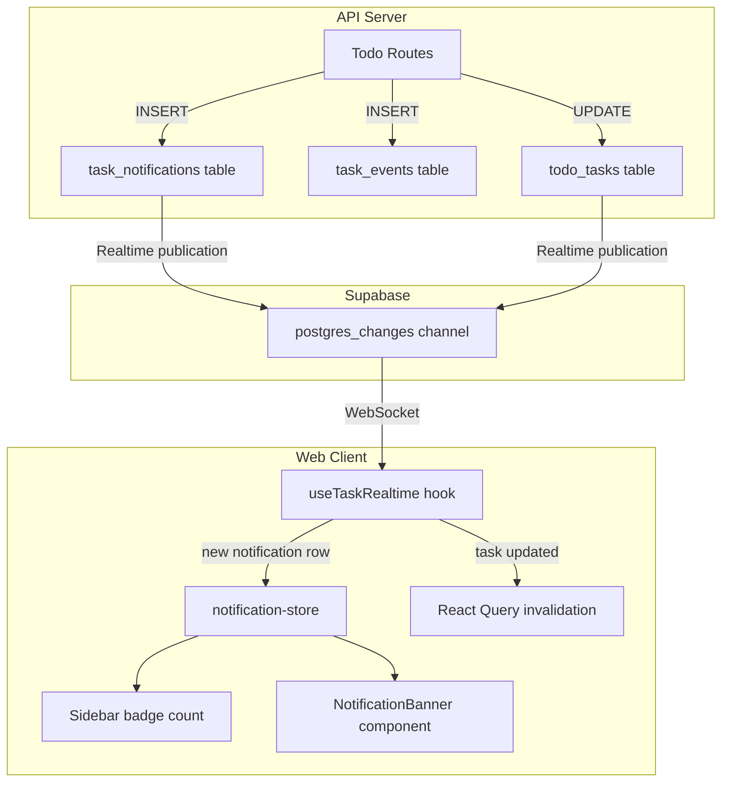
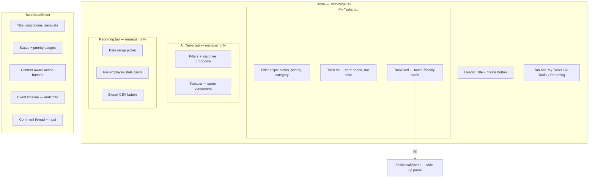

# Task Accountability System — Full Technical Plan

---

## 1. Review of What Currently Exists

### Database (`supabase/migrations/006_remaining_tables.sql`)

Two tables exist:

- `**todo_tasks**` — columns: `id` (text PK), `store_id`, `employee_id`, `vehicle_id`, `assigned_by`, `assigned_to`, `task_description`, `completion_response`, `date_created`, `date_completed`, `visibility`, `priority` (Low/Medium/High/Urgent), `status` (Open/In Progress/Completed), `due_date`, `task_category`, `seen_by` (text[]), `completed_by`
- `**todo_comments**` — columns: `id` (uuid PK), `task_id`, `employee_id`, `content`, `created_at`

Indexes in `008`: `idx_todo_assigned (assigned_to, status)`, `idx_todo_comments_task (task_id)`.
RLS in `009`: store-scoped select/modify on `todo_tasks`; open select + permission-gated insert on `todo_comments`.
Realtime in `010`: both tables already added to `supabase_realtime` publication.

### Domain Layer (`packages/domain/src/ports/todo-repository.ts`)

Defines `Task` (with `title`, `description`, `assigneeId`, `createdBy`, status as `open | in_progress | done | cancelled`) and `TodoComment` (with `authorId`, `authorName`, `body`). These **do not match** the SQL columns.

### Supabase Adapter (`apps/api/src/adapters/supabase/todo-repo.ts`)

**Critical mismatch**: queries `sb.from('tasks')` but the actual table is `todo_tasks`. Column mapping uses `title`, `assignee_id`, `author_id`, `body` — none of which exist in the migration. **This adapter has never worked against the real database.**

### API Routes (`apps/api/src/routes/todo.ts`)

Seven endpoints mounted at `/api/todo`: GET `/`, POST `/`, POST `/:id/comment`, GET `/:id/comments`, POST `/:id/claim`, POST `/:id/seen`, GET `/unseen-count`. All require `can_view_todo`. Uses dynamic imports from `use-cases/todo/*`.

### Use Cases (`apps/api/src/use-cases/todo/`)

Four files: `create-task.ts`, `add-comment.ts`, `claim-task.ts`, `mark-seen.ts`. All use the domain `Task` interface that doesn't match the DB.

### Shared Schemas (`packages/shared/src/schemas/todo-schemas.ts`)

`CreateTaskRequestSchema`, `AddCommentRequestSchema`, `ClaimTaskRequestSchema`, `MarkSeenRequestSchema`, `TodoQuerySchema`. Contains a type bug: `MarkSeenRequestRequestSchema` (doubled "Request").

### Frontend Page (`apps/web/src/pages/todo/TodoPage.tsx`)

49-line stub. Shows a basic table (Task, Priority, Status, Assigned To) with a Claim button. Uses inline `useQuery`/`useMutation` hitting `/todo` directly — does **not** use the hooks in `api/todo.ts`.

### Frontend Hooks (`apps/web/src/api/todo.ts`)

Defines `useTasks`, `useCreateTask`, `useAddComment`, `useClaimTask`, `useMarkSeen`, `useUnseenCount` — all targeting `/tasks` endpoints. **Not imported anywhere.** Query keys use `['tasks', ...]` while the page uses `['todo', ...]`.

### Realtime (`apps/web/src/stores/realtime.ts`)

An empty Zustand stub — stores a `Map` of subscriptions but **never connects to Supabase**. `@supabase/supabase-js` is in `apps/web` dependencies but no client is instantiated on the frontend.

### Notifications

No notification system exists. No toast library. No banner component. No sidebar badge counts.

### Settings — Task Categories

No `task_categories` table. No config routes for task categories. No Settings tab.

---

## 2. Gap Analysis


| Requirement                                                                           | Current State                                                                | Action                                         |
| ------------------------------------------------------------------------------------- | ---------------------------------------------------------------------------- | ---------------------------------------------- |
| Task lifecycle (Created > Acknowledged > In Progress > Pending Verification > Closed) | Status is (Open / In Progress / Completed)                                   | Restructure status enum, add `acknowledged_at` |
| Acknowledge with timestamp                                                            | Not implemented                                                              | New column + endpoint + UI                     |
| Pending Verification / Manager verify or reject                                       | Not implemented                                                              | New status transition endpoints                |
| Rejection with mandatory reason, unlimited                                            | Not implemented                                                              | New `task_events` audit table                  |
| Escalation with counter and reason                                                    | Not implemented                                                              | New columns + endpoint                         |
| Full audit trail (every action timestamped)                                           | Only `date_created` / `date_completed`                                       | New `task_events` table                        |
| Comment thread                                                                        | Exists in schema but adapter is broken                                       | Fix adapter, rebuild UI                        |
| Task categories from Settings                                                         | No table, no routes, no UI                                                   | New table + config routes + Settings tab       |
| Vehicle linkage                                                                       | Column exists (`vehicle_id`) but not in domain/adapter                       | Wire through all layers                        |
| Supabase Realtime notifications                                                       | Stub store, no connection                                                    | Full implementation                            |
| Sidebar badge                                                                         | Not implemented                                                              | Add to Sidebar component                       |
| Banner notifications                                                                  | Not implemented                                                              | New `NotificationBanner` component             |
| Visibility rules (staff vs manager vs owner)                                          | RLS is store-scoped only                                                     | Add role-aware filtering in API                |
| Reporting tab with CSV export                                                         | Not implemented                                                              | New reporting component + API endpoint         |
| Mobile-first design                                                                   | Desktop table only                                                           | Complete redesign with card-based layout       |
| DB/adapter column mismatch                                                            | Adapter queries wrong table name (`tasks` vs `todo_tasks`) and wrong columns | Full adapter rewrite                           |


---

## 3. Proposed Database Schema Changes

### Migration `024_task_accountability.sql`

#### New table: `task_categories`

```sql
CREATE TABLE task_categories (
  id         serial PRIMARY KEY,
  name       text NOT NULL UNIQUE,
  colour     text NOT NULL DEFAULT '#6B7280',
  is_active  boolean NOT NULL DEFAULT true,
  created_at timestamptz NOT NULL DEFAULT now()
);
```

#### Restructure `todo_tasks`

The existing table shape and the adapter shape are irreconcilable. Since the adapter never worked (wrong table name), no real data exists. The migration will:

1. Drop the old constraints
2. Add new columns for the accountability lifecycle
3. Leave old columns in place (safe no-data-loss approach)

```sql
-- Add columns for the new lifecycle
ALTER TABLE todo_tasks
  ADD COLUMN IF NOT EXISTS title text,
  ADD COLUMN IF NOT EXISTS description text,
  ADD COLUMN IF NOT EXISTS category_id integer REFERENCES task_categories(id),
  ADD COLUMN IF NOT EXISTS acknowledged_at timestamptz,
  ADD COLUMN IF NOT EXISTS escalation_count integer NOT NULL DEFAULT 0,
  ADD COLUMN IF NOT EXISTS is_escalated boolean NOT NULL DEFAULT false,
  ADD COLUMN IF NOT EXISTS updated_at timestamptz NOT NULL DEFAULT now();

-- Backfill title from task_description for any existing rows
UPDATE todo_tasks SET title = task_description WHERE title IS NULL AND task_description IS NOT NULL;

-- New status constraint
ALTER TABLE todo_tasks DROP CONSTRAINT IF EXISTS todo_tasks_status_check;
ALTER TABLE todo_tasks ADD CONSTRAINT todo_tasks_status_check
  CHECK (status IN ('Created','Acknowledged','In Progress','Pending Verification','Closed'));

-- Update any existing rows to valid status
UPDATE todo_tasks SET status = 'Created' WHERE status = 'Open';
UPDATE todo_tasks SET status = 'Closed' WHERE status = 'Completed';
```

**Final `todo_tasks` column usage** (adapter will map these):


| Column             | Purpose                                                              |
| ------------------ | -------------------------------------------------------------------- |
| `id` (text PK)     | Task ID (UUID generated in app)                                      |
| `store_id`         | Store scope                                                          |
| `title`            | Task title (new)                                                     |
| `description`      | Task description (new, nullable)                                     |
| `category_id`      | FK to `task_categories` (new)                                        |
| `assigned_by`      | Creator employee ID                                                  |
| `assigned_to`      | Assignee employee ID                                                 |
| `vehicle_id`       | Optional vehicle linkage (existing)                                  |
| `priority`         | Low / Medium / High / Urgent (existing)                              |
| `status`           | Created / Acknowledged / In Progress / Pending Verification / Closed |
| `due_date`         | Due date (existing)                                                  |
| `acknowledged_at`  | Timestamp when assignee acknowledged (new)                           |
| `escalation_count` | Number of times escalated (new)                                      |
| `is_escalated`     | Currently escalated flag for sort priority (new)                     |
| `date_created`     | Creation timestamp (existing)                                        |
| `date_completed`   | Completion/close timestamp (existing)                                |
| `updated_at`       | Last update timestamp (new)                                          |


Columns retained but no longer used by new code: `employee_id`, `task_description`, `completion_response`, `visibility`, `seen_by`, `completed_by` — left for safety; can be dropped in a future cleanup migration.

#### New table: `task_events` (audit log)

Every state change, rejection, escalation, and comment is recorded here.

```sql
CREATE TABLE task_events (
  id          uuid PRIMARY KEY DEFAULT gen_random_uuid(),
  task_id     text NOT NULL REFERENCES todo_tasks(id) ON DELETE CASCADE,
  event_type  text NOT NULL CHECK (event_type IN (
    'created','acknowledged','started','submitted',
    'verified','rejected','escalated','commented',
    'reassigned','updated'
  )),
  actor_id    text NOT NULL REFERENCES employees(id),
  actor_name  text,
  detail      text,
  created_at  timestamptz NOT NULL DEFAULT now()
);

CREATE INDEX idx_task_events_task ON task_events (task_id, created_at);
CREATE INDEX idx_task_events_actor ON task_events (actor_id);
```

#### New table: `task_notifications`

Persistent notification records for badge counts and banner display.

```sql
CREATE TABLE task_notifications (
  id                uuid PRIMARY KEY DEFAULT gen_random_uuid(),
  task_id           text NOT NULL REFERENCES todo_tasks(id) ON DELETE CASCADE,
  recipient_id      text NOT NULL REFERENCES employees(id),
  notification_type text NOT NULL CHECK (notification_type IN (
    'assigned','rejected','escalated','overdue','comment'
  )),
  is_read           boolean NOT NULL DEFAULT false,
  is_dismissed      boolean NOT NULL DEFAULT false,
  created_at        timestamptz NOT NULL DEFAULT now()
);

CREATE INDEX idx_task_notif_recipient ON task_notifications (recipient_id, is_read);
```

#### Realtime and RLS

```sql
ALTER PUBLICATION supabase_realtime ADD TABLE task_events;
ALTER PUBLICATION supabase_realtime ADD TABLE task_notifications;
ALTER PUBLICATION supabase_realtime ADD TABLE task_categories;

ALTER TABLE task_events ENABLE ROW LEVEL SECURITY;
CREATE POLICY task_events_select ON task_events FOR SELECT USING (true);
CREATE POLICY task_events_insert ON task_events FOR INSERT WITH CHECK (
  public.has_permission('can_view_todo')
);

ALTER TABLE task_notifications ENABLE ROW LEVEL SECURITY;
CREATE POLICY task_notif_select ON task_notifications FOR SELECT USING (true);
CREATE POLICY task_notif_modify ON task_notifications FOR ALL USING (
  public.has_permission('can_view_todo')
);

ALTER TABLE task_categories ENABLE ROW LEVEL SECURITY;
CREATE POLICY task_cat_select ON task_categories FOR SELECT USING (true);
CREATE POLICY task_cat_modify ON task_categories FOR ALL USING (
  public.has_permission('can_edit_settings')
);

-- Additional index for overdue queries
CREATE INDEX idx_todo_tasks_due_status ON todo_tasks (due_date, status)
  WHERE status NOT IN ('Closed');
```

#### New permissions

Add to `permissions.ts`:

- `ManageTodo: 'can_manage_todo'` — manager-level actions (verify, reject, escalate, see all tasks)

This keeps `can_view_todo` for basic access (staff) and adds `can_manage_todo` for manager/owner actions.

---

## 4. Proposed Notification Architecture (Supabase Realtime)

### Overview




### Frontend Supabase Client

Create [apps/web/src/lib/supabase.ts](apps/web/src/lib/supabase.ts) — instantiate a Supabase client using `VITE_SUPABASE_URL` and `VITE_SUPABASE_ANON_KEY` env vars. This client is used **only for Realtime subscriptions**, not for data queries (those stay through the REST API).

### Realtime Hook: `useTaskRealtime`

Rewrite [apps/web/src/stores/realtime.ts](apps/web/src/stores/realtime.ts) into a proper hook that:

1. Subscribes to `postgres_changes` on `task_notifications` filtered by `recipient_id = currentEmployeeId`
2. Subscribes to `postgres_changes` on `todo_tasks` (INSERT/UPDATE) for React Query cache invalidation
3. On receiving a new `task_notifications` INSERT: adds to notification store, triggers banner
4. On receiving a `todo_tasks` UPDATE: invalidates `['tasks']` query key for live list refresh
5. Cleanup on unmount

### Notification Store (`notification-store.ts`)

Zustand store holding:

- `unreadCount: number` — drives sidebar badge
- `bannerNotifications: Notification[]` — active dismissible banners
- `dismiss(id)` — marks `is_dismissed` via API + removes from banner list
- `markAllRead()` — bulk update via API

### When notifications are created (server-side, in route handlers)


| Event                                  | Recipients            | Type        |
| -------------------------------------- | --------------------- | ----------- |
| Task created/assigned                  | Assigned employee     | `assigned`  |
| Task rejected                          | Assigned employee     | `rejected`  |
| Task escalated                         | Assigned employee     | `escalated` |
| Task overdue (cron or on-access check) | Owner account(s)      | `overdue`   |
| Comment added by staff                 | Manager (assigned_by) | `comment`   |
| Comment added by manager               | Assigned employee     | `comment`   |


Overdue detection: checked when tasks are fetched (on-access) — any task where `due_date < today` and `status NOT IN ('Closed')` that doesn't already have an `overdue` notification for today. This avoids needing a separate cron job.

---

## 5. Proposed API Changes

### Rewrite `apps/api/src/routes/todo.ts`


| Method | Path                           | Purpose                                                                                  | Permission        |
| ------ | ------------------------------ | ---------------------------------------------------------------------------------------- | ----------------- |
| GET    | `/todo`                        | List tasks (filtered by role: staff sees own, manager/owner sees all)                    | `can_view_todo`   |
| GET    | `/todo/:id`                    | Single task with events + comments                                                       | `can_view_todo`   |
| POST   | `/todo`                        | Create task                                                                              | `can_view_todo`   |
| PUT    | `/todo/:id`                    | Update task fields (title, description, category, priority, due date, vehicle, assignee) | `can_view_todo`   |
| POST   | `/todo/:id/acknowledge`        | Assignee acknowledges                                                                    | `can_view_todo`   |
| POST   | `/todo/:id/start`              | Move to In Progress                                                                      | `can_view_todo`   |
| POST   | `/todo/:id/submit`             | Mark done (Pending Verification)                                                         | `can_view_todo`   |
| POST   | `/todo/:id/verify`             | Manager closes task                                                                      | `can_manage_todo` |
| POST   | `/todo/:id/reject`             | Manager rejects (body: `{ reason }`)                                                     | `can_manage_todo` |
| POST   | `/todo/:id/escalate`           | Manager escalates (body: `{ reason }`)                                                   | `can_manage_todo` |
| POST   | `/todo/:id/comment`            | Add comment                                                                              | `can_view_todo`   |
| GET    | `/todo/:id/events`             | Full audit trail                                                                         | `can_view_todo`   |
| GET    | `/todo/notifications`          | Current user's notifications                                                             | `can_view_todo`   |
| POST   | `/todo/notifications/dismiss`  | Dismiss notification                                                                     | `can_view_todo`   |
| POST   | `/todo/notifications/read-all` | Mark all read                                                                            | `can_view_todo`   |
| GET    | `/todo/report`                 | Reporting data (date range, per-employee stats)                                          | `can_manage_todo` |


### Rewrite `apps/api/src/adapters/supabase/todo-repo.ts`

Fix table name to `todo_tasks`, fix all column mappings to match the actual (post-migration) schema. Add methods for:

- `findById(id)` — single task with joined category name + assignee name + creator name
- `findForEmployee(employeeId)` — staff view
- `findForStore(storeId)` — manager view
- `updateStatus(id, status, extras)` — atomic status transition
- `addEvent(event)` — insert into `task_events`
- `getEvents(taskId)` — audit log
- `createNotification(...)` / `getNotifications(recipientId)` / `dismissNotification(id)` / `markAllRead(recipientId)`
- `getReport(storeId, dateFrom, dateTo)` — aggregated per-employee stats

### Rewrite use cases (`apps/api/src/use-cases/todo/`)

Replace the four existing files with lifecycle-specific use cases that enforce the status flow:

- `create-task.ts` — creates task + `created` event + `assigned` notification
- `acknowledge-task.ts` — validates status is `Created`, sets `acknowledged_at`, emits `acknowledged` event
- `start-task.ts` — validates `Acknowledged`, sets `In Progress`
- `submit-task.ts` — validates `In Progress`, sets `Pending Verification`
- `verify-task.ts` — validates `Pending Verification`, sets `Closed`, sets `date_completed`
- `reject-task.ts` — validates `Pending Verification`, sets `In Progress`, requires reason, emits `rejected` event + notification
- `escalate-task.ts` — any non-Closed status, increments `escalation_count`, sets `is_escalated`, emits event + notification
- `add-comment.ts` — inserts comment + `commented` event + notification to the other party

### Config routes addition (`apps/api/src/routes/config.ts`)

Add CRUD for `task_categories` following the expense-categories pattern: GET/POST/PUT/DELETE via `configRepo` methods.

### Shared schemas rewrite (`packages/shared/src/schemas/todo-schemas.ts`)

Replace all existing schemas with properly typed schemas for each endpoint above. Fix the `MarkSeenRequestRequestSchema` typo (remove entirely — `seen_by` is replaced by the events/notification system).

### Domain types update (`packages/domain/src/ports/todo-repository.ts`)

Rewrite `Task` interface to match new columns. Add `TaskEvent`, `TaskNotification`, `TaskCategory` interfaces. Rewrite `TodoRepository` port with new method signatures.

---

## 6. Proposed Frontend Component Structure

### Mobile-first page layout




### File structure

```
apps/web/src/
  lib/
    supabase.ts                    -- Supabase client for Realtime
  stores/
    notification-store.ts          -- Zustand store for notifications
    realtime.ts                    -- REWRITE: actual Realtime subscriptions
  api/
    todo.ts                        -- REWRITE: typed hooks for all endpoints
    config.ts                      -- ADD: task category hooks
  pages/
    todo/
      TodoPage.tsx                 -- REWRITE: mobile-first shell with tabs
      components/
        TaskList.tsx               -- Card-based task list with virtual scroll
        TaskCard.tsx               -- Individual task card (touch-friendly)
        TaskDetailSheet.tsx        -- Slide-up detail panel (mobile) / side panel (desktop)
        TaskForm.tsx               -- Create/edit task form
        TaskTimeline.tsx           -- Audit event timeline
        TaskComments.tsx           -- Comment thread
        TaskActionBar.tsx          -- Context-aware lifecycle buttons
        TaskFilters.tsx            -- Filter chips (status, priority, category)
        TaskReporting.tsx          -- Reporting tab content
        TaskStatusBadge.tsx        -- Status pill with colour coding
  components/
    layout/
      Sidebar.tsx                  -- MODIFY: add badge count for To Do
      AppLayout.tsx                -- MODIFY: render NotificationBanner
    common/
      NotificationBanner.tsx       -- NEW: dismissible banner at top of page
    settings/
      tabs/
        TaskCategoriesTab.tsx      -- NEW: category management
  pages/
    settings/
      SettingsPage.tsx             -- MODIFY: add Task Categories tab
```

### Mobile-first design principles

- **Card layout** instead of tables — each task is a full-width card showing title, priority badge, status badge, assignee, due date, and escalation indicator
- **Minimum 44px touch targets** on all interactive elements (buttons, cards, filter chips)
- **Bottom-anchored action bar** on task detail — Acknowledge / Start / Submit / Verify / Reject buttons are fixed to the bottom of the viewport for thumb access
- **Slide-up sheet** for task detail — full-screen on mobile, side panel on desktop (using CSS `@media (min-width: 768px)`)
- **No hover-only interactions** — all states accessible via tap; long-press not required for any action
- **Readable without zoom** — minimum 14px body text, 12px for metadata, 16px for titles
- **Sticky filter bar** below the tab bar so filters remain accessible while scrolling the task list
- **Pull-to-refresh** pattern via touch event handlers

### Task card visual hierarchy

- **Unacknowledged tasks**: amber/yellow left border + pulsing dot indicator + "Needs acknowledgement" label
- **Escalated tasks**: red left border + flame icon + escalation count badge; sorted to top of list
- **Overdue tasks**: red text on due date + "Overdue" badge
- **Status colours**: Created (gray), Acknowledged (blue), In Progress (amber), Pending Verification (purple), Closed (green)

### Visibility enforcement

- Staff (`can_view_todo` only): "My Tasks" tab is the default and only tab; `GET /todo` is filtered server-side to `assigned_to = employeeId`
- Manager (`can_manage_todo`): sees both "My Tasks" and "All Tasks" tabs + "Reporting" tab
- Owner (has all permissions + access to all stores): same as manager but across all stores

### Reporting tab

- Fetches `GET /todo/report?storeId=...&from=...&to=...`
- Displays per-employee cards: total assigned, completed on time, completed late, rejected count, average hours to completion
- "Export CSV" button generates client-side CSV from the report data using `Blob` + `URL.createObjectURL`

### Settings: Task Categories Tab

Following the [ExpenseCategoriesTab](apps/web/src/components/settings/tabs/ExpenseCategoriesTab.tsx) pattern:

- `ConfigSection` with columns: Name, Colour (rendered as a colour dot), Active
- Fields: `name` (text, required), `colour` (colour picker input), `isActive` (boolean)
- Hooks: `useTaskCategories`, `useSaveTaskCategory`, `useDeleteTaskCategory` in [config.ts](apps/web/src/api/config.ts)

---

## 7. Implementation Order

The work is organized into phases to allow incremental testing:

**Phase 1 — Foundation**: Database migration + domain types + adapter rewrite + config (task categories)
**Phase 2 — Core lifecycle**: API routes for all status transitions + use cases + audit events
**Phase 3 — Frontend shell**: Mobile-first TodoPage with TaskList, TaskCard, TaskForm, TaskDetailSheet
**Phase 4 — Lifecycle UI**: Action buttons, status transitions, rejection modal, escalation modal
**Phase 5 — Comments and timeline**: Comment thread + event timeline display
**Phase 6 — Realtime and notifications**: Supabase client, realtime subscriptions, notification store, sidebar badge, banner
**Phase 7 — Reporting**: Report endpoint + reporting tab + CSV export
**Phase 8 — Settings integration**: Task categories tab in Settings + wire into task form