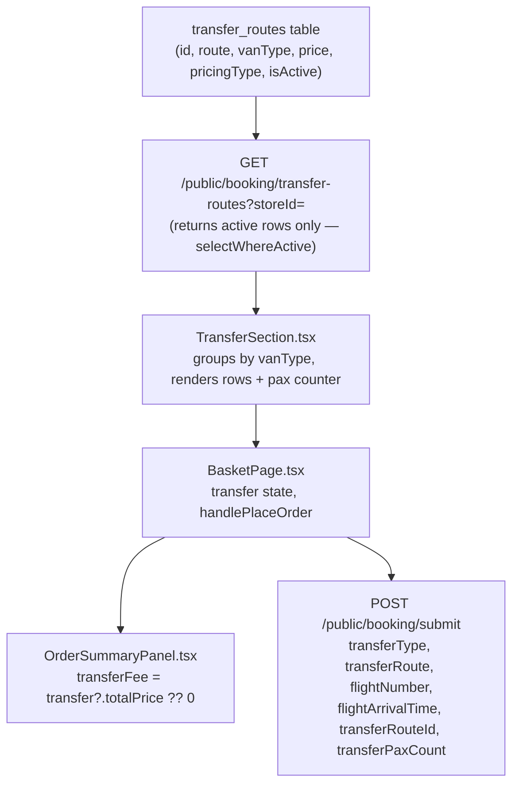

# Transfer Section Rebuild

## What exists today vs what changes

**Current (broken) model:** `TransferSection` receives `transferAddons` (addons whose name contains "transfer"/"tuk") and uses those for display and pricing. The route text comes from a separate `transfer-routes` fetch used only as a dropdown.

**New model:** `TransferSection` fetches `transfer_routes` directly, groups by `vanType`, renders one selectable row per group, and stores a fully-resolved `TransferDetails` (with `totalPrice`) in parent state.

## Data flow



## Files changed (frontend only — no backend schema changes needed)

### 1. [`apps/web/src/components/basket/basket-types.ts`](apps/web/src/components/basket/basket-types.ts)

Extend `TransferDetails` — keep existing fields for backward compat, add new ones:

```ts
export interface TransferDetails {
  // Kept — submitted to backend
  transferType: 'shared' | 'private';
  flightNumber: string;
  flightArrivalTime: string;
  transferRoute: string;     // route text from DB
  // New
  transferRouteId: number;   // DB row id
  vanType: string;           // raw van_type string
  pricingType: 'fixed' | 'per_head';
  unitPrice: number;
  paxCount: number;          // 1 for fixed; user-set for per_head
  totalPrice: number;        // unitPrice * paxCount (or just unitPrice)
}
```

### 2. [`apps/web/src/components/basket/TransferSection.tsx`](apps/web/src/components/basket/TransferSection.tsx)

Full rebuild. Remove `transferAddons` prop entirely.

```ts
interface Props {
  transfer: TransferDetails | null;
  onTransferChange: (t: TransferDetails | null) => void;
  errors: Record<string, string>;
}
```

**Mount:** fetch `GET /public/booking/transfer-routes?storeId=<storeId>`, group by `vanType`. The API already returns only `isActive = true` rows (confirmed: `selectWhereActive`).

**Van type display mapping** (case-insensitive match on `vanType`):
- contains `'shared'` → "Shared Van", icon 🚐, `transferType: 'shared'`
- contains `'tuk'` → "Private TukTuk", icon 🛺, `transferType: 'private'`
- otherwise → "Private Van", icon 🚌, `transferType: 'private'`

**Options rendered:**
1. "No transfer needed" row — always first, selected by default (`transfer === null`)
2. One row per vanType group (using first route in group for pricing)

**Pricing display:**
- `pricingType === 'per_head'` → "₱X per person", show pax counter (+/−, min 1), live total below
- `pricingType === 'fixed'` → "₱X" flat

**Pax counter** (shown inline below shared row when selected):
```
[ − ]  2 passengers  [ + ]   Total: ₱660
```

**When a transfer is selected:**
- `onTransferChange({ transferType, transferRouteId, vanType, pricingType, unitPrice, paxCount, totalPrice, flightNumber: '', flightArrivalTime: '', transferRoute: route.route })`

**Flight details form** (shown when `transfer !== null`, same inputs as today, same styling).

### 3. [`apps/web/src/pages/basket/BasketPage.tsx`](apps/web/src/pages/basket/BasketPage.tsx)

Three targeted changes, no other section touched:

**a. Remove `transferAddons` / `standardAddons` split.** Pass all `addons` directly to `AddOnsSection` (`AddOnsSection` already filters out transfer-named addons internally via its own `const standard = addons.filter(...)`).

**b. Update `handlePlaceOrder`:**
- Remove: `allAddonIds.push(Number(tAddon.id))` — transfer is no longer an addon
- Update `clientTotal`: replace the `transferAddons.find(...)?.priceOneTime ?? 0` expression with `transfer?.totalPrice ?? 0`
- Add to submit payload: `transferRouteId: transfer?.transferRouteId`, `transferPaxCount: transfer?.paxCount`
  (Zod strips unknown fields silently — no backend change needed; known fields `transferType`, `transferRoute`, `flightNumber`, `flightArrivalTime` still flow through correctly)

**c. Update `TransferSection` JSX render:**
- Remove `transferAddons` prop
- Remove `{transferAddons.length > 0 && ...}` guard — always render `TransferSection` (it self-hides if no routes loaded)

Also remove `transferAddons` from `OrderSummaryPanel` call (or pass empty array; it won't be used there after change 4).

### 4. [`apps/web/src/components/basket/OrderSummaryPanel.tsx`](apps/web/src/components/basket/OrderSummaryPanel.tsx)

Replace the `transferFee` calculation block:

```ts
// Before
let transferFee = 0;
if (transfer) {
  const tAddon = transferAddons.find((a) => ...);
  if (tAddon) { transferFee = tAddon.addonType === 'per_day' ? ... : ...; }
}

// After
const transferFee = transfer?.totalPrice ?? 0;
```

Remove `transferAddons` from the `Props` interface and from the displayed row (the label already says "Transfer Fee" — no change needed there).

## No backend changes required

The `POST /public/booking/submit` endpoint uses Zod `.parse()` (not `.strict()`), so extra fields (`transferRouteId`, `transferPaxCount`) sent from the frontend are silently stripped and do not cause errors. The four existing transfer fields (`transferType`, `transferRoute`, `flightNumber`, `flightArrivalTime`) continue to be stored in `orders_raw` unchanged.

To fully persist `transferRouteId` and `paxCount` to the database in a future step, a migration `ALTER TABLE orders_raw ADD COLUMN transfer_route_id integer, ADD COLUMN transfer_pax_count smallint;` would be needed along with schema and use-case updates — but that is out of scope for this change.

## Key assumption

The `van_type` values in the database are arbitrary text set by the admin in Settings. The display name / icon mapping uses case-insensitive substring matching (`'shared'`, `'tuk'`) so it works regardless of exact casing. If none of those match, the option renders as "Private Van" with icon 🚌. This is robust to the actual stored values.