# Execution Plan V10 — Lola's Rentals & Tours

**Plan date:** 18 April 2026
**Follows:** Audit V10 (17 April 2026, 7.4 / 10)
**Total tasks:** 38
**Blocker count:** 7 CRITICAL (V10-01 → V10-07) — fix all before first real customer
**Highest migration in repo:** `075_transfer_collection.sql` → new migrations start at `076_*`

This plan is designed to be executed top-to-bottom by a non-technical operator pasting each prompt into Cursor IDE. Every prompt is self-contained: it tells the agent which files to read first, what lines to change, and what to commit. No prompt assumes the operator has read any other document.

> **Pattern reference for all new Supabase RPCs:** `supabase/migrations/067_activate_order_atomic_payments.sql`
> **Security lockdown pattern:** see `supabase/migrations/066_security_and_schema_fixes.sql` lines 378–385 — `REVOKE EXECUTE … FROM authenticated;` then `GRANT EXECUTE … TO service_role;`

---

## Dependency graph

```mermaid
flowchart TD
  %% CRITICAL accounting blockers
  V10_10[V10-10 assert_balanced_legs helper]
  V10_01[V10-01 Maya webhook → journal + Zod + amount parity]
  V10_02[V10-02 /transfers/:id/collect posts journal]
  V10_03[V10-03 process_raw_order_atomic RPC]
  V10_04[V10-04 settle_order_atomic RPC]
  V10_05[V10-05 walk-in-direct folded into activate_order_atomic]
  V10_06[V10-06 payroll idempotency header]
  V10_07[V10-07 collect_payment_atomic RPC]
  V10_08[V10-08 Maya vs orders_raw support]
  V10_09[V10-09 Always post charity]
  V10_11[V10-11 strip SELECT * on orders_raw]
  V10_12[V10-12 strip Maya key log]
  V10_13[V10-13 require contactNumber]
  V10_14[V10-14 tighten cancel-token WHERE]
  V10_15[V10-15 lookupLimiter on entries]
  V10_16[V10-16 driver notify direction-aware]
  V10_17[V10-17 block activation if transfer_amount missing]
  V10_18[V10-18 React.Fragment key]
  V10_19[V10-19 WaiverPage uses api client]
  V10_20[V10-20 SEO on basket/cancel/privacy]
  V10_21[V10-21 top_paw_card_establishments RPC]
  V10_22[V10-22 /transfers/summary aggregates]
  V10_23[V10-23 /dashboard/summary]
  V10_24[V10-24 indexes transfers + orders + email lower]
  V10_25[V10-25 Memoise Gantt + virtualise partners]
  V10_26[V10-26 TransfersPage mobile cards]
  V10_27[V10-27 OrderDetailSummaryTab responsive grid]
  V10_28[V10-28 tap targets + chart heights]
  V10_29[V10-29 payroll accounts from configRepo]
  V10_30[V10-30 split monolith files]
  V10_31[V10-31 Zod-parse DB rows]
  V10_32[V10-32 pino logger]
  V10_33[V10-33 remove silent-fail try/catch]
  V10_34[V10-34 reconcile migration 075 duplicate]
  V10_35[V10-35 prod seed script]
  V10_36[V10-36 Sentry web + api]
  V10_37[V10-37 DMARC + deliverability warm-up]
  V10_38[V10-38 UptimeRobot /health ping]

  V10_10 --> V10_01
  V10_10 --> V10_02
  V10_10 --> V10_03
  V10_10 --> V10_04
  V10_10 --> V10_05
  V10_10 --> V10_07
  V10_01 --> V10_08
  V10_02 --> V10_22
  V10_33 --> V10_05
  V10_33 --> V10_03
  V10_34 --> V10_03
  V10_34 --> V10_04
  V10_34 --> V10_05
  V10_34 --> V10_06
  V10_34 --> V10_07
  V10_24 -.- V10_22
  V10_29 --> V10_06
  V10_11 --> V10_35
```



Notes on the graph:
- **V10-10 first**: the `assert_balanced_legs` helper must exist before it can be used inside the new atomic RPCs.
- **V10-34 first**: reconcile the migration numbering (075 was duplicated with 074) before authoring any new migration file so there is no collision.
- **V10-33 first** for AC-03 / AC-05: removes the `try/catch` swallow so the new atomic RPC will be authored against a clean control flow.

---

## Suggested execution order

### Day 1 — CRITICAL accounting blockers (all gate launch)

Run in this exact order because each builds on the previous:

1. **V10-34** — reconcile migration numbering (tiny, file housekeeping).
2. **V10-10** — add `assert_balanced_legs` helper RPC.
3. **V10-33** — remove silent-fail `try/catch` around charity posts.
4. **V10-01** — Maya webhook posts journal, Zod-validates, verifies amount parity.
5. **V10-02** — `/transfers/:id/collect` posts journal via `recordTransferPayment`.
6. **V10-03** — new `process_raw_order_atomic` RPC with deterministic order-id.
7. **V10-04** — new `settle_order_atomic` RPC.
8. **V10-05** — fold payments + charity into `activate_order_atomic` for walk-in.
9. **V10-06** — payroll idempotency via `payroll_runs` header + unique constraint.
10. **V10-07** — new `collect_payment_atomic` RPC.

### Day 2 — HIGH security + functional fixes

11. **V10-11** — strip `SELECT *` on `orders_raw` endpoints (S-01).
12. **V10-12** — strip Maya secret-prefix log (S-04).
13. **V10-13** — require `contactNumber` on token transfer booking (S-06).
14. **V10-14** — tighten cancel-token `UPDATE` WHERE (S-08).
15. **V10-15** — apply `lookupLimiter` to `/entries`, `/rental-orders` (S-09).
16. **V10-08** — Maya checkout against `orders_raw` (AC-08).
17. **V10-09** — always post charity regardless of payment method (AC-09).
18. **V10-16** — driver email direction-aware pickup/dropoff (F-02).
19. **V10-17** — block raw-order activation when `transfer_amount` missing (F-03).

### Day 3 — Performance + mobile

20. **V10-18** — add `<React.Fragment key>` in TransfersPage.
21. **V10-19** — WaiverPage uses `api` client (+ new `api.upload` helper).
22. **V10-20** — add `<SEO/>` to BasketPage, CancelBookingPage, PrivacyPage.
23. **V10-21** — `top_paw_card_establishments` RPC + cache-control header.
24. **V10-22** — `/transfers/summary` aggregates endpoint.
25. **V10-23** — `/dashboard/summary` consolidated endpoint.
26. **V10-24** — indexes on transfers + orders + lower(email).
27. **V10-25** — memoise Gantt cells; virtualise Partners list.
28. **V10-26** — TransfersPage mobile card view.
29. **V10-27** — OrderDetailSummaryTab responsive grid.
30. **V10-28** — bump tap targets; responsive chart heights.

### Week 2 — Code quality + pre-launch checklist

31. **V10-29** — de-hardcode payroll account IDs via `configRepo`.
32. **V10-30** — split monolith files (Cashup, Booking, Budget, email.ts).
33. **V10-31** — Zod-parse every Supabase row.
34. **V10-32** — pino structured logger with request IDs.
35. **V10-35** — prod seed script.
36. **V10-36** — wire Sentry on web + api.
37. **V10-37** — DMARC record + deliverability warm-up.
38. **V10-38** — UptimeRobot cron to keep Render warm.

---

## Task prompts

Every prompt below is copy-pasteable. Paste one at a time into Cursor, select the specified agent, wait for the commit, apply any migration that the prompt highlights, then move on.

---

### V10-34 — Reconcile migration numbering | CRITICAL | Composer 2

**Audit refs:** L-06
**Depends on:** none
**Files affected:** `supabase/migrations/075_transfer_collection.sql`

**What this fixes:**
Migration `074_transfer_collect_and_driver_cut.sql` already adds `collected_at` and `collected_amount` to `transfers`. Migration `075_transfer_collection.sql` repeats the same `ADD COLUMN IF NOT EXISTS` for those two columns — harmless (idempotent) but misleading. If we apply `075` after `074` in the prod project, it does nothing new but still occupies a migration slot. We keep numbering consistent and delete the duplicate body, leaving a placeholder comment so history is explicit.

**Cursor prompt:**

```
Read these files in full before editing:
- supabase/migrations/074_transfer_collect_and_driver_cut.sql
- supabase/migrations/075_transfer_collection.sql

The two migrations both ALTER TABLE transfers ADD COLUMN IF NOT EXISTS collected_at / collected_amount.
That is a duplicate: 074 already covers it. Keep 075 as a file but turn its body into a documentation-only no-op so the numbering stays contiguous and no one re-applies the same ALTER by accident.

Replace the entire contents of supabase/migrations/075_transfer_collection.sql with:

-- Migration 075: intentional no-op.
-- The columns collected_at and collected_amount were already added in
-- 074_transfer_collect_and_driver_cut.sql. This file exists only to keep
-- migration numbering contiguous. Do NOT add DDL here.
SELECT 1;

Do not change 074. Do not add any new migration. After saving, run:
  npx tsc --noEmit
Fix only any new errors you caused. Commit with:
  chore(migrations): collapse duplicate 075 transfer collection into a no-op
```

---

### V10-10 — Add `assert_balanced_legs` helper RPC | CRITICAL | Composer 2

**Audit refs:** AC-10
**Depends on:** V10-34
**Files affected:** `supabase/migrations/076_assert_balanced_legs.sql` (new)

**What this fixes:**
Every posting RPC (`activate_order_atomic`, `pay_expenses_atomic`, the new `*_atomic` RPCs added in V10-03/04/05/07) accepts `p_journal_legs jsonb` but does not validate that debits equal credits. A caller who forgets a leg silently posts an unbalanced transaction. A `PERFORM assert_balanced_legs(p_journal_legs)` guard stops this at the database layer.

⚠️ APPLY MIGRATION IN SUPABASE SQL EDITOR AFTER COMMIT

**Cursor prompt:**

```
Read in full:
- supabase/migrations/067_activate_order_atomic_payments.sql
- supabase/migrations/066_security_and_schema_fixes.sql (observe the REVOKE/GRANT pattern at lines 378–385)

Create a new file supabase/migrations/076_assert_balanced_legs.sql with this exact contents:

-- ============================================================
-- 076: assert_balanced_legs helper
-- Used by every posting RPC to guarantee sum(debit) = sum(credit).
-- ============================================================

CREATE OR REPLACE FUNCTION public.assert_balanced_legs(p_legs jsonb)
RETURNS void
LANGUAGE plpgsql
IMMUTABLE
SET search_path = public
AS $$
DECLARE
  v_debit_total  numeric(14,2) := 0;
  v_credit_total numeric(14,2) := 0;
  leg jsonb;
BEGIN
  IF p_legs IS NULL OR jsonb_array_length(p_legs) = 0 THEN
    RETURN;
  END IF;

  FOR leg IN SELECT * FROM jsonb_array_elements(p_legs) LOOP
    v_debit_total  := v_debit_total  + COALESCE((leg->>'debit')::numeric,  0);
    v_credit_total := v_credit_total + COALESCE((leg->>'credit')::numeric, 0);
  END LOOP;

  IF round(v_debit_total, 2) <> round(v_credit_total, 2) THEN
    RAISE EXCEPTION 'Unbalanced journal legs: debit=% credit=%',
      v_debit_total, v_credit_total
      USING ERRCODE = 'check_violation';
  END IF;
END;
$$;

REVOKE EXECUTE ON FUNCTION public.assert_balanced_legs(jsonb) FROM authenticated;
REVOKE EXECUTE ON FUNCTION public.assert_balanced_legs(jsonb) FROM anon;
GRANT  EXECUTE ON FUNCTION public.assert_balanced_legs(jsonb) TO service_role;

Save the file. Then run:
  npx tsc --noEmit
Fix only any new TypeScript errors. Commit with:
  feat(accounting): add assert_balanced_legs helper RPC for every posting function
```

---

### V10-33 — Remove silent-fail `try/catch` around accounting posts | CRITICAL | Sonnet 4.6

**Audit refs:** Q-08 (blocker enabler for AC-05 / AC-03)
**Depends on:** none (cleanup only — do before V10-03 and V10-05 so the new RPCs are authored against a clean control flow)
**Files affected:**
- `apps/api/src/routes/orders-raw.ts`
- `apps/api/src/use-cases/orders/process-raw-order.ts`

**What this fixes:**
Two `try/catch` blocks currently comment "Non-fatal — log and continue" around `accountingPort.createTransaction(charityLegs, …)` calls. These are *not* non-fatal for accounting integrity; a thrown error must roll the request back. Removing the catch lets the error bubble, and it lets V10-05 fold the charity posting into the atomic RPC.

**Cursor prompt:**

```
Read these files in full first:
- apps/api/src/routes/orders-raw.ts (specifically lines 382–415)
- apps/api/src/use-cases/orders/process-raw-order.ts (specifically lines 311–337 and 414–417)

Goal: remove the silent-catch behaviour so accounting errors propagate.

Edit 1 — apps/api/src/routes/orders-raw.ts (around lines 382–415):
Delete the try { … } catch (charityErr) { … } wrapper around the charity
journal post. Keep only the happy-path code inside the try block at the same
indentation level. Do NOT change the behaviour when charityAmount is 0 or
receivableAccountId is missing (those guards must remain).

Edit 2 — apps/api/src/use-cases/orders/process-raw-order.ts (around lines 414–417):
Delete the try { … } catch (transferErr) { console.error(...) } wrapper that
currently swallows transfer-creation errors. Let the error propagate — transfer
creation is a mandatory part of activating a raw order that had a transfer.
Keep all the inner logic exactly as-is.

After editing both files, run:
  npx tsc --noEmit
Fix any new errors. Run:
  npx eslint apps/api/src/routes/orders-raw.ts apps/api/src/use-cases/orders/process-raw-order.ts
Fix any new lints only in these files.

Commit with:
  fix(accounting): remove silent try/catch around charity and transfer posts
```

---

### V10-01 — Maya webhook: journal post + Zod + amount parity | CRITICAL | Opus 4.6

**Audit refs:** AC-01, S-02, S-03
**Depends on:** V10-10
**Files affected:**
- `apps/api/src/services/maya.ts`
- `apps/api/src/routes/maya.ts`
- `apps/api/src/adapters/supabase/config-repo.ts` (or wherever the existing account lookups live — see below)

**What this fixes:**
Every GCash/Card payment via Maya currently updates `maya_checkouts`, inserts a `payments` row, and recomputes `balance_due` — but posts **no journal entry** (AC-01). The webhook also type-asserts Maya's JSON shape without Zod validation (S-02) and does not verify that the webhook's `totalAmount.value` matches the stored `maya_checkouts.amount_php` (S-03), so a replayed webhook with a tampered amount could flip `status='paid'` while the ledger reads the wrong amount.

**Cursor prompt:**

```
You are fixing a CRITICAL accounting bug plus two HIGH security findings on the Maya webhook. Read every file below IN FULL before writing any code:
- apps/api/src/services/maya.ts (especially parseMayaWebhookPayload at line 115 and verifyMayaWebhook)
- apps/api/src/routes/maya.ts (the POST /webhook handler at lines 79–170)
- apps/api/src/adapters/supabase/config-repo.ts (see what account-resolution helpers already exist)
- apps/api/src/use-cases/orders/collect-payment.ts (to copy the exact shape of a payment-journal 2-leg post: debit cash account, credit receivable)
- packages/domain/src/ports/accounting-port.ts (to see AccountingPort.createTransaction signature and JournalLeg shape)
- supabase/migrations/062_maya_checkouts.sql (to see the full maya_checkouts column set)

Change 1 — Zod schema for the webhook payload.
In apps/api/src/services/maya.ts replace the body of parseMayaWebhookPayload so it returns the result of Zod .parse() using this schema:

  import { z } from 'zod';

  export const MayaWebhookPayloadSchema = z.object({
    checkoutId: z.string().min(1),
    requestReferenceNumber: z.string().min(1),
    status: z.string().min(1),
    totalAmount: z.object({
      value: z.coerce.number().positive(),
      currency: z.string().min(3),
    }),
    createdAt: z.string().optional(),
    updatedAt: z.string().optional(),
  });

  export type MayaWebhookPayload = z.infer<typeof MayaWebhookPayloadSchema>;

  export function parseMayaWebhookPayload(body: unknown): MayaWebhookPayload {
    return MayaWebhookPayloadSchema.parse(body);
  }

Delete the old MayaWebhookPayload interface (lines ~20–30) — it is now generated from the schema. Leave verifyMayaWebhook, createMayaCheckout untouched.

Change 2 — remove secret-prefix logging (S-04 is also closed here).
In apps/api/src/services/maya.ts delete the line that logs process.env.MAYA_SECRET_KEY?.slice(0, 10) at line 79. Keep the other two console.error lines (request URL + error body).

Change 3 — amount parity check.
In apps/api/src/routes/maya.ts, after parsing the payload (around line 99), before updating maya_checkouts to paid, assert:
  - payload.totalAmount.currency === 'PHP'
  - Number(payload.totalAmount.value) === Number(record.amount_php)
If either fails, respond 400 { success:false, error:{ code:'AMOUNT_MISMATCH', message:'Webhook amount does not match stored checkout' } } and return without any state change.

Change 4 — post a balanced journal entry (AC-01 fix).
Still in apps/api/src/routes/maya.ts, after the existing INSERT into payments (around line 132) and the balance_due recomputation (lines 134–157), add journal posting for the payment. You must:
  1. Resolve the "Maya clearing" cash/bank account for the store. Read the Store's COA:
       sb.from('chart_of_accounts')
         .select('id, name, account_type')
         .in('store_id', [record.store_id, 'company'])
         .eq('is_active', true)
     Pick the account whose account_type='Asset' and whose name LOWER includes 'maya' OR 'card' — fall back to account_type='Asset' and name includes 'bank'. If none is found, throw and the webhook returns 500 (log structured).
  2. Resolve the receivable account for the store using the SAME search pattern already used in apps/api/src/routes/orders-raw.ts around lines 259–267 (account_type='Asset' and name includes 'receivable').
  3. Build exactly two JournalLegs:
       DR <maya/card clearing account>, <amount_php>
       CR <receivable account>, <amount_php>
     with description "Order <record.order_id> Maya payment <payload.checkoutId>" and reference_type 'payment', reference_id = the paymentId you already generate.
  4. Call await req.app.locals.deps.accountingPort.createTransaction(legs, record.store_id).
  NOTE: the webhook handler does not currently call req.app.locals.deps — confirm that the webhook route is registered on the same app as the rest of the API in apps/api/src/server.ts, then access the deps via req.app.locals.deps. If, and only if, deps are not plumbed through this router, import the factory directly from ../container.ts (search the repo for `deps.accountingPort` in another route to see the existing pattern).

Change 5 — envelope the two early 4xx responses.
Lines that currently do `res.status(400).json({ error: 'Missing signature' })` and `res.status(401).json({ error: 'Invalid signature' })` must switch to the standard envelope: `{ success:false, error: { code: 'MISSING_SIGNATURE' | 'INVALID_SIGNATURE', message: '...' } }`. Same for the new AMOUNT_MISMATCH.

After all edits:
  npx tsc --noEmit
Fix any new TypeScript errors only. Commit with:
  fix(maya): post journal entry, zod-validate payload, assert amount parity, remove secret log
```

---

### V10-02 — `/transfers/:id/collect` posts journal (UI + API) | CRITICAL | Opus 4.6

**Audit refs:** AC-02, F-01
**Depends on:** V10-10
**Files affected:**
- `apps/api/src/routes/transfers.ts`
- `apps/api/src/use-cases/transfers/record-payment.ts` (read-only reference)
- `packages/shared/src/schemas/transfer-schemas.ts`
- `apps/web/src/api/transfers.ts`
- `apps/web/src/pages/transfers/TransfersPage.tsx`
- `apps/web/src/components/transfers/CollectTransferModal.tsx` (NEW)

**What this fixes:**
The PATCH `/transfers/:id/collect` endpoint (lines 107–121) updates `transfers.collected_at/collected_amount` only. The driver handed back cash but the ledger never sees it. Staff have to separately click "Record Payment". We merge the two actions: `/:id/collect` now requires `paymentMethod`, `cashAccountId`, `transferIncomeAccountId`, `amount` and internally calls `recordTransferPayment` (which already posts the journal via `accountingPort.createTransaction`) and then marks `collected_at`. The UI replaces the bare "Mark Collected" button with a small modal that asks for payment method and cash account before submitting.

**Cursor prompt:**

```
You are fixing CRITICAL accounting bug AC-02 and functional bug F-01: transfer-collect currently records cash received but posts no journal entry. Read these files IN FULL before writing anything:
- apps/api/src/routes/transfers.ts (the full 124-line file)
- apps/api/src/use-cases/transfers/record-payment.ts (so you know what recordTransferPayment does and what inputs it needs)
- packages/shared/src/schemas/transfer-schemas.ts (CollectTransferBodySchema at ~line 46, RecordTransferPaymentRequestSchema at ~line 25)
- apps/web/src/api/transfers.ts (the useMarkTransferCollected hook — find the useMutation and see what body it posts)
- apps/web/src/pages/transfers/TransfersPage.tsx (the full 504-line file — see the handleMarkCollected function at line 127 and the "Mark Collected" button inline at line 387)
- apps/web/src/components/transfers/TransferPaymentModal.tsx (this is the existing Record-Payment modal — mirror its field layout in the new modal for consistency)

Edit 1 — widen the shared schema. In packages/shared/src/schemas/transfer-schemas.ts, change CollectTransferBodySchema to:

  export const CollectTransferBodySchema = z.object({
    collectedAmount: z.number().positive(),
    paymentMethod: z.string().min(1),
    cashAccountId: z.string().min(1),
    transferIncomeAccountId: z.string().min(1),
    date: z.string().min(1),
  });

Keep the existing exported type.

Edit 2 — apps/api/src/routes/transfers.ts, the PATCH /:id/collect handler at lines 107–121.
Replace the handler body so it:
  1. Looks up the transfer. If null → 404 as today.
  2. If transfer.paymentStatus === 'Paid' OR transfer.collectedAt is already set → 409 with code 'ALREADY_COLLECTED'.
  3. Calls recordTransferPayment({
       transferId: id,
       amount: body.collectedAmount,
       paymentMethod: body.paymentMethod,
       date: body.date,
       cashAccountId: body.cashAccountId,
       transferIncomeAccountId: body.transferIncomeAccountId,
     }, { transfers: req.app.locals.deps.transferRepo, accounting: req.app.locals.deps.accountingPort });
  4. After that returns successfully, call transferRepo.save(existing.withCollected(new Date(), body.collectedAmount)).
  5. Refetches and returns the updated transfer.

Do NOT do the journal post inline — recordTransferPayment already posts legs via accountingPort.createTransaction. That is the whole point.

Edit 3 — apps/web/src/api/transfers.ts. Change useMarkTransferCollected to POST with the new body shape (collectedAmount, paymentMethod, cashAccountId, transferIncomeAccountId, date). The hook should accept those as mutation variables.

Edit 4 — apps/web/src/pages/transfers/TransfersPage.tsx.
  - Delete the inline handleMarkCollected function at line 127–129 (it currently calls markCollected.mutate with only id+collectedAmount).
  - Replace the "Mark Collected" button (the `<button disabled={markCollected.isPending} onClick={() => handleMarkCollected(t)} ...>Mark Collected</button>` at lines 387–394) with:
      <button
        onClick={(e) => { e.stopPropagation(); setCollectTarget(t); }}
        className="rounded-md bg-teal-brand px-2 py-1 text-xs font-medium text-white hover:bg-teal-brand/80"
      >Collect</button>
  - Add new state: const [collectTarget, setCollectTarget] = useState<TransferRow | null>(null);
  - Mount a new modal component at the bottom next to TransferPaymentModal:
      {collectTarget && (
        <CollectTransferModal
          open={!!collectTarget}
          onClose={() => setCollectTarget(null)}
          transfer={collectTarget}
          storeId={storeId}
        />
      )}

Edit 5 — create apps/web/src/components/transfers/CollectTransferModal.tsx.
Use TransferPaymentModal.tsx as the template (copy its imports, Modal chrome, field layout). The modal must capture:
  - Amount received (prefill = total price of the transfer)
  - Payment method (Cash / GCash / Bank Transfer — copy the exact option list from TransferPaymentModal)
  - Cash/Bank account (dropdown of chart_of_accounts where account_type='Asset', store_id in [storeId,'company']; reuse the same lookup hook TransferPaymentModal uses)
  - Transfer income account (dropdown of chart_of_accounts where account_type='Income'; reuse)
  - Date (defaults to today)
On submit, call useMarkTransferCollected().mutate with { id: transfer.id, collectedAmount, paymentMethod, cashAccountId, transferIncomeAccountId, date } and close the modal on success.

After all edits:
  npx tsc --noEmit
Fix only new errors. Commit with:
  fix(transfers): collect endpoint posts journal via recordTransferPayment; modal asks for method/accounts
```

---

### V10-03 — `process_raw_order_atomic` RPC (deterministic order id) | CRITICAL | Opus 4.6

**Audit refs:** AC-03
**Depends on:** V10-10, V10-33, V10-34
**Files affected:**
- `supabase/migrations/077_process_raw_order_atomic.sql` (new)
- `apps/api/src/use-cases/orders/process-raw-order.ts`
- `apps/api/src/routes/orders-raw.ts` (the `/:id/process` handler)

**What this fixes:**
`processRawOrder` today runs ~10 independent awaits (insert customer → save order → activate (RPC) → link payments → save rental payment → post journal → save deposit payment → post deposit journal → post charity journal → save transfer → re-save order → mark raw as processed). Any failure after step 2 leaves orphans; a retry generates a **new `crypto.randomUUID()` order ID** every call, which means duplicate active orders. We collapse every write into one PL/pgSQL transaction, and we make the new order ID a deterministic `uuid_generate_v5(NS, rawOrderId)` so a retry is a no-op (`ON CONFLICT DO NOTHING`).

⚠️ APPLY MIGRATION IN SUPABASE SQL EDITOR AFTER COMMIT

**Cursor prompt:**

```
You are fixing CRITICAL accounting bug AC-03 — process-raw-order is non-atomic and produces duplicate orders on retry. Read every file below IN FULL before writing any code:
- supabase/migrations/067_activate_order_atomic_payments.sql (the pattern template for all new RPCs — note structure, ON CONFLICT DO NOTHING/UPDATE, loops over jsonb_array_elements, journal_entries insert shape)
- supabase/migrations/066_security_and_schema_fixes.sql (lines 378–385: REVOKE from authenticated, GRANT to service_role)
- supabase/migrations/076_assert_balanced_legs.sql (the helper you must call inside this new RPC)
- apps/api/src/use-cases/orders/process-raw-order.ts (the full file — 441 lines)
- apps/api/src/routes/orders-raw.ts (the /:id/process handler at lines 611+)
- apps/api/src/adapters/supabase/maintenance-expense-rpc.ts (see resolveCharityPayableAccount)
- supabase/migrations/062_maya_checkouts.sql and other recent migrations to confirm the journal_entries and payments table column names

PART A — new migration.
Create supabase/migrations/077_process_raw_order_atomic.sql with a function called public.process_raw_order_atomic. Follow the 067 pattern exactly:
  CREATE OR REPLACE FUNCTION public.process_raw_order_atomic(
    p_raw_order_id           text,
    p_order_id               text,          -- deterministic UUID v5 computed by the caller
    p_store_id               text,
    p_customer_id            text,
    p_employee_id            text,
    p_customer_row           jsonb,         -- full row to UPSERT into customers (ON CONFLICT id DO UPDATE ...)
    p_order_row              jsonb,         -- full row to UPSERT into orders
    p_order_items            jsonb,         -- array of item rows
    p_order_addons           jsonb,         -- array of addon rows
    p_fleet_updates          jsonb,         -- array { id, status }
    p_rental_payment         jsonb,         -- { id, amount, payment_method_id, transaction_date, payment_type, settlement_status, settlement_ref, account_id } or NULL
    p_deposit_payment        jsonb,         -- same shape or NULL
    p_card_settlement        jsonb,         -- NULL unless card payment
    p_transfer_row           jsonb,         -- NULL if no transfer; ELSE full transfer row (ON CONFLICT id DO UPDATE ...)
    p_journal_transaction_id text,
    p_journal_period         text,
    p_journal_date           date,
    p_journal_store_id       text,
    p_journal_legs           jsonb,         -- ALL legs in one array: activation legs + rental-payment legs + deposit legs + charity legs
    p_updated_at             timestamptz
  ) RETURNS TABLE(order_id text, was_new boolean)
  LANGUAGE plpgsql
  SECURITY DEFINER
  SET search_path = public
  AS $$
  DECLARE
    v_existing_status text;
    v_was_new boolean := true;
  BEGIN
    -- 1. Idempotency guard: if orders.id already exists, return without doing anything else.
    SELECT status INTO v_existing_status FROM public.orders WHERE id = p_order_id FOR UPDATE;
    IF FOUND THEN
      v_was_new := false;
      RETURN QUERY SELECT p_order_id::text, v_was_new;
      RETURN;
    END IF;

    -- 2. assert legs balance
    PERFORM public.assert_balanced_legs(p_journal_legs);

    -- 3. UPSERT customer (ON CONFLICT id DO UPDATE SET name, mobile, email, notes)
    IF p_customer_row IS NOT NULL THEN
      INSERT INTO public.customers (...) VALUES (...) ON CONFLICT (id) DO UPDATE SET ...;
    END IF;

    -- 4. INSERT order (no upsert — we already checked existence above)
    INSERT INTO public.orders (<full column list matching the jsonb keys>) VALUES (...);

    -- 5. FOR item IN jsonb_array_elements(p_order_items) LOOP INSERT into order_items END LOOP;
    -- 6. FOR addon IN jsonb_array_elements(p_order_addons) LOOP INSERT into order_addons END LOOP;
    -- 7. FOR vehicle IN jsonb_array_elements(p_fleet_updates) LOOP UPDATE public.fleet SET status=..., updated_at=now() WHERE id = ... END LOOP;

    -- 8. INSERT payments rows if present (rental, deposit) — see 067 lines 150–180 for the shape.

    -- 9. INSERT card_settlements row if p_card_settlement IS NOT NULL.

    -- 10. INSERT / UPSERT transfer if p_transfer_row IS NOT NULL (ON CONFLICT (id) DO UPDATE the order_id + updated_at only — matches the "existingTransfer" reuse path in process-raw-order.ts).

    -- 11. INSERT journal_entries for every leg in p_journal_legs. Use the exact shape from 067 lines 130–148.

    -- 12. UPDATE orders_raw SET status='processed' WHERE id = p_raw_order_id AND status = 'unprocessed';
    --     IF NOT FOUND THEN RAISE EXCEPTION 'Raw order % was already processed during this request', p_raw_order_id; END IF;

    RETURN QUERY SELECT p_order_id::text, true;
  END;
  $$;

  REVOKE EXECUTE ON FUNCTION public.process_raw_order_atomic(text,text,text,text,text,jsonb,jsonb,jsonb,jsonb,jsonb,jsonb,jsonb,jsonb,jsonb,text,text,date,text,jsonb,timestamptz) FROM authenticated;
  REVOKE EXECUTE ON FUNCTION public.process_raw_order_atomic(text,text,text,text,text,jsonb,jsonb,jsonb,jsonb,jsonb,jsonb,jsonb,jsonb,jsonb,text,text,date,text,jsonb,timestamptz) FROM anon;
  GRANT  EXECUTE ON FUNCTION public.process_raw_order_atomic(text,text,text,text,text,jsonb,jsonb,jsonb,jsonb,jsonb,jsonb,jsonb,jsonb,jsonb,text,text,date,text,jsonb,timestamptz) TO service_role;

PART B — rewrite the TypeScript use case.
In apps/api/src/use-cases/orders/process-raw-order.ts, rewrite processRawOrder so it:
  1. Computes the new orderId deterministically:
       import { v5 as uuidv5 } from 'uuid';   // add `uuid` to apps/api package.json if absent
       const ORDER_NS = '7f3e8d4c-0b26-4a5a-91e0-6c9a0e3b4b5f'; // constant namespace for rental orders
       const orderId = uuidv5(input.rawOrderId, ORDER_NS);
  2. Still resolves the existing customer or builds a new-customer row (for UPSERT), but does not persist directly — instead serialises into customer_row jsonb.
  3. Builds every piece of state (order_row, items, addons, fleet_updates, rental_payment, deposit_payment, card_settlement, transfer_row, journal_legs) in JS and sends it all in ONE rpc call:
       await supabase.rpc('process_raw_order_atomic', { ... });
     Then reads the return value to know whether it was already processed (returns { orderId, alreadyProcessed: !was_new }).
  4. If !was_new, return immediately: { order: existingOrder, customer, alreadyProcessed: true }.
  5. Build ALL journal legs up-front and concat them into a single p_journal_legs array:
       - receivable DR / rental income CR (same as today — the activation legs)
       - if rental payment is cash/bank: cash DR / receivable CR
       - if deposit collected: cash DR / deposit liability CR
       - if charityAmount > 0: receivable DR / charity payable CR  (no try/catch — let it throw)
     This will fail assert_balanced_legs if any are mismatched.
  6. Delete the existing direct Supabase writes (deps.customerRepo.save, deps.orderRepo.save, activateOrder, deps.paymentRepo.save × N, deps.accountingPort.createTransaction × N, deps.cardSettlementRepo.save, deps.transferRepo.save, the mark-processed update at the bottom).
  7. Keep the post-RPC reload of the activated order (to return a domain object) and keep deps.paymentRepo.linkToOrder(input.rawOrderId, orderId) if that still makes sense (it may now be redundant since the payments rows already contain rawOrderId and orderId from the RPC — if so, remove the call).

PART C — the route at apps/api/src/routes/orders-raw.ts (/:id/process) needs no change if processRawOrder retains the same signature.

After all three parts:
  npx tsc --noEmit
Fix any new errors. Commit with:
  feat(accounting): process_raw_order_atomic RPC; deterministic order id makes retries safe
```

---

### V10-04 — `settle_order_atomic` RPC | CRITICAL | Opus 4.6

**Audit refs:** AC-04
**Depends on:** V10-10, V10-34
**Files affected:**
- `supabase/migrations/078_settle_order_atomic.sql` (new)
- `apps/api/src/use-cases/orders/settle-order.ts`

**What this fixes:**
`settleOrder` runs up to 7 non-atomic writes (final payment save → payment journal → card settlement row → deposit refund journal → fleet status updates × N → order save). A failure after step 1 leaves payments in the DB with no matching journal entry, and AR becomes permanently wrong. We wrap every write in a single `settle_order_atomic` PL/pgSQL RPC.

⚠️ APPLY MIGRATION IN SUPABASE SQL EDITOR AFTER COMMIT

**Cursor prompt:**

```
You are fixing CRITICAL accounting bug AC-04: settle-order runs 7+ non-atomic writes. Read in full:
- supabase/migrations/067_activate_order_atomic_payments.sql (pattern template)
- supabase/migrations/066_security_and_schema_fixes.sql lines 378–385 (REVOKE/GRANT pattern)
- supabase/migrations/076_assert_balanced_legs.sql
- apps/api/src/use-cases/orders/settle-order.ts (the full 221-line file)
- apps/api/src/routes/orders.ts (find the handler that calls settleOrder so you can see what body/inputs flow in)

PART A — new migration supabase/migrations/078_settle_order_atomic.sql.

Function signature:
  CREATE OR REPLACE FUNCTION public.settle_order_atomic(
    p_order_id              text,
    p_store_id              text,
    p_settled_at            timestamptz,
    p_final_balance_due     numeric(12,2),
    p_final_payment         jsonb,         -- { id, amount, payment_method_id, transaction_date, settlement_status, settlement_ref, account_id, customer_id } or NULL
    p_card_settlement       jsonb,         -- NULL unless card payment
    p_fleet_releases        jsonb,         -- [{ vehicle_id }]
    p_journal_transaction_id text,
    p_journal_period        text,
    p_journal_date          date,
    p_journal_legs          jsonb          -- ALL legs: payment legs + deposit-applied legs + refund legs
  ) RETURNS void
  LANGUAGE plpgsql
  SECURITY DEFINER
  SET search_path = public
  AS $$
  DECLARE
    leg jsonb;
    veh jsonb;
  BEGIN
    PERFORM public.assert_balanced_legs(p_journal_legs);

    -- 1. Insert final payment if present
    IF p_final_payment IS NOT NULL THEN
      INSERT INTO public.payments (id, store_id, order_id, amount, payment_type, payment_method_id, transaction_date, customer_id, settlement_status, settlement_ref, account_id)
      VALUES (
        p_final_payment->>'id', p_store_id, p_order_id,
        (p_final_payment->>'amount')::numeric, 'settlement',
        p_final_payment->>'payment_method_id',
        (p_final_payment->>'transaction_date')::date,
        p_final_payment->>'customer_id',
        p_final_payment->>'settlement_status',
        p_final_payment->>'settlement_ref',
        p_final_payment->>'account_id'
      );
    END IF;

    -- 2. Insert card_settlements row if present (copy columns from 067 style — match card_settlements table)
    IF p_card_settlement IS NOT NULL THEN
      INSERT INTO public.card_settlements (...) VALUES (...);
    END IF;

    -- 3. Insert every leg
    IF jsonb_array_length(p_journal_legs) > 0 THEN
      FOR leg IN SELECT * FROM jsonb_array_elements(p_journal_legs) LOOP
        INSERT INTO public.journal_entries (
          id, transaction_id, account_id, store_id, period,
          date, amount, type, description, reference_type, reference_id
        ) VALUES (
          gen_random_uuid(), p_journal_transaction_id, leg->>'account_id',
          p_store_id, p_journal_period, p_journal_date,
          (leg->>'amount')::numeric, leg->>'type', leg->>'description',
          leg->>'reference_type', leg->>'reference_id'
        );
      END LOOP;
    END IF;

    -- 4. Release vehicles
    FOR veh IN SELECT * FROM jsonb_array_elements(p_fleet_releases) LOOP
      UPDATE public.fleet SET status='Available', updated_at=now() WHERE id = veh->>'vehicle_id';
    END LOOP;

    -- 5. Transition order to completed + recompute balance_due
    UPDATE public.orders
       SET status='completed',
           balance_due=p_final_balance_due,
           settled_at=p_settled_at,
           updated_at=p_settled_at
     WHERE id = p_order_id;
  END;
  $$;

  REVOKE EXECUTE ON FUNCTION public.settle_order_atomic(...) FROM authenticated;
  REVOKE EXECUTE ON FUNCTION public.settle_order_atomic(...) FROM anon;
  GRANT  EXECUTE ON FUNCTION public.settle_order_atomic(...) TO service_role;

PART B — rewrite apps/api/src/use-cases/orders/settle-order.ts.
Before writing, confirm what the amount "type" field in journal_entries holds (in 067 it is 'debit' or 'credit' with a positive amount column; mirror that).
Collect every side-effect into a jsonb payload and call .rpc('settle_order_atomic', …). Remove the individual paymentRepo.save / accountingPort.createTransaction / fleetRepo.updateStatus / cardSettlementRepo.save / orderRepo.save calls. Keep the balance-calculation logic (calculateRefundableDeposit, balanceBeforeDeposit etc.) — only the persistence changes.

The return object must still be { order, balanceBeforeDeposit, depositApplied, depositRefund, balanceAfterDeposit, finalPaymentCollected, finalBalanceDue } so the route handler stays unchanged.

After editing both files, run:
  npx tsc --noEmit
Fix only new errors. Commit with:
  feat(accounting): settle_order_atomic RPC folds payment+deposit+refund+fleet+order into one txn
```

---

### V10-05 — Fold payments + charity into `activate_order_atomic` for walk-in-direct | CRITICAL | Opus 4.6

**Audit refs:** AC-05
**Depends on:** V10-10, V10-33, V10-34
**Files affected:**
- `supabase/migrations/079_activate_order_with_charity.sql` (new — extends 067 in place)
- `apps/api/src/routes/orders-raw.ts` (the `/walk-in-direct` handler)

**What this fixes:**
`/walk-in-direct` calls `activate_order_atomic` (which handles order+items+addons+fleet+activation-legs atomically) then does four more awaits *outside* the transaction: rental-payment insert, optional deposit-payment insert, charity-payable lookup, and a charity journal post (currently wrapped in a "Non-fatal" `try/catch` — removed in V10-33). Rename and extend the existing RPC to accept the charity legs in the same `p_journal_legs` bundle and post everything inside one PL/pgSQL transaction.

⚠️ APPLY MIGRATION IN SUPABASE SQL EDITOR AFTER COMMIT

**Cursor prompt:**

```
You are fixing CRITICAL accounting bug AC-05. V10-33 (remove silent try/catch) must be merged before this task. Read in full:
- supabase/migrations/067_activate_order_atomic_payments.sql
- supabase/migrations/076_assert_balanced_legs.sql
- apps/api/src/routes/orders-raw.ts lines 150–420 (the /walk-in-direct handler)
- apps/api/src/adapters/supabase/maintenance-expense-rpc.ts (resolveCharityPayableAccount)

Strategy: DO NOT change the signature of activate_order_atomic (existing callers must still work). Instead, observe that p_journal_legs is already a jsonb array — callers can add charity legs to the same array. But activate_order_atomic currently only inserts rental+deposit payments; it does NOT verify leg balance. We need to (a) add PERFORM assert_balanced_legs at the top, and (b) change the walk-in-direct route to build every leg — including charity — into one bundle.

PART A — new migration supabase/migrations/079_activate_order_with_charity.sql.
Using CREATE OR REPLACE FUNCTION public.activate_order_atomic(...) with the IDENTICAL parameter list as 067 (copy it verbatim), just add one line:
  PERFORM public.assert_balanced_legs(p_journal_legs);
as the very first statement inside BEGIN. Keep every other line unchanged. Re-emit the REVOKE/GRANT block at the bottom to be safe:
  REVOKE EXECUTE ON FUNCTION public.activate_order_atomic(text,text,text,text,text,date,text,text,integer,numeric,numeric,text,numeric,numeric,numeric,numeric,text,text,text,numeric,numeric,timestamptz,jsonb,jsonb,jsonb,text,text,date,text,jsonb,text,numeric,date,text,numeric,boolean) FROM authenticated;
  REVOKE EXECUTE ON FUNCTION public.activate_order_atomic(...) FROM anon;
  GRANT  EXECUTE ON FUNCTION public.activate_order_atomic(...) TO service_role;

PART B — apps/api/src/routes/orders-raw.ts, the /walk-in-direct handler.
Currently (lines 342–415) this handler:
  (i) calls activate_order_atomic with only two legs (receivable DR / income CR),
  (ii) then does paymentRepo.save(rental), optional paymentRepo.save(deposit),
  (iii) then posts charity legs separately via accountingPort.createTransaction.

Rewrite so that EVERY leg and EVERY payment is folded into the single RPC call:
  - Build journalLegs = [ receivable/income, + optional cash/receivable for the rental payment (if not card), + optional cash/deposit-liability for deposit (if collected AND not card), + optional charity receivable/charity-payable ].
  - Pass rental_payment_id + rental_amount + deposit_payment_id + deposit_amount + deposit_collected as today.
  - Because activate_order_atomic already inserts the payments rows, DELETE the two paymentRepo.save calls that currently live at lines 343–379.
  - DELETE the charity try/catch block at lines 382–415 (after V10-33 removes the catch, this block is a straight post — move the leg-construction into journalLegs and delete the lines).
  - The charity-payable account must still be resolved via resolveCharityPayableAccount(body.storeId) BEFORE the rpc call and pushed into journalLegs.
  - IMPORTANT: normalise the deposit payment_type. Right now walk-in-direct uses 'security_deposit' and process-raw-order uses 'deposit' — after V10-14 migration we standardise on 'deposit'. For this task, change the payment_type in p_deposit_payment to 'deposit'. (Do not change the DB here — V10-14 handles the migration + backfill.)
  - After the RPC returns successfully, you still need to call the fire-and-forget email block at lines 424–480. Leave that block untouched.

Remove the now-dead import of Money if it becomes unused (TypeScript will flag it).

After edits:
  npx tsc --noEmit
Fix only new errors. Commit with:
  feat(accounting): fold walk-in-direct payments and charity into activate_order_atomic
```

---

### V10-06 — Payroll idempotency (unique header) | CRITICAL | Opus 4.6

**Audit refs:** AC-06
**Depends on:** V10-34
**Files affected:**
- `supabase/migrations/080_payroll_runs_header.sql` (new)
- `apps/api/src/use-cases/payroll/run-payroll.ts`
- `apps/api/src/adapters/supabase/timesheet-repo.ts` (runPayrollAtomic wrapper)

**What this fixes:**
`runPayroll` uses a fresh `randomUUID()` per employee on every call; nothing stops a second identical submission. A network retry or a double-click posts duplicate payroll journal batches. There is currently NO `payroll_runs` or `payroll_headers` table in the repo (confirmed via search — only migration 048 defines `run_payroll_atomic` without a header table). We add a header table with a UNIQUE constraint on `(period_start, period_end, store_id)`, make the RPC insert the header `ON CONFLICT DO NOTHING`, and return `already_run=true` when the header row was not created.

⚠️ APPLY MIGRATION IN SUPABASE SQL EDITOR AFTER COMMIT

**Cursor prompt:**

```
You are fixing CRITICAL accounting bug AC-06: payroll has no idempotency guard. Read in full:
- supabase/migrations/048_payroll_transaction.sql (the existing run_payroll_atomic RPC — 46 lines)
- apps/api/src/use-cases/payroll/run-payroll.ts (the full 234-line file)
- apps/api/src/adapters/supabase/timesheet-repo.ts (look up the runPayrollAtomic method — it is the TS wrapper around the RPC)
- supabase/migrations/066_security_and_schema_fixes.sql lines 378–385 (REVOKE/GRANT pattern)

IMPORTANT — there is currently NO payroll_runs table in this repo. Verify with a grep for `CREATE TABLE.*payroll` across supabase/migrations/. Only migration 048 defines an RPC. You are creating a NEW table here.

PART A — new migration supabase/migrations/080_payroll_runs_header.sql.

  -- ============================================================
  -- 080: payroll_runs header table with idempotency constraint.
  -- ============================================================

  CREATE TABLE IF NOT EXISTS public.payroll_runs (
    id             uuid PRIMARY KEY DEFAULT gen_random_uuid(),
    store_id       text NOT NULL,
    period_start   date NOT NULL,
    period_end     date NOT NULL,
    run_by         text NOT NULL,
    run_at         timestamptz NOT NULL DEFAULT now(),
    total_net_pay  numeric(12,2) NOT NULL DEFAULT 0,
    total_gross    numeric(12,2) NOT NULL DEFAULT 0,
    employee_count integer NOT NULL DEFAULT 0,
    CONSTRAINT payroll_runs_period_unique UNIQUE (store_id, period_start, period_end)
  );

  ALTER TABLE public.payroll_runs ENABLE ROW LEVEL SECURITY;

  CREATE POLICY payroll_runs_service_only
    ON public.payroll_runs
    FOR ALL
    TO service_role
    USING (true) WITH CHECK (true);

  -- Replace run_payroll_atomic to accept and insert the header first.
  CREATE OR REPLACE FUNCTION public.run_payroll_atomic(
    p_run_id         uuid,
    p_store_id       text,
    p_period_start   date,
    p_period_end     date,
    p_run_by         text,
    p_total_net_pay  numeric(12,2),
    p_total_gross    numeric(12,2),
    p_employee_count integer,
    p_transactions   jsonb,
    p_timesheet_ids  text[],
    p_status         text
  ) RETURNS TABLE (already_run boolean, run_id uuid)
  LANGUAGE plpgsql
  SECURITY DEFINER
  SET search_path = public
  AS $$
  DECLARE
    tx jsonb;
    leg jsonb;
    v_existing uuid;
  BEGIN
    -- Try to claim the (store_id, period_start, period_end) slot.
    INSERT INTO public.payroll_runs (
      id, store_id, period_start, period_end, run_by,
      total_net_pay, total_gross, employee_count
    ) VALUES (
      p_run_id, p_store_id, p_period_start, p_period_end, p_run_by,
      p_total_net_pay, p_total_gross, p_employee_count
    )
    ON CONFLICT ON CONSTRAINT payroll_runs_period_unique DO NOTHING
    RETURNING id INTO v_existing;

    IF v_existing IS NULL THEN
      SELECT id INTO v_existing
      FROM public.payroll_runs
      WHERE store_id = p_store_id
        AND period_start = p_period_start
        AND period_end   = p_period_end;
      RETURN QUERY SELECT true::boolean, v_existing;
      RETURN;
    END IF;

    -- Header row is ours — insert every journal leg and update timesheets.
    FOR tx IN SELECT * FROM jsonb_array_elements(p_transactions) LOOP
      FOR leg IN SELECT * FROM jsonb_array_elements(tx->'legs') LOOP
        INSERT INTO public.journal_entries (
          id, transaction_id, period, date, store_id,
          account_id, debit, credit, description,
          reference_type, reference_id, created_by
        ) VALUES (
          leg->>'id', tx->>'transactionId', tx->>'period',
          (tx->>'date')::date, tx->>'storeId',
          leg->>'account_id',
          (leg->>'debit')::numeric(12,2),
          (leg->>'credit')::numeric(12,2),
          leg->>'description', leg->>'reference_type',
          leg->>'reference_id', p_run_by
        );
      END LOOP;
    END LOOP;

    IF array_length(p_timesheet_ids, 1) > 0 THEN
      UPDATE public.timesheets
         SET payroll_status = p_status
       WHERE id = ANY(p_timesheet_ids);
    END IF;

    RETURN QUERY SELECT false::boolean, v_existing;
  END;
  $$;

  REVOKE EXECUTE ON FUNCTION public.run_payroll_atomic(uuid,text,date,date,text,numeric,numeric,integer,jsonb,text[],text) FROM authenticated;
  REVOKE EXECUTE ON FUNCTION public.run_payroll_atomic(uuid,text,date,date,text,numeric,numeric,integer,jsonb,text[],text) FROM anon;
  GRANT  EXECUTE ON FUNCTION public.run_payroll_atomic(uuid,text,date,date,text,numeric,numeric,integer,jsonb,text[],text) TO service_role;

PART B — apps/api/src/use-cases/payroll/run-payroll.ts.
Change runPayroll so the RunPayrollResult type becomes:

  export interface RunPayrollResult {
    alreadyRun: boolean;
    runId: string | null;
    payslips: PayslipBreakdown[];
    totalNetPay: number;
    totalGrossPay: number;
    employeeCount: number;
  }

and the final block is rewritten to:
  - compute runId = randomUUID();
  - call deps.timesheets.runPayrollAtomic({ runId, storeId: input.storeId, periodStart: input.periodStart, periodEnd: input.periodEnd, runBy: input.approvedBy, totalNetPay, totalGross: totalGrossPay, employeeCount: payslips.length, payrollTransactions, approvedTimesheetIds, status: 'Paid' });
  - if the wrapper returns { alreadyRun: true } return { alreadyRun: true, runId: null, payslips: [], totalNetPay: 0, totalGrossPay: 0, employeeCount: 0 };
  - else return alreadyRun: false, runId.

PART C — apps/api/src/adapters/supabase/timesheet-repo.ts.
Update the runPayrollAtomic wrapper (find the current method — it calls .rpc('run_payroll_atomic', ...)) to:
  - accept the new positional params (run_id, store_id, period_start, period_end, run_by, total_net_pay, total_gross, employee_count, p_transactions, p_timesheet_ids, p_status);
  - parse the RETURN TABLE result: const row = (data ?? [])[0] as { already_run: boolean; run_id: string } | undefined; return { alreadyRun: Boolean(row?.already_run), runId: row?.run_id ?? null };
  - update the TimesheetRepository interface in packages/domain accordingly.

PART D — update any route that returns `{ success: true, data: result }` from `runPayroll` — the frontend can now react to `alreadyRun: true` with a "Already paid for this period" toast. Find the caller with grep `runPayroll\(`.

After everything:
  npx tsc --noEmit
Fix only new errors. Commit with:
  feat(payroll): payroll_runs header with unique (store, period) constraint — idempotent runs
```

---

### V10-07 — `collect_payment_atomic` RPC | CRITICAL | Opus 4.6

**Audit refs:** AC-07
**Depends on:** V10-10, V10-34
**Files affected:**
- `supabase/migrations/081_collect_payment_atomic.sql` (new)
- `apps/api/src/use-cases/orders/collect-payment.ts`

**What this fixes:**
`collectPayment` today runs `paymentRepo.save(payment)` → `accountingPort.createTransaction(legs)` → optional `cardSettlementRepo.save` → `orderRepo.save` as separate awaits. Any failure between steps leaves a payment row with no journal, and `orders.balance_due` stays wrong. Fold all writes into one RPC.

⚠️ APPLY MIGRATION IN SUPABASE SQL EDITOR AFTER COMMIT

**Cursor prompt:**

```
You are fixing HIGH accounting bug AC-07. Read in full:
- supabase/migrations/067_activate_order_atomic_payments.sql (pattern reference)
- supabase/migrations/076_assert_balanced_legs.sql
- supabase/migrations/066_security_and_schema_fixes.sql lines 378–385
- apps/api/src/use-cases/orders/collect-payment.ts (the full 120-line file)
- apps/api/src/routes/orders.ts (find the handler that calls collectPayment so you can see how it is invoked)

PART A — supabase/migrations/081_collect_payment_atomic.sql.

  CREATE OR REPLACE FUNCTION public.collect_payment_atomic(
    p_order_id              text,
    p_store_id              text,
    p_payment               jsonb,         -- { id, amount, payment_type, payment_method_id, transaction_date, customer_id, settlement_status, settlement_ref, account_id }
    p_card_settlement       jsonb,         -- NULL unless card
    p_new_balance_due       numeric(12,2),
    p_journal_transaction_id text,
    p_journal_period        text,
    p_journal_date          date,
    p_journal_legs          jsonb          -- empty array for card payments; 2 legs for cash/bank
  ) RETURNS void
  LANGUAGE plpgsql
  SECURITY DEFINER
  SET search_path = public
  AS $$
  DECLARE
    leg jsonb;
  BEGIN
    PERFORM public.assert_balanced_legs(p_journal_legs);

    INSERT INTO public.payments (
      id, store_id, order_id, amount, payment_type,
      payment_method_id, transaction_date, customer_id,
      settlement_status, settlement_ref, account_id
    ) VALUES (
      p_payment->>'id', p_store_id, p_order_id,
      (p_payment->>'amount')::numeric, p_payment->>'payment_type',
      p_payment->>'payment_method_id',
      (p_payment->>'transaction_date')::date,
      p_payment->>'customer_id',
      p_payment->>'settlement_status',
      p_payment->>'settlement_ref',
      p_payment->>'account_id'
    );

    IF p_card_settlement IS NOT NULL THEN
      INSERT INTO public.card_settlements (...) VALUES (...);
    END IF;

    IF jsonb_array_length(p_journal_legs) > 0 THEN
      FOR leg IN SELECT * FROM jsonb_array_elements(p_journal_legs) LOOP
        INSERT INTO public.journal_entries (
          id, transaction_id, account_id, store_id, period,
          date, amount, type, description, reference_type, reference_id
        ) VALUES (
          gen_random_uuid(), p_journal_transaction_id, leg->>'account_id',
          p_store_id, p_journal_period, p_journal_date,
          (leg->>'amount')::numeric, leg->>'type', leg->>'description',
          leg->>'reference_type', leg->>'reference_id'
        );
      END LOOP;
    END IF;

    UPDATE public.orders
       SET balance_due = p_new_balance_due, updated_at = now()
     WHERE id = p_order_id;
  END;
  $$;

  REVOKE EXECUTE ON FUNCTION public.collect_payment_atomic(text,text,jsonb,jsonb,numeric,text,text,date,jsonb) FROM authenticated;
  REVOKE EXECUTE ON FUNCTION public.collect_payment_atomic(text,text,jsonb,jsonb,numeric,text,text,date,jsonb) FROM anon;
  GRANT  EXECUTE ON FUNCTION public.collect_payment_atomic(text,text,jsonb,jsonb,numeric,text,text,date,jsonb) TO service_role;

Confirm the exact card_settlements column list by reading the repo for `create table card_settlements` or `card_settlements` INSERT statements — fill the ... accordingly.

PART B — rewrite apps/api/src/use-cases/orders/collect-payment.ts.
Keep the domain logic (Money math, order.applyPayments, balance recalculation) but replace the persistence block (lines ~42–117) with:
  1. Compute the full payment row + optional card_settlement row up-front.
  2. Build journal legs (empty array for card, [cash DR, receivable CR] for non-card).
  3. Recompute newBalance = (order.calculateBalanceDue(allPayments including the new one)) before the RPC call so it can be passed in.
  4. One call: await supabase.rpc('collect_payment_atomic', { ... });
  5. Remove the post-hoc paymentRepo.findByOrderId + orderRepo.save calls.
Keep the return type unchanged: { payment, balanceDue }.

After:
  npx tsc --noEmit
Fix only new errors. Commit with:
  feat(accounting): collect_payment_atomic RPC — payment + legs + card settlement + balance in one txn
```

---

### V10-11 — Strip `SELECT *` on orders_raw endpoints | HIGH | Composer 2

**Audit refs:** S-01 (V9 S-02 unfixed)
**Depends on:** none
**Files affected:** `apps/api/src/routes/orders-raw.ts`

**What this fixes:**
Both the list endpoint (lines 504–507) and the detail endpoint (lines 541–547) currently run `.select('*')` on `orders_raw`, returning the raw WooCommerce `payload` JSONB which holds full billing address, IP, UA, and internal Woo metadata. Replace with an explicit column list. Also closes P-11 (payload is 10–30 KB per row).

**Cursor prompt:**

```
Read in full:
- apps/api/src/routes/orders-raw.ts (specifically lines 486–560 for the list and detail handlers)

For BOTH handlers, replace `.select('*', { count: 'exact' })` and `.select('*')` with this exact column list:

  'id, order_reference, status, booking_channel, source, customer_name, customer_email, customer_mobile, pickup_datetime, dropoff_datetime, store_id, vehicle_model_id, charity_donation, transfer_type, transfer_route, flight_arrival_time, transfer_pax_count, transfer_amount, cancellation_token_used, cancelled_at, cancelled_reason, created_at, updated_at'

Notes:
- Keep { count: 'exact' } on the list handler.
- Do NOT return the `payload` column on either endpoint. If a downstream consumer needs it, add a separate /:id/payload handler gated by Permission.ViewRawPayload — but do NOT add that now. Just strip SELECT * here.
- Do NOT change anything inside the /:id/process handler (it still reads the full raw row via .select('*') at line 75–79 in use-cases/orders/process-raw-order.ts — that is server-side and is fine).
- Verify the list response shape is unchanged (`{ success, data: { data, total, page, limit, totalPages } }`).

After editing:
  npx tsc --noEmit
Fix only new errors. Commit with:
  fix(api): strip SELECT * on orders_raw list and detail endpoints (S-01)
```

---

### V10-12 — Strip Maya secret-prefix log | HIGH | Composer 2

**Audit refs:** S-04
**Depends on:** none (overlaps with V10-01 which already removes this line — if V10-01 is merged, this task is a no-op; run only if V10-01 was not completed)
**Files affected:** `apps/api/src/services/maya.ts`

**What this fixes:**
`apps/api/src/services/maya.ts:79` logs the first 10 chars of `MAYA_SECRET_KEY` to Render's log stream on any Maya API error. That leaks key material.

**Cursor prompt:**

```
Read in full:
- apps/api/src/services/maya.ts (focus on lines 65–82)

Delete the single line:
  console.error('[Maya] Secret key prefix:', process.env.MAYA_SECRET_KEY?.slice(0, 10));

Keep the other two console.error lines (request URL + API response body).

Run:
  npx tsc --noEmit
Fix only new errors. Commit with:
  fix(maya): stop logging secret-key prefix on API error (S-04)
```

---

### V10-13 — Require `contactNumber` on token transfer booking | HIGH | Composer 2

**Audit refs:** S-06 / V9 F-04
**Depends on:** none
**Files affected:**
- `packages/shared/src/schemas/transfer-schemas.ts`
- `apps/api/src/routes/public-transfers.ts`

**What this fixes:**
The token-flow transfer booking (`POST /api/public/transfers/transfer-booking`) uses a PublicBookingSchema that accepts `contactNumber: z.string().nullable().default(null)`. Drivers cannot call the customer without a number. The no-token schema at `transfer-schemas.ts:64` already enforces `min(1)` — tighten the token schema to match.

**Cursor prompt:**

```
Read in full:
- packages/shared/src/schemas/transfer-schemas.ts (especially CreateTransferRequestSchema at line 3 and PublicTransferBookingSchema at line 62)
- apps/api/src/routes/public-transfers.ts (especially the inline PublicBookingSchema at lines 29–42)

Edit 1 — apps/api/src/routes/public-transfers.ts line 32.
Change:
  contactNumber: z.string().nullable().default(null),
to:
  contactNumber: z.string().min(7),

Edit 2 — packages/shared/src/schemas/transfer-schemas.ts line 6.
Change:
  contactNumber: z.string().nullable().default(null),
to:
  contactNumber: z.string().min(7),

The non-token public schema (line 64) already has `contactNumber: z.string().min(1)` — do not touch. But the token schema is used by the CMS web booking form too (CreateTransferRequestSchema), so verify the frontend TransferBookingPage.tsx and AddTransferModal.tsx send a contact number before submit. If either uses `.optional()` on the frontend field, convert it to required (show a red border if empty, prevent submit). Grep for `contactNumber` under apps/web/src/components/transfers/ and apps/web/src/pages/transfers/ and adjust those forms.

After editing:
  npx tsc --noEmit
Fix only new errors. Commit with:
  fix(transfers): require contactNumber min length on token and shared booking schemas (S-06)
```

---

### V10-14 — Tighten cancel-token UPDATE WHERE | HIGH | Composer 2

**Audit refs:** S-08
**Depends on:** none
**Files affected:** `apps/api/src/routes/public-booking.ts`

**What this fixes:**
`PATCH /api/public/booking/cancel/:ref` currently pre-checks `cancellation_token_used=false` then runs `UPDATE … WHERE id = X AND status='unprocessed'`. Two parallel requests can both pass the pre-check before the UPDATE fires. Status-guard stops a double-cancel but a second confirmation email still fires. Add `.eq('cancellation_token_used', false)` to the WHERE and throw when no row is affected.

**Cursor prompt:**

```
Read in full:
- apps/api/src/routes/public-booking.ts (the cancel handler at roughly lines 220–300)

Find the UPDATE block that currently does:

  const { error } = await sb
    .from('orders_raw')
    .update({
      status: 'cancelled',
      cancelled_at: new Date().toISOString(),
      cancelled_reason: 'customer_request',
      cancellation_token_used: true,
    })
    .eq('id', orderRow.id)
    .eq('status', 'unprocessed');

Change it to:

  const { data: updatedRows, error } = await sb
    .from('orders_raw')
    .update({
      status: 'cancelled',
      cancelled_at: new Date().toISOString(),
      cancelled_reason: 'customer_request',
      cancellation_token_used: true,
    })
    .eq('id', orderRow.id)
    .eq('status', 'unprocessed')
    .eq('cancellation_token_used', false)
    .select('id');

  if (error) throw new Error(`Cancel failed: ${error.message}`);
  if (!updatedRows || updatedRows.length === 0) {
    res.status(409).json({ success: false, error: { code: 'ALREADY_CANCELLED', message: 'This booking has already been cancelled.' } });
    return;
  }
  res.json({ success: true });

This makes the UPDATE lose the race cleanly and prevents the confirmation email from double-firing (the email block lives inside the `void (async () => { … })()` that runs after res.json; by returning 409 early we skip it).

After editing:
  npx tsc --noEmit
Fix only new errors. Commit with:
  fix(public-booking): atomic cancel UPDATE prevents double-fire on parallel requests (S-08)
```

---

### V10-15 — Apply `lookupLimiter` to paw-card `/entries` and `/rental-orders` | HIGH | Composer 2

**Audit refs:** S-09
**Depends on:** none
**Files affected:** `apps/api/src/routes/public-paw-card.ts`

**What this fixes:**
`/lookup` is gated by `lookupLimiter` (10 req / 15 min). `/entries` and `/rental-orders` both call `lookupPawCardPublicAccess({ email })` — effectively the same email-probe — but they sit only behind the global 60/min `publicLimiter`. A scraper can enumerate emails at 60/min.

**Cursor prompt:**

```
Read in full:
- apps/api/src/routes/public-paw-card.ts (the full 176-line file)

Apply the existing lookupLimiter middleware (already declared at line 8) to both the `/entries` (line 49) and `/rental-orders` (line 82) routes. Concretely, change:

  router.get('/entries', validateQuery(EntriesQuerySchema), async (req, res, next) => {
  router.get('/rental-orders', validateQuery(RentalOrdersQuerySchema), async (req, res, next) => {

to:

  router.get('/entries', lookupLimiter, validateQuery(EntriesQuerySchema), async (req, res, next) => {
  router.get('/rental-orders', lookupLimiter, validateQuery(RentalOrdersQuerySchema), async (req, res, next) => {

Do NOT change anything else — /establishments, /top-establishments, and /lookup keep their existing middleware.

After editing:
  npx tsc --noEmit
Fix only new errors. Commit with:
  fix(paw-card): apply lookupLimiter to /entries and /rental-orders (S-09)
```

---

### V10-08 — Support Maya checkout against `orders_raw` | HIGH | Sonnet 4.6

**Audit refs:** AC-08, S-03 overlap
**Depends on:** V10-01
**Files affected:**
- `apps/api/src/routes/maya.ts`
- `supabase/migrations/082_maya_orders_raw.sql` (new) — optional if `maya_checkouts` already allows `order_id` to reference either table; otherwise add a `raw_order_id` column

**What this fixes:**
`POST /api/payments/maya/checkout` requires `orderId` (an activated order), but the common Woo path is a customer paying online *before* staff activates out of the Inbox. Those payments currently have no webhook-to-order match. We accept `orderReference` OR `orderId`; on webhook match, resolve to whichever table has the booking and post accordingly.

⚠️ APPLY MIGRATION IN SUPABASE SQL EDITOR AFTER COMMIT (if schema change is needed)

**Cursor prompt:**

```
Read in full:
- apps/api/src/routes/maya.ts (already modified by V10-01)
- supabase/migrations/062_maya_checkouts.sql (to know the current maya_checkouts schema)
- apps/api/src/use-cases/orders/process-raw-order.ts (so you understand how raw orders become activated)

PART A — schema reconciliation.
Read supabase/migrations/062_maya_checkouts.sql. If `maya_checkouts.order_id` is declared as a foreign key to `orders(id)`, drop that FK constraint in a new migration supabase/migrations/082_maya_orders_raw.sql:

  -- 082: allow maya_checkouts.order_id to reference either orders or orders_raw.
  ALTER TABLE public.maya_checkouts
    DROP CONSTRAINT IF EXISTS maya_checkouts_order_id_fkey;

  ALTER TABLE public.maya_checkouts
    ADD COLUMN IF NOT EXISTS order_table text NOT NULL DEFAULT 'orders'
      CHECK (order_table IN ('orders','orders_raw'));

If the column is already a plain text without an FK, you can skip the DROP CONSTRAINT but still add `order_table`. Verify by reading 062 first.

PART B — apps/api/src/routes/maya.ts POST /checkout handler.
Accept EITHER { orderId } OR { orderReference }. Resolution logic:
  1. If orderId provided, lookup `orders` table as today.
  2. Else if orderReference provided, look it up first in `orders` (by booking_token), then in `orders_raw` (by order_reference). Whichever matches, set:
       resolvedOrderId = row.id
       orderTable = 'orders' | 'orders_raw'
  3. Insert into maya_checkouts with order_id = resolvedOrderId, order_table = orderTable.

PART C — apps/api/src/routes/maya.ts POST /webhook handler.
After Zod-parse + amount parity check (V10-01 added these), branch on checkout.order_table:
  - If 'orders': post the journal entry as V10-01 implemented.
  - If 'orders_raw': DO NOT post a journal entry yet (the raw order has not activated so the receivable account is not even known). Instead:
      - still insert the payments row with raw_order_id = record.order_id, order_id = null
      - mark maya_checkouts.status = 'paid'
      - when staff later activates the raw order via /:id/process, the process_raw_order_atomic RPC (V10-03) must read the existing payments rows attached to this raw_order_id and include them in the same transaction: read `payments WHERE raw_order_id = p_raw_order_id AND order_id IS NULL FOR UPDATE`, then UPDATE to set order_id = p_order_id, and include the journal leg (cash DR / receivable CR) in p_journal_legs.
      - update V10-03's prompt output accordingly; if V10-03 is already merged, add a small migration 083_process_raw_order_atomic_links_maya.sql that REPLACES process_raw_order_atomic with the additional SELECT+UPDATE of pre-existing payments rows.

Do NOT change the frontend in this task — it is server-side only.

After editing:
  npx tsc --noEmit
Fix only new errors. Commit with:
  feat(maya): support checkout against orders_raw so pre-activation Woo bookings link cleanly
```

---

### V10-09 — Always post charity regardless of payment method | HIGH | Sonnet 4.6

**Audit refs:** AC-09
**Depends on:** V10-03
**Files affected:** `apps/api/src/use-cases/orders/process-raw-order.ts`

**What this fixes:**
Currently the charity journal only runs when `charityAmount > 0 && input.receivableAccountId`. Cash-on-arrival Woo orders (the common case) have a receivable account configured but sometimes arrive without the explicit receivable ID plumbed through. The fix: always resolve the receivable account from COA when `charity_donation > 0`, regardless of whether the customer has paid.

**Cursor prompt:**

```
Read in full:
- apps/api/src/use-cases/orders/process-raw-order.ts (especially lines 311–337)
- apps/api/src/adapters/supabase/maintenance-expense-rpc.ts (resolveCharityPayableAccount)
- apps/api/src/routes/orders-raw.ts lines 250–268 (the pattern to resolve the receivable account from chart_of_accounts)

Change: the guard `if (charityAmount > 0 && input.receivableAccountId)` must become `if (charityAmount > 0)`. If input.receivableAccountId is missing, resolve it inline:

  let receivableAccountId = input.receivableAccountId;
  if (charityAmount > 0 && !receivableAccountId) {
    const { data: accts } = await supabase
      .from('chart_of_accounts')
      .select('id, name, account_type')
      .in('store_id', [input.storeId, 'company'])
      .eq('is_active', true);
    const ar = (accts ?? []).find((a: { account_type: string; name: string }) =>
      a.account_type === 'Asset' && a.name.toLowerCase().includes('receivable'));
    if (!ar) throw new Error(`No Accounts Receivable account found for store ${input.storeId}`);
    receivableAccountId = ar.id as string;
  }

Then pass that receivableAccountId into the charityLegs builder. NOTE: this task assumes V10-03 has been merged — all leg construction now feeds into a single process_raw_order_atomic RPC call via the p_journal_legs array. Add the charity legs to that array unconditionally when charityAmount > 0.

After editing:
  npx tsc --noEmit
Fix only new errors. Commit with:
  fix(accounting): always post charity legs when charity_donation > 0 regardless of payment method (AC-09)
```

---

### V10-16 — Driver notification email: direction-aware pickup/dropoff | HIGH | Sonnet 4.6

**Audit refs:** F-02 / V9 F-03
**Depends on:** none
**Files affected:**
- `apps/api/src/routes/transfers.ts` (notify-driver handler at lines 63–105)
- `apps/api/src/services/email.ts` (driverNotificationHtml at line 1371)

**What this fixes:**
For IAO→GL (arrival) transfers, the customer's accommodation is the *drop-off*, not the pickup. The current email tells the driver "Pickup at <hotel>" which is wrong. Derive direction from the route string (first segment contains "luna" or "general" → GL→IAO, else → IAO→GL) and set pickup/dropoff fields accordingly.

**Cursor prompt:**

```
Read in full:
- apps/api/src/routes/transfers.ts (lines 63–105)
- apps/api/src/services/email.ts (driverNotificationHtml from line 1371 to its end — roughly line 1460)

Strategy: push the direction logic into the route handler so the email template stays simple.

Edit 1 — apps/api/src/routes/transfers.ts, POST /:id/notify-driver handler (line 63).
After loading the transfer, compute direction:

  function isGlToIao(route: string): boolean {
    const first = route.split(/→|->/).map((s) => s.trim().toLowerCase())[0] ?? '';
    return first.includes('luna') || first.includes('general');
  }

  const glToIao = isGlToIao(transfer.route);
  const pickupLocation = glToIao ? transfer.accommodation : 'Siargao Airport (IAO)';
  const dropoffLocation = glToIao ? 'Siargao Airport (IAO)' : transfer.accommodation;
  const pickupTime = glToIao ? transfer.serviceDate : (transfer.flightTime ?? transfer.serviceDate);

Then pass `pickupLocation`, `dropoffLocation`, `pickupTime` to driverNotificationHtml (the template currently only receives `pickupLocation` and `pickupTime` — extend its props to include `dropoffLocation`).

Edit 2 — apps/api/src/services/email.ts, driverNotificationHtml function signature (line 1371).
Add `dropoffLocation: string | null` to the params. Emit a new row between pickupRow and pickupTimeRow:
  const dropoffRow = dropoffLocation ? `<tr>...<td>Drop-off</td><td>${escapeHtml(dropoffLocation)}</td></tr>` : '';
Insert ${dropoffRow} into the HTML below ${pickupRow}.

Do not change any other email templates.

After editing:
  npx tsc --noEmit
Fix only new errors. Commit with:
  fix(email): driver notification uses route direction to pick pickup vs drop-off (F-02)
```

---

### V10-17 — Block raw-order activation when transfer_amount missing | HIGH | Composer 2

**Audit refs:** F-03
**Depends on:** none
**Files affected:** `apps/api/src/use-cases/orders/process-raw-order.ts`

**What this fixes:**
When a raw order has `transfer_type && transfer_route` but `transfer_amount` is 0 or missing (legacy rows), the fallback path (lines 392–404) creates a transfer with `totalPrice: 0`. Customer paid but the transfer shows ₱0. Block activation and surface a staff-facing error.

**Cursor prompt:**

```
Read in full:
- apps/api/src/use-cases/orders/process-raw-order.ts (especially lines 340–418)

At the start of the transfer creation block (around line 340), add this guard:

  if (rawOrder.transfer_type && rawOrder.transfer_route) {
    const payloadObj = typeof rawOrder.payload === 'object' && rawOrder.payload !== null
      ? (rawOrder.payload as Record<string, unknown>)
      : {};
    const transferAmount = Number(payloadObj.transfer_amount ?? 0);
    const existingTransferRef = rawOrder.order_reference
      ? await deps.transferRepo.findByBookingToken(rawOrder.order_reference as string)
      : null;

    if (!existingTransferRef && transferAmount <= 0) {
      throw new Error(
        `Raw order ${input.rawOrderId} has a transfer booking (${rawOrder.transfer_route}) but transfer_amount is missing. Please re-enter the transfer amount before activating.`,
      );
    }

    // ... existing code that either reuses existingTransfer or creates a new one
  }

Only the fallback branch (when no existingTransfer exists AND amount ≤ 0) should throw — if an existingTransfer was found in the Transfer table, use its price as today.

After editing:
  npx tsc --noEmit
Fix only new errors. Commit with:
  fix(orders): block raw-order activation when transfer_amount is missing (F-03)
```

---

### V10-18 — `<React.Fragment key>` in TransfersPage map | MEDIUM | Composer 2

**Audit refs:** F-04
**Depends on:** none
**Files affected:** `apps/web/src/pages/transfers/TransfersPage.tsx`

**What this fixes:**
`.map()` at lines 319–438 returns `<>…</>` fragments without a key, causing React's "Each child in a list should have a unique key" warning on every render.

**Cursor prompt:**

```
Read in full:
- apps/web/src/pages/transfers/TransfersPage.tsx

At line 1, ensure React is imported:
  import React, { useState, useMemo } from 'react';
(if `import { useState, useMemo }` is the current shape, widen to the React import above.)

At lines 324–437, in the .map((t) => { ... return ( <>…</> ); }) block, replace `<>` and `</>` with `<React.Fragment key={t.id}>` and `</React.Fragment>`. Remove the `key={t.id}` that currently lives on the inner <tr> on line 327 (the fragment now owns the key). The `<tr key={`${t.id}-actions`}>` inside the `{isExpanded && (...)}` block can stay as-is for clarity.

After editing:
  npx tsc --noEmit
Fix only new errors. Commit with:
  fix(transfers): use React.Fragment key to silence list-key warning (F-04)
```

---

### V10-19 — Migrate WaiverPage fetch calls to `api` client | MEDIUM | Sonnet 4.6

**Audit refs:** F-05
**Depends on:** none
**Files affected:**
- `apps/web/src/api/client.ts` (add `api.upload` helper)
- `apps/web/src/pages/waiver/WaiverPage.tsx`

**What this fixes:**
Two raw `fetch` calls in WaiverPage (GET at line 213; FormData upload at line 250) bypass `apps/web/src/api/client.ts`'s base-URL normalisation and auth header injection. If the API base URL changes or headers evolve (e.g. a CSRF header after an auth migration), these silently break. Add `api.upload(path, formData)` and migrate both calls.

**Cursor prompt:**

```
Read in full:
- apps/web/src/api/client.ts (the full 75-line file)
- apps/web/src/pages/waiver/WaiverPage.tsx (especially the load function around line 202 and the uploadLicence function around line 247)
- apps/web/src/api/normalize-api-base.ts (already used by client.ts)

Edit 1 — apps/web/src/api/client.ts.
Add a new helper `upload` to the exported `api` object that accepts FormData and sets NO Content-Type (browser must set the multipart boundary):

  async function upload<T>(path: string, formData: FormData): Promise<T> {
    const token = useAuthStore.getState().token;
    const headers: Record<string, string> = {};
    if (token) headers['Authorization'] = `Bearer ${token}`;
    const response = await fetch(`${BASE_URL}${path}`, {
      method: 'POST',
      body: formData,
      headers,
    });
    if (response.status === 401) {
      useAuthStore.getState().logout();
      throw new Error('Session expired');
    }
    let json: ApiResponse<T>;
    try { json = await response.json(); }
    catch { throw new Error(response.ok ? 'Invalid response' : `Request failed: ${response.status}`); }
    if (!response.ok || !json.success) throw new Error(json.error?.message ?? 'Upload failed');
    return json.data as T;
  }

  export const api = {
    get: ...,
    post: ...,
    put: ...,
    patch: ...,
    delete: ...,
    upload: <T>(path: string, formData: FormData) => upload<T>(path, formData),
  };

Note: the waiver endpoint is PUBLIC (no auth required) but passing the token anyway is harmless. Keep the shape uniform.

Edit 2 — apps/web/src/pages/waiver/WaiverPage.tsx.
Import api:
  import { api } from '../../api/client.js';

Delete the `API_BASE` constant at the top of the file (grep for where it is declared and used). Replace the two raw fetch calls:

(a) the GET at ~line 213:
    const res = await fetch(`${API_BASE}/public/waiver/${encodeURIComponent(orderReference)}`);
    ...
    const data = (await res.json()) as OrderWaiverPayload;

  becomes:
    try {
      const data = await api.get<OrderWaiverPayload>(`/public/waiver/${encodeURIComponent(orderReference)}`);
      if (cancelled) return;
      setOrderData(data);
      setDriverName(data.customerName ?? '');
      if (data.customerEmail && !driverEmail) setDriverEmail(data.customerEmail);
      if (data.waiverStatus === 'signed') { setAlreadySignedOnLoad(true); setStep(3); }
    } catch (err) {
      if (!cancelled) {
        const msg = err instanceof Error ? err.message : 'Unknown error';
        if (msg.includes('404') || msg.toLowerCase().includes('not found')) { setOrderData(null); setError('We could not find a booking for this link.'); }
        else setError('Something went wrong loading your booking. Please try again.');
      }
    }

  Note: api.get throws on 404 with the server's message — inspect the thrown message and branch accordingly. If you need the status code specifically, amend api.get to attach `response.status` on the thrown Error (do this by making it a custom Error subclass with a status field). That is the cleanest way; add it.

(b) the POST FormData upload at ~line 250:
    const res = await fetch(`${API_BASE}/public/waiver/${encodeURIComponent(orderReference)}/upload-licence?side=${side}`, { method: 'POST', body: fd });

  becomes:
    const j = await api.upload<{ url: string }>(`/public/waiver/${encodeURIComponent(orderReference)}/upload-licence?side=${side}`, fd);
    return j.url;

After editing:
  npx tsc --noEmit
Fix only new errors. Commit with:
  refactor(waiver): migrate fetch calls to api client; add api.upload helper (F-05)
```

---

### V10-20 — Add `<SEO/>` to BasketPage, CancelBookingPage, PrivacyPage | MEDIUM | Composer 2

**Audit refs:** F-06, W-02
**Depends on:** none
**Files affected:**
- `apps/web/src/pages/basket/BasketPage.tsx`
- `apps/web/src/pages/cancel/CancelBookingPage.tsx`
- `apps/web/src/pages/privacy/PrivacyPage.tsx`

**What this fixes:**
Three customer-facing pages render with Vite's default title and no meta description. SEO component already exists at `apps/web/src/components/seo/SEO.tsx` with `title`, `description`, `noIndex`, and `canonical` props.

**Cursor prompt:**

```
Read in full:
- apps/web/src/components/seo/SEO.tsx (to see the SEO component's prop interface)
- apps/web/src/pages/about/AboutPage.tsx (lines 1–20 — reference for how SEO is used on a page)
- apps/web/src/pages/basket/BasketPage.tsx (top imports and the JSX root under PageLayout)
- apps/web/src/pages/cancel/CancelBookingPage.tsx
- apps/web/src/pages/privacy/PrivacyPage.tsx

For each of the three target pages:
  1. Add at the top: `import { SEO } from '../../components/seo/SEO.js';`
  2. Inside the top-level PageLayout (or the outermost return element), as the FIRST child, add a <SEO/> component.

BasketPage.tsx:
  <SEO
    title="Your Booking — Lola's Rentals Siargao"
    description="Review your vehicle rental, add-ons, and transfer before checkout. Secure booking at Lola's Rentals Siargao."
    noIndex
  />

CancelBookingPage.tsx:
  <SEO
    title="Cancel Booking — Lola's Rentals Siargao"
    description="Cancel your Lola's Rentals booking using the secure link from your confirmation email."
    noIndex
  />

PrivacyPage.tsx:
  <SEO
    title="Privacy Policy — Lola's Rentals Siargao"
    description="How Lola's Rentals Siargao collects, uses, and protects your personal information."
    canonical="/privacy"
  />

Do NOT touch any other pages. Keep the file-count minimal.

After editing all three files:
  npx tsc --noEmit
Fix only new errors. Commit with:
  feat(seo): add SEO component to basket, cancel, and privacy pages (F-06)
```

---

### V10-21 — `top_paw_card_establishments` RPC + cache headers | HIGH | Sonnet 4.6

**Audit refs:** P-01
**Depends on:** V10-34
**Files affected:**
- `supabase/migrations/084_top_paw_card_establishments.sql` (new)
- `apps/api/src/routes/public-paw-card.ts`

**What this fixes:**
`/public/paw-card/top-establishments` today SELECTs every row's `establishment` column and counts them client-side. With 300 rows that's fine; at 10 k rows it's a 2 MB payload on every page load. Push the GROUP BY / ORDER BY / LIMIT into Postgres via an RPC, and add a 1-hour cache header.

⚠️ APPLY MIGRATION IN SUPABASE SQL EDITOR AFTER COMMIT

**Cursor prompt:**

```
Read in full:
- supabase/migrations/067_activate_order_atomic_payments.sql (RPC pattern reference)
- apps/api/src/routes/public-paw-card.ts (the /top-establishments handler at lines 153–174)

PART A — supabase/migrations/084_top_paw_card_establishments.sql.

  -- 084: Top N paw-card establishments with server-side aggregation.
  CREATE OR REPLACE FUNCTION public.top_paw_card_establishments(p_limit integer DEFAULT 10)
  RETURNS TABLE (name text, count bigint)
  LANGUAGE sql
  STABLE
  SET search_path = public
  AS $$
    SELECT establishment, COUNT(*)
    FROM public.paw_card_entries
    WHERE establishment IS NOT NULL
      AND length(trim(establishment)) > 0
    GROUP BY establishment
    ORDER BY COUNT(*) DESC
    LIMIT GREATEST(1, LEAST(p_limit, 100));
  $$;

  -- This is a public-read aggregation; allow anon + authenticated to call it.
  GRANT EXECUTE ON FUNCTION public.top_paw_card_establishments(integer) TO anon, authenticated, service_role;

PART B — apps/api/src/routes/public-paw-card.ts.
Replace the entire body of the /top-establishments handler:

  router.get('/top-establishments', async (req, res, next) => {
    try {
      const limitRaw = Number(req.query.limit ?? 10);
      const limit = Number.isFinite(limitRaw) ? Math.max(1, Math.min(limitRaw, 50)) : 10;
      const sb = getSupabaseClient();
      const { data, error } = await sb.rpc('top_paw_card_establishments', { p_limit: limit });
      if (error) throw new Error(error.message);
      res.set('Cache-Control', 'public, max-age=3600, stale-while-revalidate=300');
      res.json({ success: true, data: data ?? [] });
    } catch (err) { next(err); }
  });

After editing:
  npx tsc --noEmit
Fix only new errors. Commit with:
  perf(paw-card): push top-establishments aggregation into Postgres RPC + 1h cache (P-01)
```

---

### V10-22 — `/transfers/summary` aggregates endpoint | HIGH | Sonnet 4.6

**Audit refs:** P-02
**Depends on:** V10-02 (collected_amount must be populated consistently)
**Files affected:**
- `apps/api/src/routes/transfers.ts`
- `apps/api/src/adapters/supabase/transfer-repo.ts`
- `apps/web/src/api/transfers.ts`
- `apps/web/src/pages/transfers/TransfersPage.tsx`

**What this fixes:**
`TransfersPage` currently derives `outstandingTotal`, `collectedTotal`, `driverCutTotal`, `netKeeps` on the client from every visible row. Fine at 20 rows; janky at 500+. Move the aggregates to a dedicated `/transfers/summary` endpoint that returns one JSON object.

**Cursor prompt:**

```
Read in full:
- apps/api/src/routes/transfers.ts
- apps/api/src/adapters/supabase/transfer-repo.ts (to see existing findByStore signature and filter params)
- apps/web/src/pages/transfers/TransfersPage.tsx lines 88–102 (the settlement useMemo)
- apps/web/src/api/transfers.ts (the existing useTransfers hook)

PART A — API.
Add a new handler to apps/api/src/routes/transfers.ts:

  router.get('/summary', requirePermission(Permission.ViewTransfers), validateQuery(TransferQuerySchema), async (req, res, next) => {
    try {
      const { storeId, ...filters } = req.query as Record<string, string>;
      const summary = await req.app.locals.deps.transferRepo.summary(storeId, filters);
      res.json({ success: true, data: summary });
    } catch (err) { next(err); }
  });

Add `summary(storeId: string, filters: TransferFilters): Promise<TransferSummary>` to the TransferRepository port in packages/domain/src/ports/transfer-repository.ts. The TransferSummary type is:

  export interface TransferSummary {
    outstandingCount: number;
    outstandingTotal: number;
    collectedCount: number;
    collectedTotal: number;
    driverCutTotal: number;
    netKeeps: number;
  }

Implement summary() in apps/api/src/adapters/supabase/transfer-repo.ts by issuing a single Supabase select with filters that groups client-side in TS (keep it simple — you already have the filtered rows loaded). If row counts become large, a later task will push this to a SQL view.

PART B — Web.
Add `useTransferSummary(storeId, filters)` hook to apps/web/src/api/transfers.ts using useQuery. Replace the `const settlement = useMemo(...)` block in TransfersPage.tsx with `const { data: settlement } = useTransferSummary(storeId, transferFilters)`. If settlement is undefined (loading), show dashes in the tiles. Keep the existing tile layout.

After editing:
  npx tsc --noEmit
Fix only new errors. Commit with:
  perf(transfers): move settlement aggregates to /transfers/summary endpoint (P-02)
```

---

### V10-23 — `/dashboard/summary` consolidated endpoint | HIGH | Opus 4.6

**Audit refs:** P-03
**Depends on:** none
**Files affected:**
- `apps/api/src/routes/dashboard.ts`
- `apps/api/src/use-cases/dashboard/build-summary.ts` (new)
- `apps/web/src/pages/dashboard/DashboardPage.tsx`
- `apps/web/src/api/dashboard.ts` (new or extended)

**What this fixes:**
`DashboardPage.tsx` (692 lines) issues many sequential queries on every store-switch / filter change; mobile feels sluggish. Consolidate every piece of dashboard data behind one `useQuery(['dashboard', storeId, dateRange])` that hits a single `/dashboard/summary` endpoint.

**Cursor prompt:**

```
Read in full:
- apps/api/src/routes/dashboard.ts (the full file — large, ~842 lines)
- apps/web/src/pages/dashboard/DashboardPage.tsx (the full file)
- apps/web/src/api/ (find the existing dashboard hooks — there may already be several useX hooks firing in parallel)

Goal: one endpoint returns one JSON blob. Do NOT delete any of the existing endpoints in this task — the frontend switches to the new one but the old ones stay for compatibility.

PART A — new endpoint `GET /api/dashboard/summary`.
Query params: `storeId` (required), `dateFrom`, `dateTo` (ISO YYYY-MM-DD, both optional; default to current-month-to-date).
Response shape:
  {
    kpis: { revenueToday: number, revenueMTD: number, ordersToday: number, ordersMTD: number, upcomingPickups: number, fleetUtilisation: number },
    revenueChart: Array<{ date: string, rental: number, transfer: number, addon: number }>,
    orderStatusBreakdown: Array<{ status: string, count: number }>,
    topVehicles: Array<{ vehicleModelId: string, vehicleName: string, bookingsCount: number, revenue: number }>,
    payrollDueThisWeek: number,
    outstandingTransfers: number,
  }

Extract the computation into apps/api/src/use-cases/dashboard/build-summary.ts. The use case fans out Supabase queries in parallel via Promise.all and merges the results. Every helper that already exists in dashboard.ts should be reused, not duplicated.

PART B — web.
Create useDashboardSummary(storeId, dateFrom, dateTo) in apps/web/src/api/dashboard.ts. In DashboardPage.tsx, replace every individual useX hook that drives a tile/chart with selectors against useDashboardSummary.data. Add `staleTime: 30_000` so switching tabs and coming back doesn't refetch.

Keep the existing chart components untouched — only change what feeds them.

After editing:
  npx tsc --noEmit
Fix only new errors. Commit with:
  perf(dashboard): consolidate tile + chart queries into a single /dashboard/summary endpoint (P-03)
```

---

### V10-24 — Indexes on transfers + orders + lower(email) | MEDIUM | Composer 2

**Audit refs:** P-07, P-08, P-09
**Depends on:** V10-34
**Files affected:** `supabase/migrations/085_indexes_hot_paths.sql` (new)

**What this fixes:**
Common filter columns currently have no dedicated index. At 1 k+ rows the sequential scans become noticeable.

⚠️ APPLY MIGRATION IN SUPABASE SQL EDITOR AFTER COMMIT

**Cursor prompt:**

```
Read in full:
- supabase/migrations/005_hr_and_operations.sql (to confirm the driver_paid_status column exists on transfers)
- supabase/migrations/074_transfer_collect_and_driver_cut.sql

Create supabase/migrations/085_indexes_hot_paths.sql with exactly this content:

  -- 085: indexes on hot filter paths (transfers, orders, customers, paw_card_entries)

  CREATE INDEX IF NOT EXISTS transfers_driver_paid_status_idx
    ON public.transfers (driver_paid_status);

  CREATE INDEX IF NOT EXISTS transfers_service_date_idx
    ON public.transfers (service_date);

  CREATE INDEX IF NOT EXISTS transfers_collected_at_idx
    ON public.transfers (collected_at)
    WHERE collected_at IS NOT NULL;

  CREATE INDEX IF NOT EXISTS orders_store_status_idx
    ON public.orders (store_id, status);

  CREATE INDEX IF NOT EXISTS orders_customer_id_idx
    ON public.orders (customer_id);

  CREATE INDEX IF NOT EXISTS paw_card_entries_email_lower_idx
    ON public.paw_card_entries (lower(email));

  CREATE INDEX IF NOT EXISTS customers_email_lower_idx
    ON public.customers (lower(email));

Run:
  npx tsc --noEmit
Fix only new errors (there should be none). Commit with:
  perf(db): add indexes on transfers, orders, and lower(email) hot paths (P-07, P-08, P-09)
```

---

### V10-25 — Memoise Gantt cells + virtualise Partners list | MEDIUM | Sonnet 4.6

**Audit refs:** P-04, P-05
**Depends on:** none
**Files affected:**
- `apps/web/src/pages/fleet/FleetPage.tsx` (+ any `Gantt*` subcomponents)
- `apps/web/src/pages/paw-card/PawCardPartnersPage.tsx`
- `apps/web/package.json` (add `react-virtuoso`)

**What this fixes:**
`FleetPage` Gantt re-renders every day-cell on any parent state change. `PawCardPartnersPage` (953 lines) renders every partner card unconditionally.

**Cursor prompt:**

```
Read in full:
- apps/web/src/pages/fleet/FleetPage.tsx
- (search for `Gantt` under apps/web/src/components to find day-cell components)
- apps/web/src/pages/paw-card/PawCardPartnersPage.tsx

PART A — Gantt cell memoisation.
Identify the day-cell component (likely `GanttCell` or similar). Wrap it in React.memo and accept stable-identity props only (pass primitive ids, not objects). If the parent currently passes an inline callback, hoist it with useCallback. Verify via React DevTools Profiler that a state change in the toolbar no longer highlights every cell.

PART B — Partners list virtualisation.
In apps/web/package.json, add "react-virtuoso" as a dependency (pin to the latest 4.x — check npm view react-virtuoso version).

In PawCardPartnersPage.tsx, replace the outer `.map((partner) => <PartnerCard .../>)` with <VirtuosoGrid>:

  import { VirtuosoGrid } from 'react-virtuoso';
  ...
  <VirtuosoGrid
    style={{ height: '100vh' }}
    totalCount={filtered.length}
    listClassName="grid grid-cols-1 md:grid-cols-2 lg:grid-cols-3 gap-4"
    itemContent={(index) => <PartnerCard partner={filtered[index]} />}
  />

Also add `loading="lazy"` to every  inside PartnerCard.

Run:
  pnpm install
  npx tsc --noEmit
Fix only new errors. Commit with:
  perf(fleet,partners): memoise gantt cells and virtualise partners list (P-04, P-05)
```

---

### V10-26 — TransfersPage mobile card view | HIGH | Sonnet 4.6

**Audit refs:** M-01
**Depends on:** V10-02 (the collect action is now a modal, not an inline button)
**Files affected:** `apps/web/src/pages/transfers/TransfersPage.tsx`

**What this fixes:**
A 16-column table inside horizontal scroll is functional but fragile on mobile — tapping an inner button often registers as a scroll gesture. Provide a card view below `md:` and keep the table above `md:`.

**Cursor prompt:**

```
Read in full:
- apps/web/src/pages/transfers/TransfersPage.tsx (the full 504-line file — the table is lines 289–442)

Wrap the existing table in a `hidden md:block` container and add a new mobile-only `md:hidden` card list directly above it, iterating over `filtered` with the same actions surfaced as the expanded-row actions.

The card layout (one per row) should show in order, top to bottom:
  - Customer name (font-semibold) + badge for customerType
  - Contact number (small grey)
  - Route (bold)
  - Service date + flight time
  - Pax • Van
  - Total in PHP (bold) + driver cut underneath
  - Payment status badge + driver paid badge
  - Action buttons row: Collect (primary teal), Record Payment (green, if unpaid), Record Driver Payment (orange, if driver unpaid), Notify Driver (secondary)

All buttons are full-width min-h-11 (tap target). Each card is a `rounded-2xl border border-gray-200 bg-white p-4 shadow-sm`.

Keep the settlement summary tiles and the search/filters above the cards — those are already responsive.

After editing:
  npx tsc --noEmit
Fix only new errors. Commit with:
  feat(transfers): mobile card view below md breakpoint (M-01)
```

---

### V10-27 — OrderDetailSummaryTab responsive grid | HIGH | Sonnet 4.6

**Audit refs:** M-02
**Depends on:** none
**Files affected:** `apps/web/src/components/orders/OrderDetailSummaryTab.tsx`

**What this fixes:**
On 375 px width the 5-tab header wraps to two lines and fixed-width inputs overflow. Wrap the tab bar in `overflow-x-auto`, and make every `grid-cols-N` responsive.

**Cursor prompt:**

```
Read in full:
- apps/web/src/components/orders/OrderDetailSummaryTab.tsx (the full file — 830 lines)
- apps/web/src/components/orders/OrderDetailModal.tsx (to find the tab-bar JSX)

Edits in OrderDetailSummaryTab.tsx only:
  1. Every `grid-cols-2`, `grid-cols-3`, `grid-cols-4` becomes `grid-cols-1 sm:grid-cols-2 md:grid-cols-N` (pick the Tailwind progression that makes sense per section).
  2. Every fixed-width input (class includes `w-20`, `w-32`, `w-40`) becomes `w-full sm:w-32` (or equivalent fixed width at ≥sm).
  3. If any element uses `whitespace-nowrap` together with a text-heavy label, remove it to allow wrapping.

In OrderDetailModal.tsx (the file that holds the tab bar):
  Wrap the `<nav className="flex ...">` that holds the five `<button>` tab triggers in a parent `<div className="overflow-x-auto">` and add `flex-nowrap` + `whitespace-nowrap` to each tab button so they scroll horizontally instead of wrapping to two lines.

After editing:
  npx tsc --noEmit
Fix only new errors. Commit with:
  fix(orders): responsive grid on OrderDetailSummaryTab and horizontal-scroll tab bar (M-02)
```

---

### V10-28 — Bump tap targets + responsive chart heights | MEDIUM | Sonnet 4.6

**Audit refs:** M-03, M-07, M-08
**Depends on:** none
**Files affected:**
- `apps/web/src/pages/cashup/CashupPage.tsx`
- `apps/web/src/components/orders/WalkInBookingModal.tsx` (M-04 bonus)
- `apps/web/src/pages/orders/InboxPage.tsx` (M-05 bonus)
- `apps/web/src/pages/dashboard/DashboardPage.tsx`
- `apps/web/src/pages/transfers/TransfersPage.tsx` and `apps/web/src/pages/orders/ActivePage.tsx` (tap targets)

**What this fixes:**
Action buttons at `px-3 py-1.5 text-xs` are 32×24 — below Apple HIG 44×44. Cashup modal `max-w-4xl` clips on phones. Dashboard chart containers at `height:400` dominate 667-tall iPhone SE viewports.

**Cursor prompt:**

```
Read in full each file listed below before editing:
- apps/web/src/pages/cashup/CashupPage.tsx (find the "Before Close" modal's wrapper class and any fixed-size denomination inputs)
- apps/web/src/components/orders/WalkInBookingModal.tsx (the step indicator near the top of the modal)
- apps/web/src/pages/orders/InboxPage.tsx (the Activate modal's radio group)
- apps/web/src/pages/dashboard/DashboardPage.tsx (every chart wrapper using `height: 400` or `h-96`)
- apps/web/src/pages/transfers/TransfersPage.tsx (all action buttons at `px-3 py-1.5`)
- apps/web/src/pages/orders/ActivePage.tsx (same)

Edit rules:
1. Cashup modal: change `max-w-4xl` → `max-w-full md:max-w-4xl`. Denomination inputs `w-16` → `w-full sm:w-16`.
2. WalkInBookingModal step indicator: add `flex-wrap gap-2` and make step labels hidden below sm using `sm:inline hidden`.
3. InboxPage Activate modal radio row: `flex flex-row` → `flex flex-col sm:flex-row` with `gap-2`.
4. DashboardPage chart containers: replace any `height: 400` style or `h-96` class with `h-64 md:h-96`.
5. Tap-target bump: on TransfersPage + ActivePage, every `px-3 py-1.5 text-xs` action button → `px-4 py-2.5 text-xs sm:px-3 sm:py-1.5` (keep the desktop compact sizing, enlarge only at <sm).

Do NOT refactor beyond the specified classes.

After editing:
  npx tsc --noEmit
Fix only new errors. Commit with:
  fix(mobile): tap targets, responsive chart heights, full-width modals (M-03, M-07, M-08)
```

---

### V10-29 — De-hardcode payroll account IDs via configRepo | HIGH | Sonnet 4.6

**Audit refs:** Q-01, Q-10
**Depends on:** V10-06 (payroll refactor)
**Files affected:**
- `apps/api/src/use-cases/payroll/run-payroll.ts`
- `apps/api/src/adapters/supabase/config-repo.ts` (add `getPayrollAccounts(storeId)`)
- `supabase/migrations/086_payroll_accounts_config.sql` (new) — only if a `config_values` or `store_settings` table already exists; otherwise store the mapping in `chart_of_accounts` via a naming convention

**What this fixes:**
Account IDs (`EXP-PAYROLL-store-lolas`, `SAFE-store-lolas`, `CASH-LOLA`, `GCASH-store-lolas`, `BANK-UNION-BANK-store-lolas`) are hardcoded in `run-payroll.ts:15–27`. Renaming an account or adding a store silently posts to wrong accounts. Resolve from the config repo.

⚠️ APPLY MIGRATION IN SUPABASE SQL EDITOR AFTER COMMIT (if schema change is needed)

**Cursor prompt:**

```
Read in full:
- apps/api/src/use-cases/payroll/run-payroll.ts (especially lines 15–27 with the hardcoded account IDs and resolveCreditAccount function)
- apps/api/src/adapters/supabase/config-repo.ts (to see how existing config lookups are structured — e.g. getCharityPayableAccount)
- apps/api/src/adapters/supabase/maintenance-expense-rpc.ts (same pattern)

Strategy: do not introduce a new table. Use the existing naming pattern in chart_of_accounts and add a typed lookup.

PART A — add to apps/api/src/adapters/supabase/config-repo.ts:

  export interface PayrollAccountMap {
    payrollExpense: string;  // account_type='Expense' and name ilike '%payroll%' for this store
    cashTill: string;        // Asset, name ilike '%cash%till%' or matches legacy `CASH-LOLA`
    cashSafe: string;        // Asset, name ilike '%safe%'
    gcash: string;           // Asset, name ilike '%gcash%'
    bank: string;            // Asset, name ilike '%bank%' (prefer one flagged as primary)
  }

  async function getPayrollAccounts(storeId: string): Promise<PayrollAccountMap> {
    const { data, error } = await sb.from('chart_of_accounts')
      .select('id, name, account_type')
      .in('store_id', [storeId, 'company'])
      .eq('is_active', true);
    if (error) throw new Error(error.message);
    // match by lowercased name includes ... ; throw if any required account is missing.
    ...
  }

Add `getPayrollAccounts` to the ConfigRepository port in packages/domain.

PART B — apps/api/src/use-cases/payroll/run-payroll.ts.
Delete the module-level constants:
  const PAYROLL_EXPENSE_ACCOUNT = 'EXP-PAYROLL-store-lolas';
  const PAYROLL_JOURNAL_STORE = 'store-lolas';
Delete `resolveCreditAccount`.

At the top of `runPayroll`, resolve the account map once:
  const accounts = await deps.config.getPayrollAccounts(input.storeId);

Replace every hardcoded ID reference:
  PAYROLL_EXPENSE_ACCOUNT          → accounts.payrollExpense
  resolveCreditAccount('cash','till')   → accounts.cashTill
  resolveCreditAccount('cash','safe')   → accounts.cashSafe
  resolveCreditAccount('gcash', …)      → accounts.gcash
  resolveCreditAccount('bank_transfer', …) → accounts.bank

For PAYROLL_JOURNAL_STORE: keep the behaviour that payroll posts under `'store-lolas'` (company-level) for now — but read it from a constant at the top of the file and TODO-comment to move it to config. Track this in a follow-up task.

Extend RunPayrollDeps to include `config: ConfigRepository`. Thread the dep through from the route handler.

After editing:
  npx tsc --noEmit
Fix only new errors. Commit with:
  refactor(payroll): resolve account IDs via configRepo.getPayrollAccounts (Q-01, Q-10)
```

---

### V10-30 — Split monolith files | HIGH | Opus 4.6

**Audit refs:** Q-02, Q-03
**Depends on:** V10-05 (for walk-in direct churn), V10-06 (for payroll)
**Files affected:**
- `apps/web/src/pages/cashup/CashupPage.tsx` → several sub-components
- `apps/web/src/components/orders/BookingModal.tsx` → several sub-components
- `apps/web/src/pages/budget/BudgetPage.tsx` → several sub-components
- `apps/api/src/services/email.ts` → `apps/api/src/services/email-templates/*.ts`

**What this fixes:**
Four files are severely over the 500-line budget. Email.ts (1 533 lines) is the worst — every template edit risks merge conflicts and every deploy ships unrelated templates together.

**Cursor prompt (email.ts split ONLY — do the three web pages as separate follow-up tasks to keep scope tight):**

```
Read in full:
- apps/api/src/services/email.ts (the full 1533-line file)

Goal: extract every exported template function (`bookingConfirmationHtml`, `walkInStaffAlertHtml`, `driverNotificationHtml`, `bookingCancellationHtml`, `extendConfirmationHtml`, `transferBookingConfirmationHtml`, etc.) into its own file under apps/api/src/services/email-templates/.

Steps:
  1. Create the folder apps/api/src/services/email-templates/.
  2. For EACH exported `*Html` function in email.ts, create `email-templates/<name>.ts` that exports the same function signature and body. Keep `escapeHtml`, `formatPhp`, and any other tiny helpers shared — put them in `email-templates/shared.ts` and re-export from individual files if needed.
  3. email.ts becomes a thin barrel: re-export sendEmail, NOTIFICATION_EMAIL, NOTIFICATION_EMAIL_FROM, plus re-exports of every template from `./email-templates/index.ts`. Target: email.ts ≤ 100 lines.
  4. Add email-templates/index.ts that `export * from './<name>.js';` for each template file.
  5. Every call site that imports from '../services/email.js' (or 'services/email.js') continues to work because of the barrel — do NOT rewrite call sites.

Do NOT change any template HTML. The refactor is purely a move.

After editing:
  npx tsc --noEmit
Fix only new errors. Commit with:
  refactor(email): split services/email.ts 1533-line monolith into per-template modules (Q-03)
```

The three web splits (CashupPage, BookingModal, BudgetPage) should each be its own follow-up task using the same pattern. Example structure:
- `CashupPage.tsx` → `CashupPage/index.tsx` + `CashupDailyFlow.tsx` + `CashupInterStoreTransfer.tsx` + `CashupDeposits.tsx`.
- `BookingModal.tsx` → `BookingModal/index.tsx` + `BookingAvailability.tsx` + `BookingPricing.tsx` + `BookingPersistence.tsx`.
- `BudgetPage.tsx` → `BudgetPage/index.tsx` + `BudgetCategoriesPanel.tsx` + `BudgetPLPanel.tsx` + `BudgetNotesPanel.tsx`.

---

### V10-31 — Zod-parse every Supabase row | MEDIUM | Opus 4.6

**Audit refs:** Q-04
**Depends on:** V10-01 (type assertion removed on Maya webhook already)
**Files affected:** `apps/api/src/adapters/supabase/` (every repo) + new `apps/api/src/adapters/supabase/db-schemas.ts`

**What this fixes:**
Throughout repos and routes, Supabase rows are coerced with `as Record<string, unknown>` or bare interface casts. Schema drift (a column rename, a type change) passes unnoticed until a runtime crash.

**Cursor prompt:**

```
This is an architectural refactor. It will take one full Cursor session with many edits. Read these files first to understand scope:
- apps/api/src/adapters/supabase/*.ts (list all files in this directory)
- any route file that calls `.select(...)` directly (rg "from\\('" under apps/api/src/routes)

Strategy:
1. Create apps/api/src/adapters/supabase/db-schemas.ts. For every table the API reads, define a Zod schema matching the DB column shape (snake_case, nullable exactly as the DB says). Schema names: `OrderRowSchema`, `PaymentRowSchema`, `TransferRowSchema`, `CustomerRowSchema`, `JournalEntryRowSchema`, `MayaCheckoutRowSchema`, `OrderRawRowSchema`, etc.
2. Export a helper `parseRow<T extends ZodSchema>(schema: T, row: unknown): z.infer<T>`. Helper calls schema.parse and re-throws with a clear message including table name.
3. In each repo's `toDomain()` function, replace the type assertion (`row as Record<...>`) with `parseRow(OrderRowSchema, row)` then map to the domain entity.
4. Do NOT touch route handlers that stream raw rows to the client (those cases are fine — the DB is the trust boundary).
5. Add a unit test placeholder `apps/api/src/adapters/supabase/__tests__/db-schemas.spec.ts` that imports each schema and asserts `z.infer` type equality with hand-written golden fixtures.

Keep a paper trail: each repo file's commit message mentions which schema it adopted.

After each repo conversion:
  npx tsc --noEmit
Fix only new errors. Commit with:
  refactor(db): Zod-parse <repo name> repo rows (Q-04)

Do the repos in this order (least to most coupled): reviews, paw_card_entries, addons, employees, locations, transfers, payments, customers, orders, orders_raw, journal_entries.
```

---

### V10-32 — Structured logger (pino) across API | MEDIUM | Sonnet 4.6

**Audit refs:** Q-07
**Depends on:** none
**Files affected:**
- `apps/api/src/middleware/logger.ts` (new)
- `apps/api/src/server.ts`
- every `console.error` / `console.log` call site under `apps/api/src/`
- `apps/api/package.json` (add `pino`, `pino-http`)

**What this fixes:**
`console.error` calls cannot be filtered by level or correlated by request id in Render logs. Adopt pino with a request-scoped child logger.

**Cursor prompt:**

```
Read in full:
- apps/api/src/server.ts (the full file)
- apps/api/package.json
- rg "console\\.(error|log|warn)" apps/api/src — note every file (will be grepped inside the prompt)

Steps:
1. Add `pino` and `pino-http` to apps/api/package.json dependencies (use npm view to pick the latest minor).
2. Create apps/api/src/middleware/logger.ts exporting:
     import pino from 'pino';
     import pinoHttp from 'pino-http';
     export const logger = pino({
       level: process.env.NODE_ENV === 'production' ? 'info' : 'debug',
       base: { env: process.env.NODE_ENV ?? 'development' },
       timestamp: pino.stdTimeFunctions.isoTime,
     });
     export const httpLogger = pinoHttp({ logger });
3. In apps/api/src/server.ts, mount httpLogger as the FIRST middleware (before helmet). Every request now gets `req.log` and a per-request id.
4. Replace EVERY console.* call under apps/api/src/ with the request-scoped `req.log.error/info/warn` when inside a route/middleware, or module-level `logger.error/info/warn` otherwise. Examples:
   - maya.ts:73  → req.log.error({ err }, 'Maya checkout error');
   - maya.ts:79  → (remove per V10-12)
   - orders-raw.ts:338 → req.log.error({ err: rpcErr, code: rpcErr.code }, 'activate_order_atomic RPC failed');
   - process-raw-order.ts:416 → (deleted per V10-33)
   - public-booking.ts:347 → req.log.error({ err }, 'cancel-email failed');

Do NOT touch tests or scripts outside apps/api/src/.

After editing:
  pnpm install
  npx tsc --noEmit
Fix only new errors. Commit with:
  feat(api): adopt pino structured logger with request-scoped child (Q-07)
```

---

### V10-35 — Write & apply prod seed script | CRITICAL | Opus 4.6

**Audit refs:** L-12
**Depends on:** V10-11 (so orders_raw endpoints do not leak payloads before prod traffic)
**Files affected:** `supabase/seeds/production.sql` (new) or `apps/api/scripts/seed-production.ts` (new)

**What this fixes:**
Without the seed data (stores, COA, payment_methods, locations, addons, vehicles, employees, users, transfer_routes+driver_cut, inspection_items, paw_card_establishments), the first customer booking will fail. Produce a repeatable, idempotent seed.

⚠️ APPLY SEED IN SUPABASE SQL EDITOR AFTER COMMIT (once keys and real data are plumbed)

**Cursor prompt:**

```
Read in full:
- supabase/migrations/ — look at every migration's INSERTs into reference tables (stores, chart_of_accounts, payment_methods, locations, addons, vehicle_models, fleet, transfer_routes, paw_card_establishments, inspection_items)
- AUDIT_V10.md (L-12 for the required list)

Create supabase/seeds/production.sql. The file must be:
  - Idempotent: every INSERT uses ON CONFLICT (id) DO NOTHING or DO UPDATE on a natural-key set.
  - One transaction per table group.
  - Commented with section headers.
  - A placeholder for secrets: employees and users with weak temp PINs that must be rotated before go-live. Add a clearly-visible WARNING block at the top.

Sections (in order):
  1. stores (store-lolas, store-bass if applicable)
  2. chart_of_accounts — all accounts referenced elsewhere (receivable, rental income, cash-till, safe, gcash, bank, charity-payable, deposit-liability, payroll-expense, refund, card-clearing)
  3. payment_methods
  4. locations
  5. addons
  6. vehicle_models
  7. fleet
  8. employees + users (one admin)
  9. transfer_routes with driver_cut values
 10. inspection_items (confirm migration 060 defaults ran)
 11. paw_card_establishments (optional)

Each INSERT's values for chart_of_accounts must use IDs that match what the hardcoded lookups in maya.ts, orders-raw.ts, process-raw-order.ts, settle-order.ts, run-payroll.ts expect. Verify by grepping for the literal account IDs.

Do NOT commit live PINs or email addresses. The seed must be safe to check into git.

After creating:
  npx tsc --noEmit
Fix only new errors (there should be none). Commit with:
  feat(seed): production seed script covering every reference table (L-12)
```

---

### V10-36 — Wire Sentry on web + api | MEDIUM | Sonnet 4.6

**Audit refs:** L-15
**Depends on:** V10-32 (so the request id is already in scope)
**Files affected:**
- `apps/api/src/sentry.ts` (new)
- `apps/api/src/server.ts`
- `apps/web/src/main.tsx`
- both `package.json` files (add `@sentry/node`, `@sentry/react`)
- environment vars: `SENTRY_DSN_API`, `SENTRY_DSN_WEB`

**What this fixes:**
Neither Sentry nor Rollbar is wired. First production error = blind.

**Cursor prompt:**

```
Read in full:
- apps/api/src/server.ts
- apps/web/src/main.tsx (or App.tsx — find where ReactDOM.createRoot is called)
- apps/api/package.json and apps/web/package.json

Steps:
1. Add `@sentry/node` and `@sentry/profiling-node` to apps/api/package.json; add `@sentry/react` to apps/web/package.json. Use the latest majors per `npm view`.
2. Create apps/api/src/sentry.ts:
     import * as Sentry from '@sentry/node';
     export function initSentry() {
       const dsn = process.env.SENTRY_DSN_API;
       if (!dsn) return;
       Sentry.init({
         dsn,
         environment: process.env.NODE_ENV ?? 'development',
         tracesSampleRate: 0.2,
         release: process.env.RENDER_GIT_COMMIT ?? undefined,
       });
     }
3. In apps/api/src/server.ts, call initSentry() at the very top of server startup (before any other middleware). Mount Sentry.Handlers.requestHandler() before your httpLogger, and Sentry.Handlers.errorHandler() IMMEDIATELY before your existing error-handler middleware.
4. In apps/web/src/main.tsx, add:
     import * as Sentry from '@sentry/react';
     if (import.meta.env.VITE_SENTRY_DSN) {
       Sentry.init({
         dsn: import.meta.env.VITE_SENTRY_DSN as string,
         environment: import.meta.env.MODE,
         tracesSampleRate: 0.1,
         replaysSessionSampleRate: 0.0,
         replaysOnErrorSampleRate: 0.5,
       });
     }
   Add `VITE_SENTRY_DSN` to any `.env.example` file.

After editing:
  pnpm install
  npx tsc --noEmit
Fix only new errors. Commit with:
  feat(observability): wire Sentry on api + web (L-15)
```

---

### V10-37 — DMARC + deliverability warm-up doc | MEDIUM | Composer 2

**Audit refs:** L-13, L-08
**Depends on:** none
**Files affected:** `docs/DELIVERABILITY_CHECKLIST.md` (new)

**What this fixes:**
Sender reputation for `bookings@lolasrentals.com` is cold. DKIM/SPF are set up by Resend but DMARC + warm-up are operator-side and easy to forget.

**Cursor prompt:**

```
Create a new file docs/DELIVERABILITY_CHECKLIST.md with this content:

  # Email Deliverability Checklist
  **Sender:** bookings@lolasrentals.com (via Resend)

  ## Hostinger DNS records to add
  - SPF (already added via Resend verification)
  - DKIM (already added via Resend verification)
  - DMARC: TXT `_dmarc.lolasrentals.com` → `v=DMARC1; p=quarantine; rua=mailto:postmaster@lolasrentals.com; ruf=mailto:postmaster@lolasrentals.com; fo=1;`

  ## Warm-up plan (48 hours before go-live)
  1. Day -2 AM: send 5 test bookings to team gmail/outlook/yahoo mailboxes; reply to each.
  2. Day -2 PM: send 5 more; mark as Not Spam if they land in junk.
  3. Day -1 AM: send 10 with varied templates (booking, cancel, driver, waiver).
  4. Day -1 PM: 10 more; confirm every one reaches inbox.
  5. Day 0 AM: send 20, monitor delivery metrics in Resend dashboard.

  ## Inbox placement post-launch
  - Monitor `postmaster@lolasrentals.com` for DMARC aggregate reports weekly.
  - In Resend: alert if bounce rate > 2% or complaint rate > 0.1%.

Commit with:
  docs: add deliverability checklist (L-13, L-08)
```

---

### V10-38 — UptimeRobot /health ping | MEDIUM | Composer 2

**Audit refs:** L-14
**Depends on:** none
**Files affected:** `docs/OPS_RUNBOOK.md` (new or extended)

**What this fixes:**
Render free tier cold-starts take ~40 s. An UptimeRobot cron hitting `/health` every 5 min keeps the dyno warm.

**Cursor prompt:**

```
Open or create docs/OPS_RUNBOOK.md. Append (or create fresh if the file is missing) this section:

  # Ops Runbook

  ## Keeping Render warm (free tier)
  Render free dynos sleep after 15 min of inactivity and take ~40 s to cold-start. To keep the API warm:

  1. Sign in to https://uptimerobot.com (free tier = 50 monitors, 5-min interval).
  2. Add a new HTTP(s) monitor:
     - Friendly name: `Lola's Rentals API — health`
     - URL: `https://api.lolasrentals.com/api/health`
     - Interval: 5 minutes
     - Alerts: email to jack@lolasrentals.com on DOWN ≥ 10 minutes.
  3. Verify the first check returns 200 OK within 60 s.

  If we upgrade to Render Standard ($7/mo), delete the UptimeRobot monitor — dynos stay warm natively.

  ## Maya sandbox → production switch
  - Only after AC-01 + AC-02 + AC-08 + S-02 are confirmed fixed (see Audit V10).
  - Rotate `MAYA_SECRET_KEY` and `MAYA_WEBHOOK_SECRET` in Render dashboard.
  - Push a ₱1 real transaction end-to-end; verify the journal entry + payments row + balance update.

Commit with:
  docs(ops): add runbook for keep-warm ping and Maya prod switch (L-14)
```

---

## Quick-win groupings (Composer 2, single prompt, no file overlap)

### Group A — 3-task bundle (all HIGH / MEDIUM, orthogonal files)

Run these three with ONE Composer 2 prompt — each touches a different file and the diffs are trivial:

- **V10-12** (`apps/api/src/services/maya.ts`)
- **V10-15** (`apps/api/src/routes/public-paw-card.ts`)
- **V10-18** (`apps/web/src/pages/transfers/TransfersPage.tsx` — imports + map wrapper; does not overlap with V10-02's modal edits if V10-02 is merged first)

**Bundled prompt:**

```
Read each listed file in full before editing:
- apps/api/src/services/maya.ts (lines 65–82)
- apps/api/src/routes/public-paw-card.ts (lines 49 and 82)
- apps/web/src/pages/transfers/TransfersPage.tsx (lines 1 and 319–437)

Edit 1 — apps/api/src/services/maya.ts line 79: delete the console.error line that logs MAYA_SECRET_KEY?.slice(0, 10).

Edit 2 — apps/api/src/routes/public-paw-card.ts: insert `lookupLimiter` as the first middleware on `router.get('/entries', ...)` (line 49) and `router.get('/rental-orders', ...)` (line 82).

Edit 3 — apps/web/src/pages/transfers/TransfersPage.tsx:
  - line 1: extend the React import to `import React, { useState, useMemo } from 'react';`
  - in the .map() at line 319, replace the bare `<>` and `</>` with `<React.Fragment key={t.id}>` and `</React.Fragment>`; remove `key={t.id}` from the inner `<tr>` at line 327.

After editing:
  npx tsc --noEmit
Fix only new errors. Commit with:
  chore: bundle of small fixes (S-04 secret log, S-09 paw-card lookupLimiter, F-04 fragment key)
```

### Group B — documentation pair

- **V10-37** + **V10-38** — both are doc additions under `docs/`. Can be one Composer 2 prompt that creates both files.

### Group C — index + numbering pair

- **V10-34** (re-content 075 as no-op) + **V10-24** (new 085 indexes) — they don't overlap and both are pure migration file work. Bundle into one Composer 2 prompt.

---

## Parallel execution opportunities (two Cursor windows)

The following task pairs (and triples) have **no file overlap** and **no dependency between them**, so they can run simultaneously in two IDE windows:

1. **V10-10** (migration helper) ∥ **V10-11** (strip `SELECT *`) — different files entirely.
2. **V10-13** (contact number required) ∥ **V10-14** (cancel-token WHERE) — different routes.
3. **V10-16** (driver email direction) ∥ **V10-17** (block activation if transfer missing) ∥ **V10-18** (React.Fragment key) — three different files, one pair on the API, one on the web.
4. **V10-19** (WaiverPage api client) ∥ **V10-20** (SEO on basket/cancel/privacy) — different web pages.
5. **V10-21** (top establishments RPC) ∥ **V10-22** (transfers summary endpoint) ∥ **V10-24** (indexes) — three different migrations/handlers.
6. **V10-27** (OrderDetailSummaryTab responsive) ∥ **V10-28** (tap targets + chart heights) — mostly disjoint CSS edits (verify TransfersPage does not collide — V10-28 touches buttons, V10-18 touches the fragment; run them sequentially on TransfersPage but V10-27 is the modal file, not the page, so parallel is fine).
7. **V10-29** (payroll configRepo) ∥ **V10-31** (Zod-parse repos, in staged order) — both refactors in different subtrees.
8. **V10-36** (Sentry) ∥ **V10-37** (DMARC doc) ∥ **V10-38** (UptimeRobot doc) — three fully independent changes.

**Tasks that MUST be serial (do not parallelise):**
- V10-01 → V10-08 (V10-08 depends on V10-01's webhook validation).
- V10-03, V10-04, V10-05, V10-07 — all call `assert_balanced_legs` from V10-10; author V10-10 first and then any of them can run in parallel.
- V10-02 → V10-22 → V10-26 — all touch `TransfersPage.tsx`.
- V10-05 + V10-33 — V10-33 removes the `try/catch` that V10-05 also deletes; do V10-33 first to avoid merge conflicts.

---

**End of Execution Plan V10.**
