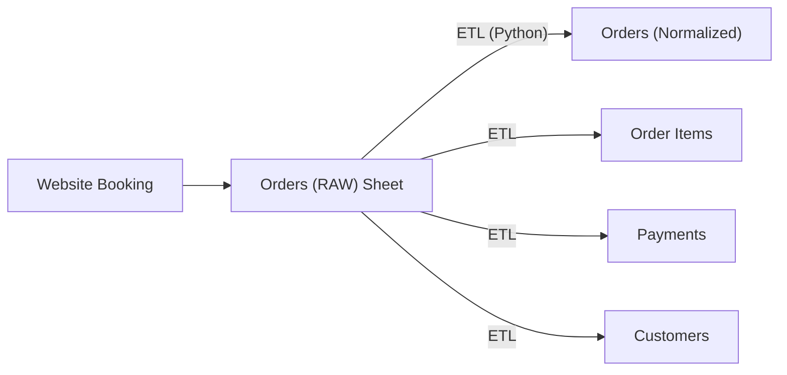

# Lola's Rentals & Tours Inc. — Complete Platform Documentation

## 1. Architecture Overview

```mermaid
graph TD
    subgraph Frontend["React Frontend (Vite/CRA)"]
        Login[Login Component]
        AppLayout[App Layout + Sidebar Nav]
        Pages[14+ Pages/Views]
        Modals[14 Modal Dialogs]
        Hooks[11 Custom Hooks]
        Services[4 Service Layers]
    end

    subgraph Backend["Node.js/Express Backend"]
        API[REST API server.js - 3400+ lines]
        Auth[Authentication Endpoint]
        CRUD[Sheet Read/Write/Append/Update]
        PawCard[Paw Card API]
    end

    subgraph Data["Google Sheets Database"]
        OrdersRAW["Orders (RAW)"]
        OrdersNorm["Orders (Normalized)"]
        OrderItems["Order Items"]
        Payments["Payments"]
        Customers["Customers"]
        Fleet["Fleet"]
        Maintenance["Maintenance"]
        Transfers["Transfers"]
        Timesheets["Timesheets"]
        Employees["Employees"]
        Expenses["Expenses"]
        JournalEntries["Journal Entries"]
        CardSettlements["Card Settlements"]
        Config["Config"]
        Ledger["Ledger"]
        CashRecon["Cash Reconciliation"]
        AccountBalances["Account Balances"]
        MiscSales["Misc Sales"]
        LostOpp["Lost Opportunity"]
        TodoTasks["To Do"]
        UIErrors["UI Errors"]
        PawCardSheet["Paw Card"]
        CashAdvSchedules["Cash Advance Schedules"]
        OrderAddons["Order Add-ons"]
    end

    Frontend -->|HTTP/REST| Backend
    Backend -->|Google Sheets API v4| Data
```

| Layer | Technology | Key Files |
|-------|-----------|-----------|
| **Frontend** | React (JSX), TailwindCSS, Lucide Icons | [src/App.jsx](file:///c:/Users/jacku/OneDrive/UI/src/App.jsx) (4,600 lines), 14 pages, 14 modals |
| **Backend** | Node.js, Express, `googleapis` SDK | [backend/server.js](file:///c:/Users/jacku/OneDrive/UI/backend/server.js) (3,400 lines) |
| **Database** | Google Sheets (24+ tabs/sheets) | Configured via [sheetsConfig.js](file:///c:/Users/jacku/OneDrive/UI/src/config/sheetsConfig.js) + [.env](file:///c:/Users/jacku/OneDrive/UI/.env) |
| **ETL** | Python (pandas) | [etl_google_sheets.py](file:///c:/Users/jacku/OneDrive/UI/etl_google_sheets.py), [etl_orders.py](file:///c:/Users/jacku/OneDrive/UI/etl_orders.py) |
| **Deployment** | Netlify (frontend) + Render (backend) | [netlify.toml](file:///c:/Users/jacku/OneDrive/UI/netlify.toml), [vercel.json](file:///c:/Users/jacku/OneDrive/UI/vercel.json) |

---

## 2. Authentication & Authorization

### Login
- **PIN-based login**: users authenticate with username + PIN via `/api/auth/login`
- Backend reads the **Config** sheet for user credentials (User, PIN, Employee ID, Access Level, Role ID, Role Name columns)
- On success, user data is stored in `localStorage` and passed throughout the app

### Role-Based Access Control (RBAC)
Permissions are loaded from Config via `useUserPermissions` hook and checked using utility functions in [permissions.js](file:///c:/Users/jacku/OneDrive/UI/src/utils/permissions.js):

| Permission | Controls |
|-----------|----------|
| `can_view_inbox` | Unprocessed orders page |
| `can_view_active` | Active rentals page |
| `can_view_completed` | Completed orders page |
| `can_view_fleet` | Fleet management page |
| `can_view_maintenance` | Maintenance log page |
| `can_view_transfers` | Airport/hotel transfers page |
| `can_view_cardsettlements` | Card settlements page |
| `can_view_accounts` | Accounting/Ledger page |
| `can_view_miscsales` | Miscellaneous sales page |
| `can_view_expenses` | Expenses page |
| `can_view_timesheets` | HR/Timesheets page |
| `can_view_payroll` | Payroll tab in HR |
| `can_view_todo` | To Do list page |
| `can_view_lostopportunity` | Lost opportunity page |
| `can_view_cashup` | Cash Up/Reconciliation page |
| `can_view_uierrors` | UI Errors/Bug report page |
| `can_view_fleet_book_value` | Fleet asset book value KPI |
| `can_edit_orders` | Edit/process orders |
| `can_edit_fleet` | Edit fleet vehicles |
| `can_edit_accounts` | Edit accounting entries |
| `can_submit_timesheet` | Submit timesheets |
| `can_approve_timesheets` | Approve timesheets & run payroll |
| `can_override_cashup` | Override cash reconciliation |

Navigation sidebar items are dynamically shown/hidden based on these permissions.

---

## 3. Navigation & Layout

The app uses a **collapsible sidebar** ([AppLayout.jsx](file:///c:/Users/jacku/OneDrive/UI/src/components/layout/AppLayout.jsx)) with the following navigation items:

| Nav Item | View ID | Icon | Description |
|----------|---------|------|-------------|
| Unprocessed Orders | `inbox` | LayoutDashboard | New orders from website |
| Active Rentals | `active` | CheckCircle | Currently active bookings |
| Completed Orders | `completed` | Clock | Settled/completed rentals |
| Fleet | `fleet` | Truck | Vehicle inventory |
| Maintenance | `maintenance` | Wrench | Maintenance logs |
| Transfers | `transfers` | Plane | Airport/hotel transfers |
| To Do List | `todo` | CheckSquare | Task management *(badge with unseen count)* |
| HR / Timesheets | `hr` | Users | Time tracking & payroll |
| Expenses | `expenses` | Receipt | Expense tracking |
| Accounts | `accounts` | Coins | Double-entry ledger |
| Card Settlements | `cardsettlements` | CreditCard | Card payment reconciliation |
| Cash Up | `cashup` | DollarSign | Daily cash reconciliation |
| Misc. Sales | `miscsales` | ShoppingBag | Non-rental sales |
| Lost Opportunity | `lostopportunity` | — | Missed/declined bookings |
| UI Errors | `uierrors` | — | Bug reports & improvement suggestions |

The header bar shows: current page title, logged-in user, last refresh timestamp, refresh button, and logout button.

---

## 4. Orders Management (Core Module)

### 4.1 Data Architecture

Orders flow through a **3-stage pipeline**:

- **Orders (RAW)**: Raw booking data from the website (source of truth); 26+ columns
- **Orders (Normalized)**: Cleaned/structured order headers (order_id, customer_id, status, store_id, dates, totals, etc.)
- **Order Items**: Individual line items per order (vehicle assignments, rental days, pricing)
- **Payments**: Payment records per order (method, amount, date)
- **Customers**: Deduplicated customer records

### 4.2 Unprocessed Orders (Inbox)

View: `inbox` — [OrdersListView.jsx](file:///c:/Users/jacku/OneDrive/UI/src/components/OrdersListView.jsx) + [OrdersTileView.jsx](file:///c:/Users/jacku/OneDrive/UI/src/components/OrdersTileView.jsx)

- Displays new orders from the website that haven't been processed yet
- **List view** with sortable columns or **tile/card view**
- Store filter dropdown + date filter + search
- Click to open the [BookingModal.jsx](file:///c:/Users/jacku/OneDrive/UI/src/components/modals/BookingModal.jsx) (3,750 lines) for processing

**Unprocessed order workflow:**
1. Review customer info (name, email, phone, nationality)
2. Assign vehicle(s) from fleet (single or multi-quantity)
3. Set pickup/dropoff dates and locations
4. Configure add-ons (Peace of Mind Cover, Surf Rack, Helmets, etc.) with per-day or one-time pricing
5. Add custom charges
6. Log card payment if already paid
7. **Process & Activate** — writes to normalized sheets, creates journal entries, updates fleet status
8. Or **Cancel Booking** — marks as cancelled in RAW sheet

### 4.3 Active Rentals

View: `active`

- Shows orders with status `active` or `confirmed`
- Clicking opens BookingModal for management:
  - **Collect Payment**: Add payment record (Cash, GCash, PayMaya, Card, Bank Transfer)
  - **Vehicle Swap**: Change assigned vehicle mid-rental (creates swap record)
  - **Modify Add-ons**: Toggle add-ons with payment method prompt
  - **Extend/Shorten Rental**: Adjust dates and recalculate
  - **Settle Order**: Mark as completed, process final payment, create journal entries

### 4.4 Completed Orders

View: `completed`

- Shows settled/completed orders
- Read-only view with booking history timeline

### 4.5 BookingModal — The Order Processing Engine

[BookingModal.jsx](file:///c:/Users/jacku/OneDrive/UI/src/components/modals/BookingModal.jsx) is the most complex component (3,754 lines). It handles:

| Section | Functionality |
|---------|--------------|
| **Customer Details** | Name, email, phone, nationality, customer matching/deduplication |
| **Booking Details** | Status, store, pickup/dropoff dates & locations with delivery costs |
| **Vehicle Assignment** | Single or multi-vehicle selection from available fleet |
| **Add-ons** | Toggle-based add-on selection with store-aware pricing (per-day or one-time) |
| **Custom Charges** | Ad-hoc charge line items |
| **Pricing Summary** | Real-time total calculation: rental + add-ons + charges - discounts |
| **Payment Processing** | Collect payments via multiple methods; split payments |
| **Settlement** | Final reconciliation, balance calculation, journal entry creation |
| **Vehicle Swap** | Change vehicle mid-rental |
| **Order History** | Timeline of all changes and payments |
| **Deposit & Settlement** | Deposit forfeiture rules, card settlement tracking |

### 4.6 Order Update Pipeline

[orderUpdateService.js](file:///c:/Users/jacku/OneDrive/UI/src/services/orderUpdateService.js) (1,979 lines) handles the complex logic of persisting order changes:

1. **Customer matching**: Deduplication by email/phone using Levenshtein similarity
2. **Write to Orders (Normalized)**: Update or create order row
3. **Write to Order Items**: Create/update individual line items
4. **Write to Payments**: Append payment records
5. **Write to Customers**: Create/update customer record
6. **Card Settlements**: Auto-create card settlement entries for card payments
7. **Journal Entries**: Create double-entry accounting records
8. **Fleet Status Update**: Mark vehicles as rented/available

---

## 5. Fleet Management

### 5.1 Fleet Page

[FleetPage.jsx](file:///c:/Users/jacku/OneDrive/UI/src/pages/FleetPage.jsx) — Vehicle inventory dashboard

- **Grid display** of all vehicles with: name, model, plate number, store, status, current mileage, GPS ID, ORCR expiry
- **Status badges**: Active, Available, Under Maintenance, Out of Service, Sold, Closed, Pending ORCR, Service Vehicle
- **Store filter**: Filter by Lola's or Bass Bikes location
- **Search**: Filter by vehicle name/plate

### 5.2 Vehicle Modal

[VehicleModal.jsx](file:///c:/Users/jacku/OneDrive/UI/src/components/modals/VehicleModal.jsx) — Edit vehicle details:
- Vehicle name, model, plate number, GPS ID
- Status toggle
- Mileage update
- ORCR expiry date
- Surf rack compatibility flag
- Store assignment

### 5.3 Asset Management Modal

[AssetManagementModal.jsx](file:///c:/Users/jacku/OneDrive/UI/src/components/modals/AssetManagementModal.jsx) — Financial tracking per vehicle:
- Purchase price, purchase date, setup costs
- Useful life (months), salvage value
- Accumulated depreciation, book value
- **Record Purchase**: Creates journal entry (debit Fixed Assets, credit Cash/Bank)
- **Record Sale**: Records sale price, calculates profit/loss, creates journal entries

### 5.4 Utilization Dashboard

[UtilizationDashboardModal.jsx](file:///c:/Users/jacku/OneDrive/UI/src/components/modals/UtilizationDashboardModal.jsx) — Analytics:

- **Time period**: 7 days, 30 days, 90 days, custom range
- **KPIs**: Fleet utilization %, revenue per vehicle, downtime %, idle %
- **Per-vehicle breakdown**: Rental hours, revenue, downtime, utilization rate
- **Period comparison**: Delta indicators vs. previous period (trending up/down)
- **Store-level filtering**
- Accounts for: rentable start date, sold date, non-rentable statuses

### 5.5 Fleet Status Sync

The [App.jsx](file:///c:/Users/jacku/OneDrive/UI/src/App.jsx) contains comprehensive fleet status synchronization:
- [syncFleetStatusFromMaintenance()](file:///c:/Users/jacku/OneDrive/UI/src/App.jsx#2995-3110) — Updates fleet status based on active maintenance records
- [syncAllFleetStatuses()](file:///c:/Users/jacku/OneDrive/UI/src/App.jsx#3111-3249) — Comprehensive check against active rentals + maintenance
- [isVehicleRented()](file:///c:/Users/jacku/OneDrive/UI/src/App.jsx#2852-2939) — Cross-references active orders with vehicle assignments
- [validateRentalDates()](file:///c:/Users/jacku/OneDrive/UI/src/App.jsx#2940-2994) — Ensures current time is within rental period
- Protected statuses (Sold/Closed) are never auto-updated

---

## 6. Maintenance Management

### 6.1 Maintenance Page

[MaintenancePage.jsx](file:///c:/Users/jacku/OneDrive/UI/src/pages/MaintenancePage.jsx) — Table view of all maintenance logs:
- Asset name, issue description, downtime period, mechanic, cost, status

### 6.2 Maintenance Log Modal

[MaintenanceLogModal.jsx](file:///c:/Users/jacku/OneDrive/UI/src/components/modals/MaintenanceLogModal.jsx) (1,036 lines) — Detailed maintenance tracking:

| Feature | Detail |
|---------|--------|
| **Vehicle selection** | From fleet inventory |
| **Issue description** | Free text |
| **Downtime tracking** | Start/end dates; ongoing flag |
| **Mechanic** | From employee list or free text |
| **Parts replaced** | Toggle-based parts list with date/distance tracking |
| **Distance-tracked parts** | Brake pads, tires, chains, belts — tracks replacement intervals by km |
| **Parts cost** | Per-part cost entry |
| **Labor cost** | Separate labor charge |
| **Total cost** | Auto-calculated |
| **Payment account** | Asset account for the expense |
| **Status** | Reported, In Progress, Completed |
| **Fleet status sync** | Auto-sets vehicle to "Under Maintenance" or "Available" |
| **Mileage update** | Update current mileage at service time |
| **Expense creation** | Auto-creates expense record (Maintenance category) |
| **Service History PDF** | Generate PDF via [serviceHistoryPdf.js](file:///c:/Users/jacku/OneDrive/UI/src/utils/serviceHistoryPdf.js) |

---

## 7. Airport & Hotel Transfers

### 7.1 Transfers View

[TransfersView.jsx](file:///c:/Users/jacku/OneDrive/UI/src/components/views/TransfersView.jsx) — Manages airport/hotel transfer bookings:

- **Table display**: Customer, route, date/time, pax count, vehicle type, payment status
- **Payment status badges**: Pending, Partially Paid, Paid
- **Customer type badges**: Walk-in, Online
- **Batch selection** for bulk operations
- **Add Transfer Modal** ([AddTransferModal.jsx](file:///c:/Users/jacku/OneDrive/UI/src/components/modals/AddTransferModal.jsx)) — 21,637 bytes of booking form
- **Driver Payment Modal** — Record driver payments (creates expense + journal entries)
- **Transfer Payment Modal** — Record customer payments

### 7.2 Public Transfer Booking Page

[TransferBooking.jsx](file:///c:/Users/jacku/OneDrive/UI/src/pages/TransferBooking.jsx) — Public-facing booking page:
- Token-based access (shareable link)
- Route selection with dynamic pricing
- Customer details form
- Payment method selection (Cash, GCash, Card)
- Order verification
- Journal entry creation on submission

### 7.3 Transfer Data Structure (23 columns)
Transfer ID, date, time, customer name, email, phone, customer type, route, pax, vehicle type, price, discount, total amount, payment method, payment status, driver, driver fee, notes, store_id, order_id, created_by, created_at, link_token

---

## 8. Financial System

### 8.1 Double-Entry Accounting

[accountingService.js](file:///c:/Users/jacku/OneDrive/UI/src/services/accountingService.js) (1,551 lines) implements a full double-entry ledger:

**Reference Types:**
`rental`, `deposit`, `addon`, `transfer`, `maintenance`, `payroll`, `expense`, `cash_deposit`, `card_settlement`, `period_end`, `adjustment`, `depreciation`, `vehicle_purchase`, `vehicle_sale`, `refund`, `misc_sale`, `order_tips`, `order_charity`, `charity_payout`, `paw_card_charity`, `float-split`

**Core Functions:**
- [createJournalEntry()](file:///c:/Users/jacku/OneDrive/UI/src/services/accountingService.js#189-267) — Balanced debit/credit pair
- [createCompoundJournalEntry()](file:///c:/Users/jacku/OneDrive/UI/src/services/accountingService.js#337-425) — Multi-leg entries (total debits = total credits)
- [createAccountAdjustmentEntry()](file:///c:/Users/jacku/OneDrive/UI/src/services/accountingService.js#268-336) — Balance adjustments with offset accounts
- [calculateAccountBalance()](file:///c:/Users/jacku/OneDrive/UI/src/services/accountingService.js#426-478) — Account balance from journal entries with date/period filters
- [calculateAllAccountBalances()](file:///c:/Users/jacku/OneDrive/UI/src/services/accountingService.js#479-493) — Batch balance calculation
- [getBalanceSummaryByType()](file:///c:/Users/jacku/OneDrive/UI/src/services/accountingService.js#494-516) — Summary grouped by account type (Asset, Liability, Income, Expense, Equity)
- [createPeriodEndRecord()](file:///c:/Users/jacku/OneDrive/UI/src/services/accountingService.js#517-542) — Period closing records

**Journal Entry Format:**
`entry_id, transaction_id, date, period, store_id, account_id, debit, credit, description, reference_type, reference_id, created_by, created_at`

### 8.2 Accounts Page

[AccountsPage.jsx](file:///c:/Users/jacku/OneDrive/UI/src/pages/AccountsPage.jsx) (858 lines):

- **Account balances dashboard** by store
- **Period selection**: 1st–15th or 16th–end of month
- **Account detail modal** ([AccountDetailModal.jsx](file:///c:/Users/jacku/OneDrive/UI/src/components/modals/AccountDetailModal.jsx)) — Ledger entries per account
- **Transfer funds** between accounts ([TransferModal.jsx](file:///c:/Users/jacku/OneDrive/UI/src/components/modals/TransferModal.jsx))
- **Batch Depreciation** ([BatchDepreciationModal.jsx](file:///c:/Users/jacku/OneDrive/UI/src/components/modals/BatchDepreciationModal.jsx)) — Run monthly depreciation across all vehicles
- **Charity payout** — Disburse accumulated Paw Card charity funds
- **Account aliases** for legacy compatibility (e.g., `RENTAL-INCOME` → `INCOME-RENTAL`)

### 8.3 Card Settlements

[CardSettlementsPage.jsx](file:///c:/Users/jacku/OneDrive/UI/src/pages/CardSettlementsPage.jsx) — Card payment reconciliation:

- **Pending settlements**: Card payments not yet received from processor
- **Forecasted dates**: Auto-calculated settlement dates based on order date
- **Match settlement** ([SettlementMatchModal.jsx](file:///c:/Users/jacku/OneDrive/UI/src/components/modals/SettlementMatchModal.jsx)): Reconcile with bank deposits
- **Batch match**: Select multiple settlements for bulk reconciliation
- **Batch edit**: Bulk update settlement details
- **Combine settlements**: Merge related entries
- **Card terminal balance**: Running total of unsettled card payments

### 8.4 Cash Up / Reconciliation

[CashUpPage.jsx](file:///c:/Users/jacku/OneDrive/UI/src/pages/CashUpPage.jsx) (1,007 lines) — Daily cash reconciliation:

- **Store tabs**: Separate reconciliation per store
- **Date navigation**: Day-by-day browsing
- **Sections**: Cash transactions, card transactions, GCash, expenses
- **Denomination counting**: Physical cash count by denomination (₱1,000 down to ₱1)
- **Opening float**: With badge showing source (previous day's closing, override, default)
- **Expected vs. Actual**: Variance calculation
- **Deposit tracking**: Cumulative deposits for the day
- **Reconcile flow**: Confirmation modal with summary
- **Override**: Admin can override balances (requires `can_override_cashup` permission)
- **Print**: Generate printable reconciliation report
- **Deposit Funds Modal** ([DepositFundsModal.jsx](file:///c:/Users/jacku/OneDrive/UI/src/components/modals/DepositFundsModal.jsx)): Record bank deposits

### 8.5 Expenses

[ExpensesPage.jsx](file:///c:/Users/jacku/OneDrive/UI/src/pages/ExpensesPage.jsx) (616 lines):

- **Daily expense log** with date navigation
- **Categories**: From Config (expense_category + account_id mapping)
- **Payment accounts**: Asset accounts for payment source
- **Vehicle linkage**: Associate expense with fleet vehicle
- **Employee linkage**: Track who incurred expense
- **CRUD**: Create, edit, delete expense entries
- **Cash advance tracking**: Linked to payroll deductions

### 8.6 Misc. Sales

[MiscSalesPage.jsx](file:///c:/Users/jacku/OneDrive/UI/src/pages/MiscSalesPage.jsx) — Non-rental revenue:
- Daily log with date navigation
- Categories, amounts, income account mapping
- Payment account selection (Cash, GCash, Card, etc.)
- Journal entry creation

---

## 9. HR, Timesheets & Payroll

### 9.1 Timesheets (HR View)

[HRView.jsx](file:///c:/Users/jacku/OneDrive/UI/src/components/views/HRView.jsx) (2,725 lines) — The largest view component:

**Timesheet Entry:**
- Employee selection from roster
- Date, Day Type (Regular, Rest Day, Holiday)
- Time In / Time Out (24-hour format)
- Auto-calculated: Regular hours (cap 8), Overtime hours
- 9PM Returns count (late-night bonus trigger)
- Daily notes
- Payroll status (Pending, Approved, Paid)
- Duplicate detection (same employee + date)

**Bulk Submission:**
- Select multiple employees at once
- Common fields (date, day type, time in/out) with per-employee overrides
- Batch submit all selected timesheets

**Approval Workflow:**
- Bulk approval by employee
- Select/deselect all employees with pending timesheets
- Requires `can_approve_timesheets` permission

### 9.2 Payroll Engine

[payrollService.js](file:///c:/Users/jacku/OneDrive/UI/src/services/payrollService.js) (712 lines):

**Pay Components:**

| Component | Calculation |
|-----------|-------------|
| **Basic Pay** | `daily_rate × days_worked` or `monthly_rate / working_days × days_worked` |
| **Overtime** | `overtime_rate × overtime_hours` |
| **9PM Bonus** | `nine_pm_rate × count` (for late-night vehicle returns) |
| **Commission** | Peace of Mind add-on revenue split equally among selected recipients |
| **Tips** | Total tips from orders, split among selected recipients |
| **Bike Allowance** | Monthly rolling allowance with payout tracking |
| **Bonuses** | From Expenses with "bonus" category |
| **Vehicle Allowance** | From Expenses with "vehicle allowance" category |

**Deductions:**

| Deduction | Logic |
|-----------|-------|
| **Cash Advances** | From Expenses (category "cash advance"), with scheduled installment support |
| **SSS** | Government contribution — EOM payroll only |
| **PhilHealth** | Government contribution — EOM payroll only |
| **PagIBIG** | Government contribution — EOM payroll only |
| **13th Month Accrual** | [(basic_rate × days) / 12](file:///c:/Users/jacku/OneDrive/UI/src/hooks/useAppData.js#243-273) |

**Payroll Run:**
- Period selection: 1st–15th or 16th–end of month
- Per-employee payment source allocation (multi-source: Cash, GCash, Bank Transfer)
- Payslip generation with full breakdown
- Journal entry creation: debit Payroll Expense, credit Cash/GCash/Bank
- Printable payslips

---

## 10. To Do / Task Management

[ToDoView.jsx](file:///c:/Users/jacku/OneDrive/UI/src/components/ToDoView.jsx) (880 lines):

- **Task creation**: Title, description, priority (Low/Medium/High/Urgent), due date
- **Assignment**: Assign to employee or leave unassigned
- **Vehicle linkage**: Associate task with fleet vehicle
- **Status tracking**: Open, In Progress, Completed
- **Claim tasks**: Unassigned tasks can be claimed by any user
- **Completion**: Mark as done with timestamp
- **Seen/unseen tracking**: Per-user "seen" status (like read receipts)
- **Sidebar badge**: Count of unseen tasks assigned to current user
- **Filters**: By status, priority, assignee, search
- **Edit permissions**: Creator or assignee can edit

---

## 11. Lost Opportunity Tracking

[LostOpportunityPage.jsx](file:///c:/Users/jacku/OneDrive/UI/src/pages/LostOpportunityPage.jsx) (437 lines):

- Track missed/declined bookings
- Date, store, reason (No availability, Price too high, Competition, Walk-away, etc.)
- Potential revenue amount
- Vehicle type requested
- Edit existing entries
- Date navigation with daily view

---

## 12. Paw Card (Charity / Loyalty System)

### 12.1 Customer-Facing App

[PawCardApp.jsx](file:///c:/Users/jacku/OneDrive/UI/src/pages/PawCardApp.jsx) — "Siargao Paw Card — Log Your Savings":

**Flow:**
1. **Identify**: Enter email, mobile, or order ID
2. **Confirm**: "Are you [name]?" confirmation
3. **Log Form**: Record savings at participating establishments
4. **Lifetime Savings**: Display cumulative savings

### 12.2 Supporting Pages
- [PawCardHero.jsx](file:///c:/Users/jacku/OneDrive/UI/src/pages/PawCardHero.jsx) — Marketing hero section
- [PawCardLogForm.jsx](file:///c:/Users/jacku/OneDrive/UI/src/pages/PawCardLogForm.jsx) — Savings log entry form (10,106 bytes)
- [PawCardConfirm.jsx](file:///c:/Users/jacku/OneDrive/UI/src/pages/PawCardConfirm.jsx) — Identity confirmation
- [PawCardMySubmissions.jsx](file:///c:/Users/jacku/OneDrive/UI/src/pages/PawCardMySubmissions.jsx) — View past submissions

### 12.3 Backend API
- `/api/paw-card/lookup` — Customer lookup by email/mobile/order ID
- `/api/paw-card/establishments` — List participating establishments (cached with 2-min TTL)
- `/api/paw-card/lifetime` — Calculate lifetime savings for a customer
- `/api/paw-card/submit` — Log a new savings entry
- `/api/paw-card/company-impact` — Company-wide charity impact (baseline ₱282,995 + yearly cap ₱100,000)

---

## 13. UI Errors / Bug Reports

[UIErrorsView.jsx](file:///c:/Users/jacku/OneDrive/UI/src/components/UIErrorsView.jsx):

- **Submit bugs**: Page selection dropdown, error description, ideas & improvements
- **Status tracking**: Outstanding vs. Completed (Fixed)
- **Filter**: By status (All, Outstanding, Completed)
- **Table**: error_id, page, description, ideas, employee_id, fixed

---

## 14. Backend API (server.js)

The backend at [server.js](file:///c:/Users/jacku/OneDrive/UI/backend/server.js) (3,404 lines, 169+ code blocks) provides:

### Core Endpoints

| Endpoint | Method | Purpose |
|----------|--------|---------|
| `/api/auth/login` | POST | PIN-based authentication |
| `/api/sheets/read` | POST | Generic Google Sheets read (any tab) |
| `/api/sheets/append` | POST | Append row to any sheet |
| `/api/sheets/update` | POST | Update specific row by row number |
| `/api/sheets/batch-update` | POST | Batch update multiple rows |
| `/api/sheets/find-and-update` | POST | Find row by key column, then update |
| `/api/sheets/delete-row` | POST | Delete specific row |
| `/health` | GET | Health check |

### Paw Card Endpoints

| Endpoint | Method | Purpose |
|----------|--------|---------|
| `/api/paw-card` | GET | Service status check |
| `/api/paw-card/lookup` | GET | Customer lookup |
| `/api/paw-card/establishments` | GET | List establishments (cached) |
| `/api/paw-card/lifetime` | GET | Customer lifetime savings |
| `/api/paw-card/submit` | POST | Log savings entry |
| `/api/paw-card/company-impact` | GET | Company-wide impact stats |
| `/api/paw-card/my-submissions` | GET | User's past submissions |

### Key Backend Features
- **Sheet name alternatives**: Handles multiple tab name variants (e.g., `Order Add-ons`, `Order Add Ons`, `Order AddOns`)
- **Range normalization**: Auto-quotes sheet names with special characters
- **Quota handling**: Graceful error handling for Google Sheets API rate limits
- **Proxy bypass**: Avoids ECONNREFUSED from bad proxy settings

---

## 15. Data Services & Hooks

### Custom Hooks

| Hook | Purpose |
|------|---------|
| [useOrdersDirect](file:///c:/Users/jacku/OneDrive/UI/src/hooks/useOrdersDirect.js#19-1152) | Reads Orders (RAW) + normalized sheets, parses add-ons, manages order state |
| [useFleetDirect](file:///c:/Users/jacku/OneDrive/UI/src/hooks/useFleetDirect.js#7-277) | Reads Fleet sheet, parses vehicle data with 23-column structure |
| [useAppData](file:///c:/Users/jacku/OneDrive/UI/src/hooks/useAppData.js#23-330) | Orchestrates initial data loading + view-based lazy loading |
| `useAppBackgroundRefresh` | Activity-based auto-refresh (refreshes on user interaction) |
| `useCashUpData` | Aggregates journal entries + payments for cash reconciliation |
| [useJournalEntries](file:///c:/Users/jacku/OneDrive/UI/src/hooks/useJournalEntries.js#45-1553) | CRUD operations for double-entry journal entries |
| `useGoogleSheets` | Generic Google Sheets read/write operations |
| `useGoogleSheetsSimple` | Simplified sheet operations |
| `useOrdersSimple` | Lightweight orders read |
| `useToDoDirect` | To Do task management |
| `useUserPermissions` | Loads and parses RBAC permissions from Config |

### Service Layer

| Service | Size | Purpose |
|---------|------|---------|
| [googleSheetsService.js](file:///c:/Users/jacku/OneDrive/UI/src/services/googleSheetsService.js) | 3,430 lines | Core data layer: fetch, parse, transform, cache, CRUD for all 24+ sheet types |
| [orderUpdateService.js](file:///c:/Users/jacku/OneDrive/UI/src/services/orderUpdateService.js) | 1,979 lines | Order processing pipeline: customer matching, multi-sheet writes |
| [accountingService.js](file:///c:/Users/jacku/OneDrive/UI/src/services/accountingService.js) | 1,551 lines | Double-entry accounting engine |
| [payrollService.js](file:///c:/Users/jacku/OneDrive/UI/src/services/payrollService.js) | 712 lines | Payroll computation engine |

### API Queue

[apiQueue.js](file:///c:/Users/jacku/OneDrive/UI/src/utils/apiQueue.js) — Request queuing and rate limiting:
- Prevents concurrent API calls from overwhelming Google Sheets quota
- Sequential processing of write operations
- Retry logic with exponential backoff

---

## 16. ETL Pipeline

Python ETL scripts transform raw booking data into normalized tables:

| Script | Purpose |
|--------|---------|
| [etl_google_sheets.py](file:///c:/Users/jacku/OneDrive/UI/etl_google_sheets.py) | Full ETL: reads RAW orders, creates normalized tables |
| [etl_orders.py](file:///c:/Users/jacku/OneDrive/UI/etl_orders.py) | Orders-specific ETL |
| [etl_orders_pandas.py](file:///c:/Users/jacku/OneDrive/UI/etl_orders_pandas.py) | Pandas-based orders ETL |
| [etl_complete.py](file:///c:/Users/jacku/OneDrive/UI/etl_complete.py) / [etl_complete_fixed.py](file:///c:/Users/jacku/OneDrive/UI/etl_complete_fixed.py) | Complete ETL run |
| [populate_customer_store_id.py](file:///c:/Users/jacku/OneDrive/UI/populate_customer_store_id.py) | Backfill customer store IDs |

**Backfill Scripts (backend/):**
- [backfill-customer-ids.js](file:///c:/Users/jacku/OneDrive/UI/backend/backfill-customer-ids.js) — Assign customer IDs
- [backfill-order-customer-ids.js](file:///c:/Users/jacku/OneDrive/UI/backend/backfill-order-customer-ids.js) — Link orders to customers
- [backfill-order-item-ids.js](file:///c:/Users/jacku/OneDrive/UI/backend/backfill-order-item-ids.js) — Generate order item IDs
- [backfill-journal-entries.js](file:///c:/Users/jacku/OneDrive/UI/backend/backfill-journal-entries.js) — Reconstruct journal entries
- [update-vehicle-statuses.js](file:///c:/Users/jacku/OneDrive/UI/backend/update-vehicle-statuses.js) — Batch update fleet statuses
- [cleanup-customers.js](file:///c:/Users/jacku/OneDrive/UI/backend/cleanup-customers.js) — Deduplicate customers
- Various `fix-*.js` scripts for data corrections

---

## 17. Configuration (Config Sheet)

The Config sheet drives most configurable behavior (extends to column AZ):

| Config Area | Columns | Contents |
|------------|---------|----------|
| **Users & Auth** | User, PIN, Employee ID, Access Level, Role ID, Role Name | Login credentials & RBAC |
| **Permissions** | can_view_*, can_edit_* | Per-role permission flags |
| **Stores** | store_id, store_name | Multi-store setup (Lola's, Bass Bikes) |
| **Add-ons** | addon_name, price_per_day, price_one_time, per_store pricing | Rental add-ons with store-specific pricing |
| **Locations** | location, delivery_cost | Pickup/dropoff locations with costs |
| **Vehicles** | vehicle types for Config-driven dropdowns | |
| **Parts** | Maintenance parts list | |
| **Payment Methods** | Available payment methods | |
| **Categories** | Expense categories | |
| **Transfer Routes** | Route, price, vehicle type | Transfer pricing |
| **Day Types** | Regular, Rest Day, Holiday | For timesheet entry |
| **Accounts** | account_id, account_name, account_type, store_id | Chart of accounts for ledger |
| **Expense Categories** | expense_category, account_id | Expense → account mapping |
| **Paw Card Establishments** | Participating business names | |

---

## 18. Multi-Store Support

The platform supports multiple store locations:

- **Lola's Rentals** (primary)
- **Bass Bikes** (secondary)

Multi-store features permeate the entire system:
- Orders filtered by store
- Fleet assigned per store
- Expenses per store
- Cash reconciliation per store
- Separate cash accounts per store
- Transfer routes per store
- Employee assignment per store
- Journal entries tagged with store_id

---

## 19. Data Integrity & Recovery

Built-in data integrity features in [App.jsx](file:///c:/Users/jacku/OneDrive/UI/src/App.jsx):

- [checkOrderInSheet()](file:///c:/Users/jacku/OneDrive/UI/src/App.jsx#2444-2480) — Verify order exists in normalized sheet
- [resyncOrder()](file:///c:/Users/jacku/OneDrive/UI/src/App.jsx#2481-2507) — Re-sync an order from UI state to sheets
- [checkDataIntegrity()](file:///c:/Users/jacku/OneDrive/UI/src/App.jsx#2508-2570) — Find orders present in UI but missing from sheets
- Order recovery implementation for handling write failures
- Comprehensive error logging and UI error reporting system

---

## 20. Technical Details

### Frontend Build
- React with JSX
- TailwindCSS for styling
- Lucide React for icons
- Lazy-loaded views via `React.lazy()` + `Suspense`
- `React.memo()` on heavy components

### State Management
- React `useState` + `useCallback` + `useMemo` — no external state library
- Data passed via props from [App.jsx](file:///c:/Users/jacku/OneDrive/UI/src/App.jsx) (the 4,600-line orchestrator)
- `AppContext` exists but is minimal
- `localStorage` for user session persistence

### Currency
- Philippine Peso (₱) throughout
- [formatCurrency()](file:///c:/Users/jacku/OneDrive/UI/src/pages/PawCardApp.jsx#18-22) helper for consistent formatting

### Date/Time Handling
- Local timezone awareness ([getTodayLocal()](file:///c:/Users/jacku/OneDrive/UI/src/pages/CashUpPage.jsx#29-34))
- ISO format (YYYY-MM-DD) for storage
- Display formatting for user-facing dates
